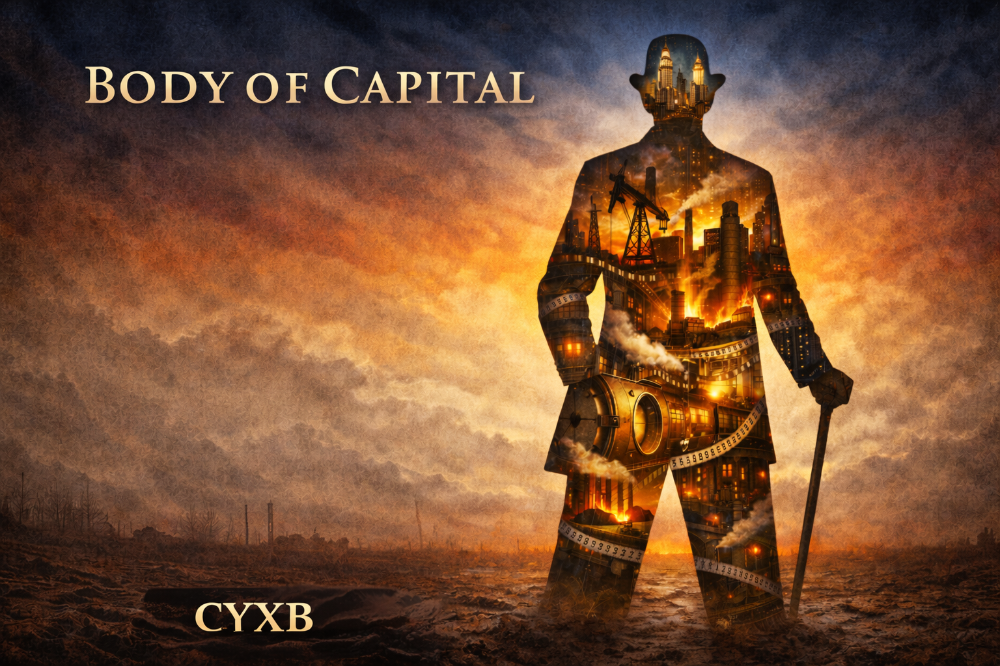

# 资本之躯

## ——泥土与火种

---

### 楔子

一九一八年十二月十一日。纽约。

曼哈顿的灯火从第五大道七十二街的窗口铺展开去，一直延伸到视线碎裂的地方。每一盏灯都在燃烧——煤油或电力，两者都从同一个体系中流出，流向同一个方向。

卡尔·瓦格纳坐在书桌前。他六十九岁。灰蓝色的眼睛在台灯下几乎没有颜色，像冬天的伊利湖面。短须已经全白了。他的手指——那双从泥土中爬出来、在油脂中硬化、在钢铁的热浪中定型的手指——正翻动一只旧木箱的箱盖。

箱子是橡木的，角上包着铁皮，铁皮已经锈蚀。这只箱子从巴伐利亚出发，渡过大西洋，穿越半个美国，在俄亥俄的阁楼上积了十年灰，然后跟着他——从油溪到克利夫兰，从匹兹堡到纽约。七十年。箱子没变。箱子里的东西在变多。

最底层是一本《共产党宣言》德文初版，纸页发黄发脆，边角被翻烂了。旁边是一封折了又折的信，信纸上的墨迹已经淡得几乎看不清。一八六七年冬天的信。告诉他一个叫艾玛·施密特的女孩死了。

他没有打开那封信。他打开了另一本书。

《资本论》第一卷。德文。一八六七年汉堡版。书脊断裂，用线重新缝过。每一页的空白处都写满了批注——最早的字迹潦草而锐利，像少年在纸上刻字；中间的字迹工整、精确，像账本；最后的字迹极细极小，仿佛不再需要完整的句子。

他翻到第二十四章。"所谓原始积累。"

页边的批注层层叠叠，像地层。最早的一行写于一八六九年前后，德语：*Genau. Siehe mein Kontobuch, Seite eins.*（准确。参见我的账本第一页。）

他的目光滑过那些年轻时写下的字，停在马克思那段话上。他已经读过这段话不下一百遍。他不需要读。他只是看着那些铅字，像看着一面镜子。

然后他拿起笔。

在那一页最后一行空白处——所有批注之下、所有年份之后——他写了两个德语词。

*Und weiter.*

然后继续。

他合上书，放回箱子，关上箱盖。站起来。走到窗前。

曼哈顿在他脚下闪烁。

这个故事不从这里开始。这个故事从泥土开始。

---

### 第一章 木屋

一八五五年。秋天。俄亥俄州阿什塔比拉县。

木屋在风中嘎吱作响，像一个正在咳嗽的老人。屋顶有三个地方漏雨，其中两个用锡罐接着，第三个已经没有多余的锡罐了，水就直接滴在泥地上，滴成一个浅浅的凹坑。

卡尔·瓦格纳六岁。他醒来时天还没亮。冷。十月份的俄亥俄，夜间温度已经降到四十华氏度以下。他身上盖的是一条用碎布拼缝的被子，棉花填充物已经结成了硬块。他把自己缩得更紧，膝盖顶着下巴，感觉自己像一个被攥紧的拳头。

隔壁房间传来声音。德语。含混的、带着酒气的德语。

"……*Verräter*（叛徒）……所有人都是*Verräter*……维也纳是、柏林是、这个狗娘养的国家也是……"

那是他的父亲。奥古斯特·瓦格纳。巴伐利亚人。一八四八年德国三月革命的参与者——他左肩上有一道疤，是在慕尼黑街垒上被刺刀划的。革命失败后，他从不来梅港登上一艘运牲口的船，花了六十三天横渡大西洋，到达纽约。然后一路往西，在俄亥俄买了四十英亩薄田，打算种出一个新世界。

新世界没来。来的是伊利铁路公司的运费账单和克利夫兰第一国民银行的还款通知。四十英亩薄田在七年间缩成二十英亩、十英亩、零。

奥古斯特·瓦格纳现在什么都没有了。除了那些旧书、那些旧梦，和一瓶接一瓶的廉价玉米威士忌。

卡尔没有动。他听着父亲在隔壁翻倒了什么东西——也许是椅子，也许是空瓶子——然后是母亲的声音，低而快，像在安抚一头受伤的牲口。玛塔·瓦格纳。符腾堡农家女。她的手粗糙得像树皮。她的声音永远是低的、快的、不占空间的。

卡尔闭着眼睛。他在听。不是在听吵闹——吵闹是这间屋子的背景音，像风声一样，他早就学会了不去注意。他在听另一种东西。某种更安静、更深的东西。

后来他把这种东西叫做"规律"。

但在六岁的时候，他只知道一件事：父亲说的那些话——关于革命、关于公平、关于劳动者应得的报偿——和他面前的现实之间，有一条巨大的裂缝。父亲相信那些话。父亲为那些话流过血。父亲带着那些话渡过了大西洋。

然后父亲冻死在了路边。

不是今天。是六年后。但卡尔后来回想起来，觉得父亲在一八五五年那个秋天的夜晚就已经死了。剩下的六年只是身体还在走动。

天亮了。卡尔起床。穿上靴子——靴子是从一个大两号的邻居男孩那里买来的二手货，鞋头塞了干草。他走到院子里的水井旁洗脸。水冰得割皮肤。

他抬头看了一眼。

远处，伊利铁路的轨道在晨雾中延伸，像一条不知道通往哪里的灰色疤痕。一列货车正在缓慢地经过，车厢上印着"伊利铁路"的字样。车厢里装的是什么？煤？粮食？某个人的利润？

六岁的卡尔当然不知道那些车厢里装的是什么。但他记住了那列火车。他记住了铁轨。他记住了那种感觉——某种巨大的、不停运转的东西在他头顶经过，和他无关，但决定着他的一切。

他转身回屋吃早饭。黑面包。咸肉。一杯掺了水的牛奶。母亲把食物放在他面前，没有说话。父亲还在床上，鼾声像锯木头。

吃完饭他去上学。镇上的学校是一间教室，一个老师，十几个孩子。老师是个瘦高的康涅狄格人，鼻梁上架着小圆眼镜，对德裔孩子没有明显的恶意，但也没有善意——他只是把他们当作教室后排一些不太重要的存在。

卡尔的英语说得磕磕绊绊。他的元音带着巴伐利亚的厚重感，辅音在不该停顿的地方停顿。每当他开口回答问题，前排的美国孩子就会发出嗤嗤的笑声。有时候不只是笑。放学后，三个比他高半个头的男孩把他堵在校舍后面的泥地里。

"说'three'，德国佬。"

"*Sree*——"

"哈哈哈——他说'sree'——"

然后是推搡。然后是拳头。卡尔不还手——不是因为害怕，是因为他在那一瞬间做了一个计算：还手意味着受更重的伤（他比他们矮，比他们瘦），受更重的伤意味着不能干活，不能干活意味着少赚钱。不划算。

他让他们打。倒在地上时护住了脸和肚子——那是他从观察街上的流浪狗打架中学来的姿势。然后他从泥里爬起来，拍掉裤子上的土，走回家。

那天晚上他在油灯下练习发音。"Three. Three. Three." 直到那个"th"的气音从他的舌尖和牙齿之间挤出来为止。

他不是为了不被嘲笑才练发音。他是为了消除一个弱点。口音是一个标记。标记意味着你是外来者。外来者在交易中处于不利地位。这个不利地位必须被消除。

这是一八五五年秋天的一个早晨。没有什么特别的事发生。

但如果你知道后来发生了什么，你会在这个早晨的每一个细节里看到预兆——那个沉默的男孩、那双灰蓝色的眼睛、那列驶过的火车、那块黑面包。你会看到原始积累的第一粒种子正在泥土中发芽。

当然，这是后来的人才会有的看法。在一八五五年，这只是一个穷人家的普通早晨。

---

### 第二章 旧书箱

一八五七年。冬天。

奥古斯特·瓦格纳的书箱放在阁楼最里面的角落，上面盖着一块发霉的帆布。卡尔是在找老鼠夹的时候发现它的——母亲说阁楼里有老鼠在啃她存放的干粮，让他上去查看。

他掀开帆布。箱盖没锁。橡木的箱体在潮湿中微微膨胀，铁皮包角已经生了铜绿色的锈。

里面的书散发着一股混合的气味：旧纸、霉菌、烟草，以及某种更隐蔽的东西——海水的咸味，从不来梅港一路渗透进纤维，几千英里和好几年都没有散尽。

黑格尔的《精神现象学》。费希特的《告德意志国民书》。几份一八四八年的德语报纸，纸张脆得像枯叶。还有一本薄薄的小册子，封面印着两个名字和一个标题：卡尔·马克思，弗里德里希·恩格斯，《共产党宣言》。

卡尔拿起那本小册子。八岁的他已经能读德语——这是母亲教的，虽然他在学校里只说英语，说得磕磕绊绊，带着被同学嘲笑的巴伐利亚口音。

他翻开第一页。

*Ein Gespenst geht um in Europa — das Gespenst des Kommunismus.*

一个幽灵在欧洲游荡——共产主义的幽灵。

他不完全理解这句话的意思。但他理解了"幽灵"这个词。他父亲就是一个幽灵。他父亲的革命就是一个幽灵。那些关于公平和解放的话语就是幽灵——它们存在过、战斗过、失败了，然后变成了某种飘荡在旧书页间的东西，不会再咬人。

他继续往下读。读得很慢。很多词他不认识。但某些句子——某些排列方式——像石头一样沉进他的脑子里，不是因为它们激起了什么热情，而是因为它们有一种他从未见过的东西：清晰。

世界不是一团混沌。世界有结构。结构可以被描述。被描述的东西就可以被理解。被理解的东西就可以被——

他还不知道"利用"这个词。但那个概念已经在他脑子里了。

他把小册子放回箱子，盖上帆布。没有告诉任何人。

此后的两年里，他定期上阁楼。不是每天，也不是有规律地——他凭本能避免形成可以被观察到的模式。他读黑格尔。读费希特。读报纸上马克思的文章。大部分他读不懂。但他读出了一个东西。

世界是由力量构成的。力量有规律。知道规律的人，就站在规律那一边。不知道规律的人，就被规律碾过去。

他父亲被碾过去了。

---

与此同时，他在镇上交了一个朋友。赫尔曼·克莱因。同镇的德裔男孩，比他大一岁，父亲开一间小铁匠铺。克莱因不像卡尔——他爱笑，手脚笨拙，对机械有一种天然的亲近。他能把一把坏了的锁拆开再装回去，但他算不清三位数的加减法。

两个穷孩子在小镇边缘的荒地上打发时间。弹弓打罐头。偷邻居的苹果。在河边的泥地里挖蚯蚓——不是为了钓鱼，是因为卡尔发现镇上杂货店的店主在找鱼饵供应商，他可以把蚯蚓以每罐两美分的价格卖出去。

这是他的第一笔生意。

"你怎么知道他要买蚯蚓？"克莱因问。

"我看到他上周从县城进了十罐鱼饵，每罐进价五美分，卖八美分。"卡尔说。"我们挖的蚯蚓比他进的大。两美分一罐，他至少赚六美分，比从县城进货多赚一美分。"

克莱因看着他。"你怎么知道他的进价？"

"我在柜台上看到了送货单。"

克莱因张了张嘴。然后笑了。"你这个人，"他说，"脑子里装的不是脑子，是算盘。"

卡尔没有笑。他在想下一步：如果蚯蚓的供应稳定，他可以和杂货店签一个固定的供货协议。如果杂货店还从县城进其他东西——烟草、纸张、蜡烛——是不是也存在同样的差价空间？

他九岁。

---

### 第三章 冻土

一八六一年。二月。

冬天。俄亥俄的冬天像一面灰色的墙，压在所有人头上。

奥古斯特·瓦格纳在一个星期二的夜晚喝了大半瓶威士忌——比平时多。他从镇上的酒馆出来，沿着回家的土路走。夜间温度降到了华氏十五度。他走了大约一英里之后倒在了路边的排水沟里。

第二天早晨，一个赶着马车经过的农夫发现了他。他的身体已经僵硬了。左手还攥着那个空酒瓶。脸上的表情——如果冻硬的面部还能叫做表情的话——是一种混合了困惑和愤怒的东西。

他四十一岁。

消息传到家里的时候，玛塔正在给卡尔补一件冬天穿的外套。她的针停在半空中。停了很久。然后她把针插进布料里，站起来，披上披肩，走出了门。

卡尔跟在后面。他们走了一英里多地。路边的沟渠里有薄冰。冰下面是黑色的泥水。

卡尔是中午被叫去的。两个邻居把尸体抬到了镇上的教堂旁边。没有棺材——棺材要三美元，他们付不起。用一条旧床单裹着。

卡尔站在那条床单旁边。他看着父亲的脸。很久。

他没有哭。

后来有人——镇上的那些盎格鲁-撒克逊裔，那些从来不掩饰对德裔移民的鄙视的人——会说这个德国男孩冷血得像条蛇。他们不知道的是，在那几分钟的沉默里，卡尔正在进行一种运算。不是有意的。他的大脑自动在做这件事，就像心脏自动在跳动。

运算的内容是：父亲相信了什么？公平、劳动、民主、革命——一整套关于世界应该怎样运转的理论。这些理论花了他多少成本？一道肩膀上的伤疤、一次横渡大西洋的流亡、四十英亩田产的丧失、十二年的酗酒、一具冻僵在排水沟里的尸体。

这些理论带来了多少收益？零。

投入与产出的比率：无穷大的负数。

这不是悲剧。这是数据。关于信仰错误事物的代价。

他把父亲的遗物清点了一遍。几件破衣服。一双磨穿了底的靴子。那只旧书箱——这是唯一有用的东西。四十英亩田产的抵押文件——已经毫无价值，银行早就把地收走了。还有债。五十七美元的债。

五十七美元。他父亲整个人生的净值是负五十七美元。

卡尔把书箱搬回家。在母亲的低声啜泣中，他坐在阁楼上，翻开了一本父亲的旧笔记。笔记本上潦草地记着一些数字——田亩的面积、种子的价格、铁路的运费、银行的利率。他父亲也算过这些账。但父亲把这些数字当作不公的证据，当作控诉的弹药。

卡尔看到了别的东西。他看到了一个系统：铁路公司收多少运费、银行放多少利息、种子商卖多少价格——这些不是随机的，不是某个坏人在作恶。这是一台机器。一台按照某种内在逻辑运转的机器。

他的父亲试图用拳头去砸这台机器。拳头碎了，机器纹丝不动。

卡尔决定不再做这样的事。他不要砸机器。他要成为机器的一部分。不——他要成为操作机器的那只手。

他关上笔记本。走下阁楼。外面天快黑了。母亲在灶台前准备晚饭。黑面包和土豆汤。和昨天一样。和前天一样。

"妈妈，"他说。德语。"我们得离开这里。"

玛塔转过头看了他一眼。她的儿子十二岁，瘦而沉默，灰蓝色的眼睛在昏暗的灯光下像两块磨光的石头。

她没有问为什么。她只是点了点头。

两周后，她带着卡尔搬到了县城。在克拉克纺织厂找到了一份工作。

---

### 第四章 纺锤

一八六一年。春天。

克拉克纺织厂。

厂房是一座红砖建筑，窗户小而少，光线从肮脏的玻璃后面渗进来，像是不情愿地来到这里。空气中弥漫着棉絮、机油和汗水的混合气味。纺锤在转，织机在响，声音大到人们必须把嘴凑到对方耳朵边才能说话。

卡尔和母亲都在这里做工。母亲在纺纱车间，每天工作十四个小时，手指被纺锤切伤了五次以上——她不再数了。卡尔在仓库搬运棉花包，每天的工钱是十五美分。一磅棉花包重约四百磅。他搬不动，就用杠杆和滑轮——他花了两天时间用仓库里的废木料自己做了一个。

但搬运棉花包不是他在纺织厂做的主要事情。他的主要事情是观察。

他观察棉花从哪里来——从南方的种植园，经过中间商、铁路、仓库，最后到达克拉克纺织厂。每一个环节都有成本，每一个环节都有人在收费。他在本子上画了一张图，从棉花田到成品布匹，标注了他能打听到的每一个价格。

他观察工人。他们的工资是多少？每天干多久？他们的产出值多少钱？他用笨拙的算术——他没上过多少学，数学是自己教的——算了一笔账：一个女工每天纺出的纱线，在市场上大约值一美元二十美分。女工的日薪是三十五美分。差额是八十五美分。这八十五美分去了哪里？

他不知道这叫"剩余价值"。他要到七八年后读了那本书才知道这个词。但他已经看到了那个东西。

他还观察另一件事：工厂周围的工人需要什么？他们住在拥挤的出租屋里，做饭用的燃料要从杂货店买，而杂货店的价格比县城外的农场高两成。他们抽烟——劣质烟草，一包五美分。他们喝酒——更劣质的威士忌，一品脱十美分。他们身上穿的衣服和脚上的鞋子总是在破——破了就需要补，补比买新的便宜，但镇上只有一个补鞋匠，一个裁缝，垄断定价。

卡尔把这一切都记在了本子上。不是用文字——他的文字能力有限——而是用数字。价格、数量、频率、利润率。本子上密密麻麻的数字像一种只有他自己才能读懂的密码。

卡尔开始做他的第二笔生意。他从更远的地方——步行来回四个小时——批发烟草和劣质酒，然后以略低于杂货店的价格卖给工人。利润很薄，每天大约多赚十到十五美分。但这是额外的收入，而且不需要搬四百磅的棉花包。

赫尔曼·克莱因也搬到了县城附近。他的父亲把铁匠铺关了——镇上已经没有足够的活让一个铁匠生存。克莱因开始在另一家工厂做学徒。两个少年保持通信——不是写信，是每周日在教堂外面碰头，交换信息。卡尔告诉克莱因哪些货物有差价可赚，克莱因告诉卡尔他在工厂里学到的技术细节。

四月的某一天，卡尔在工厂后面的河边遇到了一个女孩。

她叫艾玛·施密特。比卡尔小一岁。父亲是德裔矿工，后来转到纺织厂做工。母亲是爱尔兰裔洗衣女工——在这个镇上，德裔和爱尔兰裔通婚是少见的，两边的人都看不起。她家里六个孩子，她排第三，从十岁起就在纺织厂帮工。

她坐在河边洗一块手帕。手帕上有血迹——她的手指在纺锤上被切了。

卡尔站在几步之外。他看着她洗手帕。河水在四月的阳光下闪着光。她的头发是深棕色的，编成一条辫子垂在背后。她的手——和所有纺织女工一样——粗糙、发红，指尖上有细小的伤口。但她动作很轻，洗那块手帕的样子像在抚摸一件贵重的东西。

"你也是德国人？"她抬头看到他，用德语问。

"*Ja.*"

"我叫艾玛。"

"卡尔。"

他们坐在河边说了一会儿话。说的都是小事——工厂里哪个工头最凶，哪个杂货店的面包不掺沙子，哪棵树上的苹果最甜。她笑起来的时候，有一种让空气变暖的东西。

卡尔在她身上看到了一种他不习惯的东西：毫无计算。她不是在试图从他这里得到什么。她不是在评估他。她只是在说话。在笑。在洗一块带血的手帕。

后来，很多年后——在他已经拥有了铁路和炼油厂和银行之后——他偶尔会想起这条河。不是想起艾玛。是想起那种感觉。一种他路过但没有走进去的房间。门开着，光线是温暖的，但他的脚没有停下来。

此后的几个月里，他们经常在河边见面。用德语聊天。她给他看她从工厂里偷偷带出来的一小团彩色棉线——"看，多好看"——她的眼睛在说这句话的时候亮了一下。

卡尔看着那团棉线。他知道那团棉线的市场价格大约是半美分。他知道这个。但他没有说。

有一次她问他："你长大以后想做什么？"

他想了想。"大事。"

"什么样的大事？"

他不知道怎么回答。不是因为他没有想法——他有太多想法——而是因为那些想法不适合说给一个在河边洗手帕的女孩听。他不能说他想控制一条供应链。他不能说他想拥有一座工厂。他不能说他想站到那台巨大的、碾碎了他父亲的机器的另一边去。

"很大的事。"他只重复了一遍。

艾玛笑了。"你总是这样，"她说。"说一些谁也听不懂的话。"

她不知道的是——他对她隐瞒了很多东西，但他在她面前隐瞒得最少。在这条河边，在德语的世界里，在她那种不带任何计算的目光下，他身体里那个不停运转的齿轮会慢下来。不是停。从来没有停过。只是慢了一点。

后来这种"慢"也消失了。

---

### 第五章 炮声

一八六一年。四月十二日。

萨姆特堡的炮声从南卡罗来纳传到俄亥俄需要时间——电报快，但消息渗透到小镇上的德裔移民社区还是花了几天。

战争了。

镇上的年轻人开始去报名。爱国主义、冒险欲望、或者只是为了每月十三美元的军饷——原因各不相同，结果相同：他们穿上蓝色军装离开了。

卡尔十二岁。他不能参军。他也没有兴趣参军。

他的兴趣在别的地方。

战争爆发后的第一周，他做了一件事：他去了县城的邮局，花五美分买了一份克利夫兰的报纸。他翻到商业版面。棉花价格上涨了百分之十五。粮食价格上涨了百分之八。靴子——军靴——的价格在一个月内翻了一倍。

他把这些数字抄在本子上。然后他去了杂货店，问店主最近有没有什么东西卖得特别快。

"烟草和威士忌，"店主说。"军营那边的需求很大。"

"军营那边的采购价是多少？"

店主看了他一眼。十二岁的男孩问这种问题，让他觉得有点不舒服。

卡尔得到了那个数字。他把数字记下来。

他回到出租屋，坐在床上，打开本子。本子上密密麻麻地写着数字——进价、售价、运费、税费。他做了一系列计算。

结论是：战争意味着短缺。短缺意味着涨价。涨价意味着利润。利润意味着——

他闭上眼睛。外面传来母亲在纺车旁咳嗽的声音。纺织厂现在在为军队赶制军装。工资没有涨。工时从十四小时变成了十六小时。

他记住了这一点。

"妈妈，"他说。"我要开始做一些买卖。"

玛塔看着他。她的脸在油灯下是一张疲惫的、被劳作刻满纹路的脸。她没有问他要做什么买卖。她只是说了一句话："小心。"

"我会的。"

她不知道——也许隐约知道——她的儿子在这一刻已经不再是她的儿子了。他是某种正在形成中的东西。某种她没有见过也无法命名的东西。

她只看到一个十二岁的男孩坐在床上，翻着一个写满数字的本子，灰蓝色的眼睛里没有恐惧，没有兴奋，只有一种极其安静的、近乎无人的专注。

---

### 第六章 靴子

一八六二年。春天。

卡尔十三岁。他用所有积蓄——加上从一个醉鬼赌徒那里用纸牌赢来的四美元——总共凑了十一美元二十美分。

他用这笔钱买了三十六双靴子。

不是好靴子。鞋底薄，缝线粗糙，皮革是最劣等的处理过的牛皮——穿两个月就会开裂。但它们看起来像靴子。在军需中间商那里，"看起来像"就够了。

军方的采购体系是这样运作的：国会拨款，陆军部下订单，订单发给承包商，承包商转包给二级承包商，二级承包商再转包给三级承包商。每一层转包都抽走一截利润，到了最底层，供货商只能用最低的成本来满足最低的要求。质量验收形同虚设——战场上没有退货机制。

卡尔花了两周时间摸清了这条链条。他找到了一个三级承包商——一个在匹兹堡和俄亥俄之间来回跑的中间人，身材肥胖，满嘴烟味，对任何能降低他进货成本的供应商都热情备至。

"多少钱一双？"中间人问。

"六十美分。"

中间人笑了。"市面上最便宜的也要七十五美分。"

"但他们不能送货上门。我可以。"

"你多大了？"

"这重要吗？"

中间人看着他。一个十三岁的男孩，瘦得像根铁丝，穿着塞了干草的大号靴子，说话时不笑、不紧张、不讨好。像一个已经做了二十年生意的人。

"不重要。"中间人最后说。

交易完成后，中间人递给他一根雪茄。卡尔摇了摇头。

"不抽？"中间人有些惊讶。在这个圈子里，十三岁不抽烟的男孩比十三岁会做生意的男孩更稀罕。

"抽烟花钱，"卡尔说。"而且手指会变黄。手指变黄的人在谈判时会被认为是穷人。"

中间人盯着他看了好一会儿，然后哈哈大笑起来。他不知道面前这个男孩没有在开玩笑。

三十六双靴子，每双六十美分，总收入二十一美元六十美分。成本：靴子进价每双三十一美分（他从一家濒临倒闭的小作坊以低于成本价买入），加上运输成本（他自己用借来的手推车运的），总计约十二美元。净利润：九美元六十美分。

他在本子上记下了这笔账。字迹工整，数字精确到美分。本子的空白处他写了一行字：*第一笔。*

不是"第一桶金"。不是"开始了"。只是"第一笔"。像科学家记录实验数据一样。

克莱因从邻镇过来找他。卡尔把账本给他看。克莱因瞪大了眼睛。

"九美元？"克莱因的声音里有一种被震撼的兴奋。"我爸在铁匠铺干一个月才赚十二美元。"

"靴子只是开始。"卡尔说。"你看这条供应链——军队需要的不只是靴子。棉花、粮食、铁器、马匹饲料、毛毯、药品——每一样东西的需求都在涨。我们需要更多的钱来扩大规模。"

"我有三美元。"克莱因说。

"不够。但可以开始。你负责找货源——你在铁匠铺认识那些做铁器的人，他们手里有军方需要的铁片和铁钉。我负责找买家。"

"合伙？"

"合伙。"

两个少年握了手。克莱因笑了。卡尔没有。

---

### 第七章 棉花

一八六二年。秋天到一八六三年。

联邦海军封锁了南方港口。棉花——美国经济的血液之一——几乎断供。北方纺织厂的棉花价格从每磅十二美分飙升到了一美元以上。

卡尔闻到了血腥味。不是战场上的。是利润的。

他通过在码头和仓库间跑腿时建立的关系网，接触到了一个灰色地带：走私。并非大规模的军事走私——那需要船只和武装。是一种更小、更隐蔽的操作：从肯塔基和田纳西边境地区的农场主那里少量收购棉花（这些地区在名义上被联邦控制但实际上秩序混乱），然后通过陆路转运到北方纺织中心。

合法吗？边界模糊。道德吗？战争年代，"道德"这个词的含义每天都在变。有人在前线为废奴流血，有人在后方倒卖棉花赚钱——棉花，那种曾经由奴隶之手采摘的白色纤维。如果你对卡尔说"你在从奴隶制中牟利"，他会看你一眼，不说话。不是因为他觉得你说得不对。是因为他认为这句话没有意义。利润不区分道德。利润只区分价格。

卡尔的道德计算只有一个维度：利润。

他不买太多。每次只是几百磅——一个十三岁男孩能调动的资金和运输能力也只够做到这个规模。但利润率惊人：进价每磅约三十美分（含运输风险溢价），在克利夫兰或匹兹堡的卖价可以达到每磅八十美分至一美元。他用赚来的钱立刻投入下一轮周转——不留现金，不消费，不存储。每一分钱都是流动的。像血液。

克莱因对这桩生意感到不安。"那些棉花——"他说了一半就停住了。

"那些棉花怎么了？"卡尔问。

"算了。"克莱因说。他不知道怎么表达自己的不安。他只是觉得有什么东西不对。一种气味。不是棉花的气味。是别的什么。

但他继续合伙了。因为钱在涨。因为两个穷孩子第一次闻到了不再穷的可能。因为卡尔的眼睛在说：跟着我。

这段时间里发生了一件事。

一个与他竞争同一条走私路线的小贩——一个三十多岁的爱尔兰裔，身材壮实，满嘴脏话——在一条偏僻的乡间道路上拦住了他的手推车。

"把棉花留下，小鬼。"

卡尔站在手推车旁边。手推车上是六包棉花，每包约五十磅，总价值大约十八美元。他手里没有武器。

他没有跑。他看了看四周。路两边是干枯的玉米地。没有人。

他弯腰捡起手推车的把手——一根结实的橡木杆，约四英尺长，一端因为长期摩擦而光滑发亮。

然后他打了那个人。

不是乱打。第一下打在对方伸出来抓棉花包的手腕上——手腕骨传来一声脆响。第二下打在对方弯腰抱手腕时露出的后脑勺——但卡尔控制了力度，不是全力，刚好让对方倒下去。第三下没有打。对方已经蜷缩在地上了。

卡尔翻了翻对方的口袋。三美元零七美分。他把钱收进自己的口袋。然后他扶正手推车，继续赶路。

那天晚上，他在账本上记了两笔：棉花运输收入，十八美元。额外收入，三美元零七美分。在旁边的空白处，他写了一行小字：*需要武装护送。这是成本的一部分。*

他的手很稳。心跳也很稳。

这是他一生中第一次亲手施暴。叙事到这里可以停一下：他十三岁。用一根木杆打断了一个成年人的手腕。然后翻了对方的口袋，拿走了钱，继续赶路。

没有恐惧。没有愧疚。没有回头。

有的只是一条写在账本边缘的备注。

---

### 第八章 母亲

一八六四年。冬天。

玛塔·瓦格纳在十一月的一个早晨没有起来去上工。她躺在出租屋的床上，脸色是一种灰白的、没有血色的颜色。她在咳嗽。每一声咳嗽都像是从肺里撕下一块什么东西。

肺痨。在这个时代、这个阶层，这不是一个会让人意外的诊断。纺织厂的棉尘、出租屋的潮气、十六小时的工时、几乎没有蛋白质的饮食——这些东西加在一起，就是一张缓慢生效的死刑判决书。

卡尔从匹兹堡赶回来的时候——他当时正在那边交割一批军需物资——母亲已经不能说话了。她的眼睛睁着，看到他进来时眨了一下。她的嘴唇动了动，也许是在说什么，也许只是在呼吸。屋子里有一股甜腐的气味——肺痨晚期的病人都有这种气味，像是身体在活着的时候就已经开始分解了。

那是他们之间最后的交流。不是对话。只是一个眨眼和一个嘴唇的微动。如果你非要把它翻译成语言，也许是"你回来了"，也许是"走吧"，也许什么都不是。

她在第二天凌晨去世。三十八岁。

卡尔坐在那间出租屋里。屋子很小。一张床、一个灶台、一把椅子、地上的箱子。灯已经灭了，外面天还没亮。他能听到隔壁屋里另一户人家的呼吸声——一个带着三个孩子的寡妇，靠在洗衣坊做工过活。

他坐了很久。

在这段沉默中，他做了一件事：他把母亲的手理平，放在胸口。她的手冷了，但还柔软。他把手指一根一根地摆正——拇指、食指、中指、无名指、小指。那些被纺锤切伤过无数次的手指，上面的茧子和疤痕在微光中看得很清楚。

然后他站起来。

他清点了母亲的遗物。一件冬天的外套（磨损严重，不值钱）。两条裙子。一双工作鞋。一本德语圣经——路德宗的，扉页上有母亲的名字和一个日期，可能是她受洗的日期。一个用布包着的小东西——打开后是一枚旧戒指，铜质，没有什么价值，可能是结婚戒指。

他把圣经和戒指放进了父亲的旧书箱。其他东西卖掉了。卖了一美元四十美分。

他用两美元安排了一个最简朴的葬礼——不是教堂葬礼，是穷人公墓边一个牧师说了几句话然后把棺材放进坑里的那种。棺材是最便宜的松木板，钉子都是歪的。

葬礼那天下着冷雨。除了卡尔，只有隔壁的那个寡妇来了。

卡尔站在墓穴旁边。雨水从他的帽檐上滴下来。他的脸上没有表情。不是因为他在压抑什么。

后来——很多年后——当有人问起他的母亲时，他会说："她是一个勤劳的女人。"仅此而已。不是因为他冷酷。是因为他把能说的已经说完了。所有的形容词都不能增加这句话的重量，就像所有的眼泪都不能让一个死去的人活过来。

葬礼结束后，他去找了艾玛。

她们家的出租屋在工厂后面的一排木板房里。六个孩子挤在两间屋子里。艾玛在门口，穿着一件洗得发白的棉布裙子。

"我要走了，"他说。"离开俄亥俄。"

艾玛看着他。她的眼睛是深色的，棕色中带着一点绿。

"去哪里？"

"纽约。也许匹兹堡。"

"做什么？"

"赚钱。"

沉默。雨还在下，但小了一些。远处纺织厂的烟囱在灰色的天空下冒着白烟。

"带我一起走。"她说。声音很轻，像是害怕自己的话被风吹走。

卡尔沉默了很久。这是他一生中少数几次真正的沉默——不是因为他在计算，不是因为他在选择措辞，而是因为他的内部有某个零件卡住了，某个通常运转得毫无阻碍的齿轮停了一瞬。

他看着她的脸。雨水把她的头发打湿了，贴在额头和脸颊上。她的眼睛——那双棕色中带着一点绿的眼睛——在看着他，里面有一种他不知道怎么回应的东西。不是请求。比请求更安静。像是一扇门开着，等他走进去。

他没有走进去。

"我不能。"

他没有解释为什么。也许是因为他知道带上她意味着多一个人的食宿开支、行动速度的下降、以及在任何一个新城市里的一个无法被用于商业目的的负担。也许不是。也许原因比这更深。也许他知道——以某种连他自己都无法用语言表达的方式——如果他带上她，他就带上了某种柔软的东西。而他要去的地方不允许柔软。

他转身走了。她在他身后站了多久，他不知道。他没有回头。

---

### 第九章 码头

一八六四年。十二月。纽约。

东河码头。

十二月的纽约比俄亥俄好不了多少——风从河面上刮过来，带着盐味和鱼腥味和某种更深层的腐败气息。码头上堆满了货物：木桶、麻袋、铁箱、还有用油布盖着的不明物体。装卸工人——大多数是爱尔兰裔，穿着破旧的外套，手上戴着露指的手套——在吆喝声中来回搬运。

卡尔十五岁。但他看起来不像十五岁。他高了——一年之内蹿了四英寸，瘦长的身体像一根还没长出枝叶的树干。他的脸上已经褪去了童年的圆润，颧骨和下颌的线条开始变得明确。如果你只看他的脸，你会猜他十八九岁。如果你看他的眼睛，你会猜更大。

他站在码头边缘，看着一艘驳船靠岸。驳船上装的是从华盛顿运来的军需退货——被军方拒收的劣质物资，以极低的价格被中间商买下，然后在纽约的黑市上重新流通。这是一桩不大不小的生意。卡尔已经在这条链条上运转了几个月。

这时候，驳船旁边发生了一件事。

三个人——码头上的流氓，那种靠抢劫和敲诈为生的混混——试图从一个独自看守货物的男人手里抢走几箱东西。那个男人很高，肩膀宽得不成比例，穿着一件褪色的蓝色军装外套——联邦军的制服。他的右肩似乎有问题，不时地不自觉地揉一下。

三个流氓围上来了。其中一个亮出了刀子。

那个穿军装外套的男人没有后退。

他的动作很快。快到卡尔必须集中注意力才能看清。第一下——他用左手（不是右手——右肩有伤）抓住亮刀子那个人的手腕，用力一拧。刀子掉了。第二下——他的膝盖顶进了第二个人的腹部。第三下——他用捡起的刀子的刀背——不是刀刃——敲在第三个人的太阳穴上。

三个人倒了两个。第三个跑了。

整个过程不超过十秒。没有多余的动作。没有叫喊。没有威胁性的姿态。像一台机器完成了一个程序。

卡尔站在二十步之外，看完了全过程。

他走过去。

"你叫什么？"

那个男人低头看着他。他的脸上有一道旧疤——从左眉角一直延伸到颧骨。他的眼睛是深灰色的，没有什么表情。

"弗兰克·马洛伊。"爱尔兰口音。

"你以前是军人。"

"第六十九步兵团。爱尔兰旅。"马洛伊的声音很低，像砂纸在木头上划。"葛底斯堡、安提特姆、弗雷德里克斯堡。你想知道还有哪些吗？"

"不需要。你现在做什么？"

"什么都做。什么都不做。"

"我有一批货要从这里运到下城去。那条路不太安全。我付你十美元。"

马洛伊看着他。一个十五岁的男孩——瘦长、沉静、穿着不合身的外套——站在码头上，用一种比他的年龄老了二十岁的语气在和他谈条件。

"十美元？"

"十美元。如果今晚顺利的话，以后可能还有更多。"

马洛伊沉默了几秒钟。然后他点了一下头。

那天晚上，他们把三箱军需物资从东河码头运到了鲍厄里街的一个仓库。途中经过了两段"不安全地带"——那里连巡警都不敢走夜路。路上确实遇到了麻烦：一群半大的帮派少年试图拦截他们。

马洛伊解决了问题。干净利落。没有死人。但有两个少年要去接骨头。

卡尔在一旁看着。他的目光平静得像在看一台正在运转的机器。他注意到了几个细节：马洛伊打人时总是用左手——右肩的旧伤限制了他的右臂动作范围。他的站位永远让自己的后背靠墙或靠车。他在动手之前会扫视一遍环境——不是紧张的扫视，是一种长期训练形成的习惯性评估。这些都是成本很高的技能。在军队里用鲜血和尸体训练出来的技能。

事后，他在账本上记下了这笔支出：护送费，十美元。在旁边他又写了一行字：*马洛伊。可靠。值得长期雇佣。右肩有伤，需注意。*

这张收据——写在一张被折了几次的纸上，墨迹歪歪扭扭——后来在萨凡纳一栋小屋的锡盒里被发现。和一枚军牌、一张模糊的照片放在一起。那是四十多年后的事了。

---

### 第十章 清点

一八六五年。四月。

李将军在阿波马托克斯投降了。战争结束了。

纽约街头挤满了庆祝的人群。旗帜、歌声、拥抱、眼泪。林肯的名字被一遍又一遍地喊着。一个伟大的联邦保住了。奴隶制结束了。正义得到了伸张。

卡尔站在百老汇大街的人潮边缘。他不在庆祝。他在算另一笔账。

战争结束意味着军需物资的需求会在几周内断崖式下跌。那些他手里还没有卖出去的库存——靴子、毛毯、铁器——会迅速贬值。他必须在价格崩溃之前把所有东西抛售出去。

他在人群的欢呼声中穿过街道，走进一间廉价旅馆的房间——月租四美元，墙上有裂缝，窗户关不严——坐在床边的桌子前，开始清点。

账本摊开在桌上。他一页一页地翻过去，核对每一笔记录。

最终数字：七千二百美元。

七千二百美元。在一八六五年，这是一个普通工人十二到十五年的总收入。他十六岁。他没有田产，没有房产，没有家庭，没有学历，没有社交圈子。他有一个合伙人（克莱因），一个打手（马洛伊），一只旧书箱，和七千两百美元的现金。

他把这个数字看了很久。不是因为惊讶。不是因为满足。是因为他在衡量这个数字和他心目中的下一个数字之间的距离。七千二百美元和——比如说——七万两千美元之间，差了多少步？七万两千美元和七十二万美元之间呢？

他已经学会了一件事：数字不是静止的。数字是活的。数字有方向。每一个数字都在指向下一个更大的数字。这就是资本的本质——它不会停在任何一个点上。它永远在增殖。永远在寻找下一个出口。

然后他翻到账本的空白页，开始列下一步的计划。七千二百美元是一笔可观的种子。但只是种子。他已经观察了整个军需供应链的运作——每一个环节、每一个利润点、每一个可以被利用的漏洞。他知道了一件事：真正的钱不在倒买倒卖里。那只是原始的、低效的积累方式。真正的钱在系统里——在产业链的控制节点上。

他还不知道那个控制节点具体是什么。但他闻到了方向。

他给赫尔曼·克莱因写了一封信。信写得很短：

> 赫尔曼，
>
> 战争结束了。来纽约。或者来克利夫兰。我有更大的事要做。
>
> 带上你所有的钱。
>
> 卡尔

---

五月。

在写那封信之后的某一天——具体是哪一天他没有记录——一封辗转了数月的信终于到达了他手中。信是一个他不认识的人寄的——艾玛·施密特邻居家的一个女人，字迹歪斜，显然不习惯写信。

信上说：艾玛在一八六七年冬天死了。

不。不对。那是两年后的事。这封信说的是：艾玛嫁了人。嫁给了镇上一个铁匠学徒。去年的事。

卡尔读完了信。把信折好。放进旧书箱最底层。

没有其他记录。

但这个故事不会在这里放过她。因为两年后——一八六七年冬天——另一封辗转更久的信会到达。那时候卡尔已经不在纽约了。他在宾夕法尼亚的油溪。那封信告诉他：艾玛·施密特，十七岁，死于伤寒。营养不良。医疗匮乏。十天。

她被葬在镇外的穷人公墓。木质墓标在几年内就会腐烂消失。到一八八零年代，不会有人能指出她的确切埋骨之处。

卡尔读了那封信。折好。放进旧书箱。紧挨着第一封信。

此后他再也没有回过俄亥俄那个小镇。

---

### 第十一章 宾夕法尼亚的油溪

一八六六年。春天。

泰特斯维尔。宾夕法尼亚西部。

如果地狱有一个入口，它看起来可能就像油溪。

泥浆。到处是泥浆——不是普通的泥，是混合了原油、马粪、腐烂木材和人类排泄物的黑色稀糊状物质。它覆盖了道路、建筑物的外墙、人的靴子和裤脚。空气中弥漫着一种刺鼻的、甜腻的、让人反胃的气味——硫化氢和石油蒸汽的混合物。

井架林立。粗糙的木质井架从泥地里拔地而起，像一片光秃秃的钢铁森林。打井的噪音日夜不停——铁链的碰撞声、蒸汽机的喘息声、工人的吆喝声、偶尔的爆炸声。

到处是人。投机者、钻井工、骗子、妓女、酒鬼、牧师、记者。每个人都在找油。每个人都以为自己离暴富只差一口井的距离。街道上——如果那些泥泞的小路可以叫做街道的话——酒馆比住宅多，赌场比教堂多，坟墓比商店多。一个月前还在纽约穿西装的律师现在蹲在泥里用铁锹挖地基。一个昨天还一文不名的农民今天因为地里涌出了油而买下了整条街。一个上周刚暴富的商人这周因为油井干涸而在酒馆后面的小巷里吞枪自杀。

一八五九年德雷克在泰特斯维尔打出第一口商业油井之后，这片土地在短短几年内涌入了数万人。原油价格从每桶二十美元暴跌到十美分又飞涨回来，像一个喝了酒的疯子在钢丝上跳舞。

卡尔带着全部身家——七千二百美元——来到了这里。

他没有急着做任何事。

他花了两个月时间走遍了从泰特斯维尔到油城的整个产区。他去了油井——看工人如何钻井、如何采油、如何把原油装桶运输。他去了炼油厂——看原油如何被加热、蒸馏、分离出煤油和各种副产品。他去了铁路货运站——看油桶如何被装上车皮、运价如何计算、谁拿走了最大的那一块利润。

他在账本上画了一张图。不是艺术品——线条歪歪扭扭，字迹密密麻麻。但如果你懂得看，你会发现这是一张完整的产业链地图。从地下的原油到消费者手中的煤油灯，每一个环节、每一个中间人、每一个成本和利润点都被标注在上面。

他得出了一个判断。

打井是赌博。你永远不知道地下有没有油，有多少油。十个人打井，九个人倾家荡产。这不是商业，这是彩票。

真正稳定的利润在炼油环节。原油进来，煤油出去。价格有波动，但只要你的成本够低——比别人低——你就永远有利润空间。炼油是工业。工业有规律。

他知道该做什么了。

赫尔曼·克莱因在七月到达。他从俄亥俄带来了他所有的积蓄——一百四十美元——和他父亲铁匠铺里学来的全部技术知识。

两人在油溪附近找了一块地。用四百美元买下（包括一座半倒塌的棚屋）。然后开始建炼油厂。

"厂"这个字说得太大了。实际上是两口铁锅、一个冷凝管、几个木桶、一个棚子。克莱因负责搭建和调试设备——他在这方面有天赋，能用废铁和木头拼凑出可以工作的东西。他的手上永远有烫伤的水泡和铁锈留下的划痕，但他不在意。他在机器旁边的表情和卡尔在账本旁边的表情是一样的：专注、安静、几乎是幸福的。卡尔负责一切其他的事：买原油、卖煤油、谈价格、找客户、记账。

他们雇了三个工人。工资是每天一美元一角。卡尔知道油溪附近类似工厂的平均工资是一美元两角五分。他定的价格低了一成五。

"为什么不给他们一样的工资？"克莱因问。

"因为不需要。"卡尔说。"附近没有别的工作机会。他们要么接受一美元一角，要么回去打井碰运气。他们会接受。"

他们接受了。

克莱因皱了皱眉。他想说什么，但没有说。这是他们之间第一次出现一种细微的、几乎看不见的不和谐。像一根弦上出现的一个小小的裂纹——当时不会断，但每一次拨动都会让裂纹变大一点。

第一桶煤油在八月底炼出来了。

他们站在棚子外面，看着那桶黄色的、散发着刺鼻气味的液体。克莱因脸上有汗——他在高温旁边站了三天。卡尔脸上没有。他只是看着那桶煤油，像看着一个数字。

"这桶煤油值多少？"克莱因问。

"原油成本加上炼制成本加上运输成本，大约四美元。在克利夫兰的批发价是七美元。毛利三美元。"

"三美元。"克莱因笑了。"值了。"

"还不够。"卡尔说。"一桶三美元的毛利不够。我们需要一天炼一百桶。然后是一千桶。我需要找到更便宜的原油供应商。我需要找到更便宜的运输方式。"

他看向远处。铁路的轨道在夕阳中发着暗光。

"运输。"他低声说。"一切的关键在运输。"

---

### 第十二章 铁路

一八六七年到一八六八年。

卡尔用了一年时间弄明白了一件事：制约炼油利润的最大因素不是原油价格，不是炼制技术，不是市场需求。是运输成本。

铁路运费。

把一桶煤油从油溪运到纽约，铁路公司收取的费用几乎吃掉了一半的利润空间。而铁路公司的定价机制——卡尔花了几个月才彻底摸清——并不是均匀的。

大客户有回扣。如果你每天装满十车皮，铁路公司会给你一个折扣价。如果你每天只装一车皮，你付全价。差距可以达到百分之三十甚至更多。

这意味着什么？这意味着规模不仅仅是"做得更大"——规模是一种武器。拿到铁路回扣的大炼油商，成本比小炼油商低三成。这三成的成本差异足以决定谁生谁死。

卡尔在账本上画了一个循环：更大的规模→更低的运费→更大的利润→更多的资本→更大的规模。

正反馈循环。一旦转起来就不会停。

他做出了一个决定。一个十八岁的年轻人——在宾夕法尼亚的泥浆中站了一年，脸被油烟熏得发黑，穿着沾满原油的工装——做出了一个将决定整个美国石油产业命运的决定。

他要做最大的炼油商。不是最大之一。是最大的。唯一的。

"我们不能留在油溪。"他对克莱因说。"这里太偏僻，铁路只有一条线。我们需要去克利夫兰。"

"克利夫兰？为什么？"

"因为克利夫兰有三条铁路——伊利铁路、纽约中央铁路、大西洋和大西部铁路。它们在竞争。竞争意味着我可以用一家压另一家。我可以同时向东向西运输。克利夫兰是一个节点。"

克莱因看着他。"你已经想好了。"

"我在来油溪之前就想好了。我只是需要确认。"

"确认什么？"

"确认石油是对的。"卡尔说。"石油是对的。现在我们去克利夫兰。"

---

一八六八年。克利夫兰。

在克利夫兰，卡尔做了两件重要的事。

第一件事：他找到了钱。

他需要贷款来建一座比油溪大得多的炼油厂。银行不会轻易贷款给一个十九岁的德裔青年——在克利夫兰的商业圈子里，德裔移民的地位比盎格鲁-撒克逊裔低一截。但有一家银行的老板愿意见他。

克利夫兰商业储蓄银行。老板叫乔治·哈里森。英裔。长老会教徒。五十岁上下。中上层中产阶级——在克利夫兰，这意味着一栋砖石联排别墅、一辆马车、教堂里靠前的座位。

哈里森在办公室里见了卡尔。他看到的是：一个年轻人，穿着他显然不太习惯的干净衣服（衣领还有叠痕），脸上有过早的棱角，说话时带着淡淡的德国口音，但逻辑极其清晰。他的手在说话时不动——这一点哈里森注意到了。在哈里森的经验中，来借钱的人手都不老实：要么搓手、要么攥拳、要么摸帽子。这个年轻人的手放在膝盖上，像两块石头。

卡尔没有说"请借我钱"。他说的是：

"哈里森先生，我来告诉你为什么石油行业在未来十年内的利润增长率会超过纺织业、矿业和铁路业。以及为什么克利夫兰是这个行业的最佳枢纽。以及为什么投资我的炼油厂的回报率会超过你目前任何一笔商业贷款。"

然后他展开了他的账本。数字、图表、产业链分析、铁路运费比较、市场需求预测——全部手工计算，全部精确到美分。哈里森后来对妻子说起这次会面时用了一个词："不自然。"一个十九岁的人不应该有这样的头脑。但他又补充了一句："不过他的数字是对的。每一个都是对的。"

哈里森听了四十五分钟。他被打动了。不是被热情打动——这个年轻人没有热情。是被清晰打动。被那种刀锋般的逻辑打动。

贷款批了。五千美元。年利率百分之八。

第二件事：他遇到了一个人。

乔治·哈里森有一个女儿。玛格丽特·哈里森。十七岁。在克利夫兰女子学院读书。弹钢琴，读法语小说，关心废奴运动——虽然战争已经结束了。

她在父亲的办公室外面等父亲下班时，看到了那个从办公室里走出来的年轻人。他的眼睛是灰蓝色的，像冬天的伊利湖面。他的衣领——她注意到了——有一条新的叠痕，像是今天早上才从箱子里拿出来的。

他们互相看了一眼。他微微点了一下头。她也是。就这样。

这一眼在当时没有任何特别的意义。玛格丽特后来在日记中写过这次相遇——她有写日记的习惯，用一种工整而略带文学腔调的笔迹。她写道："今天在父亲的银行见到了一个年轻人。德国人。看起来很严肃。父亲对他评价颇高。"

仅此而已。日记本上没有任何关于心动或好感的暗示。那些东西要到后来才会出现——在婚礼上、在新婚之夜床头柜上的账本旁、在克利夫兰越来越大的宅邸里越来越空洞的走廊中、在雪利酒的瓶底——它们会慢慢显现。有些以温暖的面目出现，有些以苦涩的面目出现。大多数以空洞的面目出现。

---

## ——石油

---

### 第十三章 婚礼

一八七〇年。三月。克利夫兰。

石门长老会教堂。灰色石块砌成的墙壁上爬着枯死的常春藤。三月的克利夫兰还没有脱掉冬天的壳，风从伊利湖上刮过来，带着铁锈和冷水的气味。

六十个宾客坐在教堂的橡木长椅上。全部是新娘一方的人。银行家、商人、律师、医生——克利夫兰中上层社会的横截面。女士们穿着去年从纽约订购的丝绸裙，男士们在高领硬衬衫里端坐着，脊背挺得像教堂的廊柱。

新郎一方只有一个人。

赫尔曼·克莱因站在卡尔身后，穿着一件借来的礼服——尺寸略大，肩膀处堆着多余的布料。他的手不知道该放在哪里，左手攥着右手，右手攥着左手，来回交替。他的脸上有一种不完全是快乐的表情——像一个人站在一扇正在关闭的门前面，不确定自己是在门的哪一边。

卡尔站在圣坛前。他穿着他拥有的第一套量身定制的西装。黑色羊毛呢。白衬衫。领口的硬挺程度刚好。他的站姿像一根被测量过垂直度的铁柱——没有多余的弧度，没有倾斜。灰蓝色的眼睛看着教堂正门的方向，等着。

玛格丽特·哈里森从正门走进来的时候，教堂里有几个女宾轻声吸了口气。白色的婚纱不是很华贵——哈里森家算不上真正的富豪——但剪裁合身，她的腰身在纱裙中显出一种细而坚定的轮廓。她的脸上有光泽，那种只属于十九岁的、尚未被任何东西磨损过的光泽。

她走到卡尔身边。他看着她。

他的眼神——如果当时有人足够仔细地观察——经历了一个极短暂的变化。不是柔软。是某种更接近"评估完毕"的东西。一种确认：她是合适的。她的父亲是合适的。这桩婚姻是合适的。一切参数都在预期范围内。

但如果那个观察者再仔细一点——比如赫尔曼·克莱因，他站在两步之外，视角恰好能看到卡尔的侧脸——他会注意到另一个东西：卡尔的嘴角有一条极细微的弧线。不是微笑。是某种更真实的、更不受控制的东西。它只存在了不到一秒。然后消失了。像一滴水落在滚烫的铁板上。

牧师开始念诵。"我们今日在上帝面前聚集……"

乔治·哈里森坐在前排。他在女儿说出"我愿意"的时候用手帕擦了一下眼角。他不完全理解这个德裔青年女婿——他的数字能力令人敬畏，但他的目光有某种东西让老银行家隐隐不安。什么东西？哈里森说不清楚。也许是太安静了。二十一岁的年轻人不应该有那样安静的眼睛。

婚宴在哈里森家的宅邸举行。食物是克利夫兰中产阶级标准的丰盛：烤火腿、土豆泥、奶油汤、苹果派。卡尔在宴席上表现得恰到好处——他与岳父的商界朋友握手时力度适中，谈话时措辞得体，甚至在克莱因打翻了一杯酒的时候露出了一个几乎可以被称为宽容的表情。

只有弗兰克·马洛伊与这一切格格不入。他站在宴厅的角落里，穿着他最干净的那件衣服——一件洗得发白的蓝色军装外套。他没有吃东西。他的目光在人群上方扫过，像一个在执勤的哨兵。偶尔他的右手会不自觉地去按右肩——那里有一块弹片留下的疤。

新婚之夜。卡尔和玛格丽特住进了刚租下的联排别墅——凯霍加河以南、欧几里得大道附近的一栋两层红砖房子。楼下是客厅和厨房。楼上是卧室和一间小书房。

玛格丽特坐在梳妆台前卸下发饰的时候，从镜子里看到卡尔在床头柜上放了两样东西：一本德文版的《战争论》和一本账簿。

她转过身看着他。"你在洞房花烛夜也要记账？"

"习惯。"他说。

她笑了。二十年后，她在给女儿路易丝的一封信中提到了这个细节。那时候她已经不觉得它好笑了。

---

### 第十四章 律师

一八七一年。克利夫兰。

塞缪尔·霍金斯二十六岁，坐在克利夫兰地方法院的原告席上。他的对手是伊利铁路公司——它的律师团有四个人，每个人的年薪都超过霍金斯全年收入的五倍。

案件的内容不重要。一桩运费纠纷。原告是一个德裔青年炼油商，被伊利铁路多收了运费，拿出了合同和账目作为证据。证据是充分的。法律是明确的。但法官的眼睛在看另一个方向——铁路公司那一边。

霍金斯输了。

不出意料。力量悬殊。他收拾文件的时候，手指微微发抖——不是因为紧张，是因为愤怒。哈佛法学院毕业四年，他已经见过太多次这样的审判：法律是一把秤，但放砝码的手从来不是盲的。

他走出法庭。克利夫兰的初春。街上的泥泞还没干透。他的皮鞋底子薄，寒气从脚底往上渗。

"你的论证第三段有一个更好的切入点。你想听吗？"

霍金斯转过身。那个德裔青年站在法庭台阶的下方，双手插在外套口袋里，灰蓝色的眼睛在阴天的光线下几乎是透明的。

"什么？"

"你引用的是一八六七年的铁路法修正案第七条。但你应该引用一八六九年的伊利铁路特许经营续约条款——里面有一段关于运费争议的仲裁程序。铁路公司的律师不会预料到你从那个角度切入。当然，你还是会输。但你可以让他们多花三个月的时间。三个月对一家铁路公司来说是有成本的。"

霍金斯看着他。

一个二十二岁的炼油商。德裔。不是律师。

他比霍金斯更懂这个案子。不——他比霍金斯更懂法律是什么。法律不是正义的工具。法律是权力的语言。谁掌握了这门语言，谁就掌握了把力量转化为秩序的能力。

"你是我的委托人，"霍金斯说。"你为什么不早告诉我这个？"

"因为我想看看你自己能做到什么程度。"卡尔说。"你的水平在第三段之前是优秀的。第三段之后你慌了。你开始用道德论证代替法律论证——这在法庭上是最大的浪费。"

霍金斯的脸白了一下。不是因为被冒犯。是因为对方说得对。

"你现在在哪家律所？"卡尔问。

"亨德森与沃尔夫。"

"你的年薪是多少？"

"这不——"

"四百美元。我猜的。可能更少。"

霍金斯没有回答。

"来为我工作，"卡尔说。"不是做律师。做比律师更重要的事。设计规则。"

那天晚上霍金斯在租住的公寓里坐了很久。他的书桌上摊着布莱克斯通的《英国法律评注》——他在哈佛时候的教材，扉页上他曾经写过一句话："法律是理性的命令。"

他把那本书合上了。

两周后，他辞去了亨德森与沃尔夫律所的职位。

---

### 第十五章 南方改进公司

一八七二年。一月。

密谋在一间没有窗户的房间里发生。纽约中央酒店。三楼。煤气灯把墙壁照成暗黄色。

八个人。三家铁路公司的代表——伊利铁路、纽约中央铁路、大西洋和大西部铁路。五个大炼油商，卡尔是其中最年轻的。

桌上摊开一份文件。文件的名称是"南方改进公司章程"。

核心条款极其简单：三家铁路给签约炼油商最低的运费，同时——这是关键——对没有签约的炼油商征收双倍运费。更恶毒的是，签约炼油商不仅自己获得回扣，还能从竞争对手支付的高额运费中分到一笔——也就是说，你的竞争对手每运一桶油，都在给你送钱。

这是一把完美的绞索。它不是勒死你，而是让你的每一次呼吸都在为别人输血。

卡尔在文件上签了字。他是最后一个签的。不是因为犹豫，而是因为他在读。逐字逐句地读。他在第七条和第十二条之间发现了一个矛盾——一个可能在未来被法庭利用的漏洞。

"第七条需要修改，"他说。

八个人都看着他。

他拿出笔，在文件边缘写了两行字，然后推给霍金斯。霍金斯看了，微微点了一下头，开始重新拟定那个条款。

会议结束后，卡尔走出酒店。纽约的冬天。他在第五大道上站了一会儿。呼出的气在冷空气中变成白雾。

他知道这份协议会泄露。他知道泄露之后会引发公众的愤怒和小炼油商的联合抵制。他知道这个联盟最终会在政治压力下瓦解。

他也知道这些都不重要。

重要的是泄露之前的那几个月。在那几个月里，那些小炼油商会看到自己的运费翻了一倍，他们的利润空间被挤压到零以下，他们的银行贷款开始逾期。他们会惊慌。惊慌的人会犯错。犯错的人会贱卖。

重要的是恐惧。恐惧是免费的催化剂。

---

### 第十六章 屠杀

一八七二年。二月至四月。克利夫兰。

后来人们把这件事叫做"克利夫兰大屠杀"。这个名字不完全准确——没有人流血。但如果你把一个人一生的心血、三代人的积累、一家人的生计视为某种活着的东西，那么在那三个月里，克利夫兰确实发生了一场大规模的屠杀。

二十六家炼油厂。克利夫兰全部的炼油产能。

卡尔要全部拿下。

他的方法是分层的，像一台精密的压力机——每一层都在增加压力，直到对方的骨头碎掉。

第一层：算术。他让霍金斯带着一份文件去拜访每一家炼油厂的老板。文件上列着两列数字：左边是"你目前的运费"，右边是"帝国石油的运费"。差距是百分之三十到五十。这意味着即使两家工厂炼同样的油、卖同样的价格，对手每赚一美元，其中三十到五十美分就被运费差吃掉了。

"你可以看看这些数字，"霍金斯会说。"然后做出理性的决定。"

大多数人看完数字就签了字。不是因为他们懦弱。是因为数字不说谎。和数字战斗是所有战斗中最无望的一种。

第二层：窒息。对那些看完数字还不肯签字的人，卡尔切断他们的氧气。原油供应商被"建议"停止向这些炼油厂供货——"建议"的方式各有不同，但效果相同。银行开始催收贷款。本地报纸上出现了关于某某炼油厂"经营不善"、"质量堪忧"的报道——这些报道的来源是帝国石油公关部门提供的"情报"。

第三层：恐惧。

这一层由弗兰克·马洛伊负责。

他不会出现在任何文件上。他甚至不会出现在人们的视野里。但那些最顽固的炼油商开始发现一些事情：他们的仓库附近总有陌生人在"散步"。他们的妻子在市场上被人"不小心"撞了一下。他们的孩子上学的路上，总能看到一个穿着旧军装外套的高大男人站在街角。

没有人被打。没有人被威胁。但每个人都明白了。

三个月。二十六家炼油厂。二十二家被收购或自愿关闭。

四家坚持到了最后。其中两家在半年内破产。一家接受了比最初报价低四成的价格。

最后一家是乔治·沃伦的。

---

### 第十七章 沃伦

乔治·沃伦五十七岁。苏格兰裔。长老会教徒。他的祖父在克利夫兰还是一个泥泞小镇的时候就开始炼油了——那时候"油"还指的是鲸油。

"沃伦父子炼油厂"。一块手绘的木牌。产量不大，但每一桶煤油都经过沃伦亲手检验。他的客户信任他。三十年的信任。

霍金斯带着报价单来了三次。

第一次，沃伦把报价单放在桌上，没打开。"我爷爷把这地方传给我爸，我爸传给我。你回去告诉你的老板，这不是卖的。"

第二次，报价单上的数字涨了百分之二十。沃伦打开看了一眼，然后把它推回去。"涨多少都不卖。"

第三次，霍金斯没有带报价单。他带了一份运费对比表。

"沃伦先生，"霍金斯说，声音极其平静，像在朗读一份天气预报，"你目前每桶煤油的运费是一美元一角。从下个月开始，这个价格会变成两美元两角。帝国石油的运费是六角五分。你可以自己算一下，在新的运费结构下，你的利润空间还剩多少。"

沃伦算了。答案是负数。

他还是没有签。

然后事情开始发生。一个黄昏。他的仓库着火了。消防队到得太晚——或者说到得恰好是太晚的时间。仓库烧了一半。三百桶成品煤油。还有他的儿子——十三岁的威廉·沃伦——在火中试图抢救设备，被倒塌的横梁压住了右臂。

孩子活了下来。手臂也保住了。但右臂上留下了一道从肘部到手腕的烧伤疤痕。那道疤痕会跟随他一辈子。

事后，没有任何证据指向任何人。消防官员的报告写的是"疑似煤油泄漏引发自燃"。

三天后，沃伦签了字。霍金斯给出的价格是他企业账面价值的三分之一。

卡尔在自己的办公室里翻阅了那天的收购文件。沃伦的名字是二十二个名字中的最后一个。他在文件上签了自己的名字，合上了文件夹，在账本上记下了总收购成本。

然后他翻到下一页，开始计算明天的运营数据。

他没有提到沃伦。没有提到那场火。没有提到那个男孩的手臂。

在帝国石油的账目中，乔治·沃伦的一生——他祖父的手艺、他父亲的坚持、他三十年的诚信经营、他儿子手臂上的疤痕——被折算成了一个数字，填入了"收购成本"那一栏。

数字不大。

---

### 第十八章 裂纹

一八七七年。克利夫兰。

赫尔曼·克莱因已经很少说话了。

在帝国石油的月度会议上——如果那间橡木会议桌旁坐着的七个人之间的沉默可以被称为"会议"的话——克莱因总是坐在最远的那个位置。他的手放在桌上，不翻文件，不记笔记。他的目光落在窗户外面，那里能看到凯霍加河上冒着黑烟的货船。

他在帝国石油的头衔是"技术总监"。这个头衔在五年前还有实际的意义——克莱因是最好的炼油技师之一，他对蒸馏温度的直觉、对设备的理解，是帝国早期能够迅速超越竞争对手的原因之一。但现在帝国已经没有竞争对手了。技术总监的职责变成了维护一台已经自动运转的机器。

克莱因变成了机器上一个多余的零件。他自己知道。卡尔也知道。

裂痕不是突然出现的。它像一棵树的年轮——每一圈都比上一圈大一点，但要剖开来才能看见。

一八七二年的"克利夫兰大屠杀"是第一圈。克莱因在那三个月里看到了卡尔做的事。他没有反对——他说服自己那是"必要的商业行为"——但那个词"必要"在他嘴里的味道一年比一年苦。

一八七五年，他们在一次私下谈话中爆发了第一次争吵。起因是工资。卡尔要把帝国石油旗下所有炼油厂的工人工资削减百分之五。

"为什么？"克莱因问。"利润已经够高了。"

"利润没有'够高'这回事。"卡尔说。"如果我能用更低的成本达到同样的产出，那更高的成本就是浪费。浪费必须被消除。"

"他们是人，不是成本。"

"他们可以同时是两者。"

克莱因看着他。他看到的那张脸——瘦长、棱角分明、灰蓝色的眼睛没有波动——和他九岁时在小镇荒地上一起弹弓打罐头的那个男孩是同一张脸。线条一样。颜色一样。但里面住着的已经不是同一个人了。

或者，里面住着的从来就不是克莱因以为的那个人。

然后是沃伦的事。

消息是间接传到他耳朵里的——一个在克利夫兰城东住的老相识提到，沃伦的仓库失了火，他儿子的手臂被烧伤了。

克莱因去找了卡尔。

他走进卡尔的办公室。没有敲门。这在帝国石油是没有先例的——所有人都敲门，包括霍金斯。

"沃伦的仓库。"他说。

卡尔抬头看了他一眼。然后低下头继续批阅文件。

"沃伦的仓库，"克莱因又说了一遍。"他的儿子。十三岁。手臂被烧伤了。"

"我听说了。"卡尔说。

"是你让人干的。"

卡尔没有承认。也没有否认。他把文件翻到下一页。

"沃伦现在有两个选择，"他说。"接受我的报价，或者看着他的保险公司也拒绝理赔。后者我已经安排好了。"

克莱因站在那里。他的嘴唇在发抖。不是因为害怕。是因为某种比愤怒更沉重的东西——像是一扇门终于关上了，而他花了十年时间假装那扇门还开着。

"我要走了，"他说。

卡尔放下笔。看着他。那个眼神里没有恳求，没有挽留，也没有威胁。只有一种极其平静的计算——像一个棋手在评估一枚棋子从棋盘上移走后，棋局是否受到影响。

"你的股份按市价结算，"卡尔说。"霍金斯会处理文件。"

"我不是在谈股份。"

"你的股份按市价结算。四万美元。这是公平的。"

克莱因站了一会儿。然后他说了一句话。德语。他们之间已经很久没有用德语交谈了。

"*Du bist geworden, was dein Vater am meisten gehasst hat.*"

你变成了你父亲最痛恨的那种人。

卡尔的嘴角微微动了一下。不是微笑。不是苦笑。是某种更小的、更不可名状的东西——一块岩石表面的裂纹在温度变化时发出的那种声响，如果你把耳朵贴上去才能听到。

"我父亲痛恨的是赢家，"他说。也是德语。"因为他是输家。"

克莱因转身走了。他没有摔门。他甚至轻轻地把门带上了。

卡尔坐了几秒钟。然后他拿起笔，在当天的日程表上划掉了克莱因的名字。下一项是与纽约中央铁路的运费谈判。他开始阅读霍金斯准备的谈判备忘录。

窗外，克利夫兰的天空是帝国石油的炼油区特有的颜色——铅灰色中带着一层浑浊的橙，像是有人在云层后面烧了一把大火。

克莱因带着四万美元离开了克利夫兰。他去了印第安纳州韦恩堡。一个中型城市。有铁路，但不是枢纽。有商业，但不是中心。正好是帝国的边缘地带——大到可以谋生，小到也许可以被遗忘。

他在那里开了一家五金杂货店。克莱因五金百货。手绘的木牌。就像沃伦的炼油厂曾经有过的那块。

他娶了一个当地德裔教师的女儿。安娜·穆勒。安静的女人，在教会学校教德语和算术。他们有了两个儿子和一个女儿。

星期天他去路德宗教堂唱诗班唱歌。他的嗓音不好，但他唱得很认真。

帝国石油的会议上不再有人提起他的名字。

但在帝国石油总部的一间锁着的办公室里——卡尔的私人书房——那只从巴伐利亚漂洋过海来的旧书箱里，有一张泛黄的纸条。纸条上歪歪扭扭地写着：

> *蚯蚓，每罐两美分。——卡尔&赫尔曼。*

那是他们九岁时做的第一笔生意的记录。

卡尔没有把它扔掉。他也没有理由把它留下。它就在那里。在书箱底层。在那封告诉他艾玛死了的信旁边。在那本纸页发黄的《共产党宣言》旁边。

在所有已经死去的东西旁边。

---

### 第十九章 帝国石油

一八七九年。

让我们停下来。看一组数字。

帝国石油信托委员会——九人，卡尔·瓦格纳任主席——控制的炼油产能占全美的百分之九十。这意味着美国每十盏煤油灯中有九盏的燃料出自帝国石油的管道。每一个冬夜，每一间厨房，每一盏灯下读书的孩子、缝衣服的母亲、记账的店主，都在为帝国石油公司的利润做贡献。

帝国的结构是霍金斯设计的。信托制度。四十余家炼油厂的股权集中到九人委员会名下。对外，它们仍然挂着各自的名字——好像它们仍然是独立的公司。对内，每一个决定——定价、产量、采购、运输、人事——都由卡尔一个人做出。

九人委员会每季度开一次会。会议通常持续四十五分钟。卡尔陈述方案，八个人投票。投票结果永远是九比零。不是因为其他八个人没有自己的想法，而是因为他们各自持有的股份使他们的命运已经和帝国绑在了一起。反对卡尔就是反对自己的财富。这是一种比恐惧更有效的忠诚。

帝国石油信托委员会主席的年薪记录为一美元。

卡尔的真实收入无从统计。它不以工资的形式存在。它以股息、资产增值、关联交易、控制权溢价等无数种形式分散在帝国的每一条毛细血管中。如果你试图把它们加起来——假设你能找到所有的账目——你会发现这个数字比美国大多数州的年度财政预算还要大。

但数字本身不是重点。重点是控制。

卡尔三十岁了。他拥有一个帝国。一个妻子。三个孩子（弗里德里希，六岁；奥古斯特二世，四岁；路易丝，两岁）。一个律师。一个打手。一只旧书箱。一本写满批注的《资本论》。

他在克利夫兰的宅邸——欧几里得大道上的一栋三层石砌豪宅——里面的装潢出人意料地简朴。没有镀金家具，没有水晶吊灯，没有那些镀金时代的新贵们用来展示财富的庸俗装饰。墙上挂着几幅荷兰画派的风景画——卡尔对艺术没有热情，但他欣赏荷兰画派对光线的精确处理。书房里最显眼的东西是一张巨大的橡木桌、一盏煤油灯（他拒绝使用新安装的煤气灯——"我需要知道我的产品的光线质量"），以及那只旧书箱。

玛格丽特在这栋房子里管理着越来越多的仆人、越来越频繁的社交宴会、越来越空旷的走廊。她开始在下午独自喝雪利酒。只是一杯。有时候两杯。还不算酗酒。还不算。

弗里德里希——六岁的长子——已经显露出某些让玛格丽特不安的特征。他在花园里抓到一只受伤的鸟，没有试图救它，而是非常仔细地观察它是怎么死的。整个过程中他的表情平静而专注。玛格丽特看到了，什么也没说。

她只是多喝了一杯雪利酒。

---

### 第二十章 信托

卡尔在一八七九年的某个深夜——或者是一八八〇年的凌晨，时间的边界在那些年里变得越来越模糊——坐在书房里翻开了那本《资本论》。

到这时，他已经把这本书读了不下十遍。德文。每一遍他都在空白处增添新的批注。早期的批注是潦草的、带着少年气的：像是在和作者争论，语气急切，偶尔有拼写错误。中期的批注变得工整、精确，像账本上的附注：每一个论点都被分解、量化、与现实数据交叉验证。

现在的批注越来越短了。有时候只是一个词。一个数字。一个问号。

他翻到第一卷第二十三章——"资本主义积累的一般规律"。马克思论述大资本吞噬小资本，社会财富向少数人集中，另一端是贫困的积累。

他在旁边写了一行字，英语：*Cleveland: 22/26. National: est. 85-90%. In progress.*

克利夫兰：二十六分之二十二。全国：估计百分之八十五到九十。正在进行中。

他翻到第三卷——一八九四年才由恩格斯整理出版的第三卷。他还没读到。但第一卷和第二卷已经足够了。

他翻到论"资本的人格化"那一段。他读过无数遍的那一段。

*Die Charaktermaske des Kapitals.*

资本的人格面具。

马克思说，资本家并非因为个人品质而剥削。他是资本的人格化——一个被经济规律驱动的执行者。他的所有行为不是出于善恶，而是出于资本增殖的内在逻辑。他是一个面具。面具后面不是一个人，是一种力量。

卡尔在这里又停了很久。

他已经在这一页停过很多次了。这一页是全书中唯一一个没有他的批注的页面。其他所有页面——无论是关于剩余价值、资本积累、利润率下降还是原始积累——他都写了批注。有的赞同。有的反驳。有的补充数据。

只有这一页。空白。

不是因为他不理解。是因为他理解得太好了。你不需要在镜子上写字。你只需要看。

他合上书。站起来。走到窗前。

克利夫兰的夜空被炼油区的火光映成了那种特有的暗红色。远处凯霍加河上的火焰——那条河上漂浮着太多的油脂和工业废料，有时候河面本身都会着火——在夜色中跳动。

他三十岁。他拥有了他想要的一切。或者更准确地说：他正在成为他注定要成为的东西。

他回到桌前。翻开账本。在空白页上写下了他对下一个十年的规划：

> 1. 铁路——目标：控制中西部至东海岸的主要运输线路。
> 2. 钢铁——目标：纵向整合，从矿石到成品。
> 3. 金融——初步接触。银行是控制一切的总开关。

在最后一行下面，他画了一个箭头，箭头指向页面右下角。在那里他写了一个词：

*Weiter.*

继续。

---

## ——钢铁

---

### 第二十一章 血管

一八八一年。纽约。

卡尔三十二岁的时候，画了一张图。

不是在纸上。是在他脑子里。后来霍金斯根据他的口述把它画了出来——一张六英尺宽的产业链结构图，用墨水和红铅笔画在裱好的厚纸板上。这张图挂在纽约新办公室的内墙上——那间办公室在百老汇大街和沃尔街交界处的一栋楼里，只有持卡尔亲手签名的通行条的人才能进入。

图的中心是一个圆：帝国石油。从圆向四面八方延伸出线条——管道、铁路、航运、银行、保险。每一条线的末端连着一个方块：原油产区、炼油厂、储油场、出口码头。

但卡尔看的不是这些。他看的是那些线条之间的空白。

空白是他还没有控制的东西。

铁路。他的石油在铁路上运输。他的煤油在铁路上到达每一个城镇的杂货店。但铁路不是他的。铁路是瓶颈。瓶颈意味着别人的手扼着他的喉咙。

钢铁。铁路的铁轨是钢做的。他的输油管道是钢做的。未来美国的桥梁、建筑、机器——一切坚硬的东西——都是钢做的。谁控制了钢铁，谁就控制了这个国家的骨架。

他在图上用红铅笔画了两个箭头。一个指向铁路。一个指向钢铁。

然后他在箭头旁边写了一个词：*Nächste.*

下一步。

---

一八八二年。

他买下了第一条铁路。

准确地说，是"吞下了"。过程和吞并克利夫兰那些炼油商一样——先在股市上秘密收购目标铁路的股票，同时通过银行关系掐断它的融资渠道，再用帝国石油作为大客户的身份威胁将货运转移到竞争对手的线路上。当铁路公司的股价跌到足够低、董事会足够慌张的时候，卡尔派霍金斯去谈判。

谈判总是很短。数字面前不需要修辞。

一八八三年到一八八五年。他收购了三条中型铁路。手段越来越精密：股市操纵、法庭诉讼、政治游说——有时候三者同时进行，像一台三缸发动机，每个缸体的节奏不同，但都在推动同一根曲轴。

在收购第二条铁路时，他遇到了阻力。一个铁路大亨——老派的、凶悍的、在华尔街和华盛顿都有人脉的那种——试图反击。他在报纸上攻击卡尔，在国会里推动调查，甚至派人去恐吓帝国石油的一些中层管理者。

卡尔让马洛伊"回访"了那些恐吓者。不是以暴制暴——只是在正确的时间出现在正确的地方，让对方明白他们面对的不是一个守规矩的商人。

然后卡尔做了一件更有效的事。他让霍金斯查清了那个铁路大亨的债务结构——每一笔贷款、每一个到期日、每一个担保条件。然后他通过自己控制的银行网络，在几个关键贷款的续约期收紧了信贷。

不是拒绝续约。是提高利率。提高到对方刚好付不起的那个点。

三个月后，那个铁路大亨坐在卡尔的办公室里，签了出售协议。他的手在发抖。不是因为恐惧。是因为愤怒——那种一个老猎人发现自己被一头更年轻、更冷的动物猎杀时的愤怒。

卡尔看着他签字。脸上没有胜利的表情。胜利是一种情绪。情绪是成本。

他在账本上记下了这笔收购的总支出。然后翻页。下一项：匹兹堡钢铁厂的收购方案。

---

### 第二十二章 匹兹堡

一八八三年。夏天。匹兹堡。

如果地狱需要一个分部，它的选址委员会会认真考虑匹兹堡。

这座城市在莫农加希拉河和阿勒格尼河的交汇处——两条河在这里合流为俄亥俄河。河谷两岸是钢铁厂。高炉昼夜不灭。火光把天空染成一种不自然的橙红色，即使在正午，太阳穿过煤灰和铁粉构成的帷幕后也只剩下一个病恹恹的灰白圆盘。空气中弥漫着一种混合了硫、碳、铁锈和某种更辛辣的东西的气味——被烧焦的人类劳动的气味。

卡尔站在莫农加希拉河畔的一处高地上，俯瞰霍姆斯特德地区的钢铁厂群。他的身后站着霍金斯和一个当地的工厂经纪人。三个人都穿着考究的外套。脚下的草地被煤灰染成了灰色。

"产量多少？"卡尔问。

经纪人回答了一串数字。日产钢锭、月产钢轨、贝塞麦转炉的数量、高炉的温度参数。

卡尔没有看工厂。他在看河。

河面上有驳船在运输矿石——铁矿石从五大湖区的矿山运来，在这里被炼成钢。钢被铸成铁轨、钢管、结构钢，然后通过铁路运往全国。

矿石、运输、炼钢、成品、铁路——一条完整的链条。

"我需要的不是一座工厂，"卡尔对霍金斯说。"我需要整条链条。从湖底的矿石到铁轨上的火车。中间不能有任何一段是别人的。"

霍金斯点了点头。他已经开始在脑子里起草收购方案了。

在随后的三年里，卡尔用帝国石油的利润——像一把不会停止旋转的钻头——打入了钢铁行业。他在匹兹堡收购了两座中型钢铁厂，在苏必利尔湖畔买下了铁矿开采权，在五大湖上建立了自己的矿石运输船队。

每一步都在填补那张结构图上的空白。石油是帝国的血液。铁路是帝国的血管。钢铁是帝国的骨骼。

他现在要把骨骼也变成自己的。

---

### 第二十三章 维多利亚

一八八四年。冬天。纽约。

范德比尔特家族的晚宴。第五大道。

大厅里有三百个人。水晶吊灯把灯光碎成一千片。女士们穿着从巴黎订购的晚礼服，裙摆在抛光的大理石地板上划出弧线。男士们的领结和口袋方巾叠得一丝不苟。空气中是香水、雪茄烟、松露和资本的味道。

卡尔不喜欢晚宴。他出席这些场合不是为了社交，而是为了同一个目的——信息。每一次交谈都是一次情报收集。每一次握手都是一次关系网络的更新。他的脑子在人群中运转的速度比他的脚步快十倍。

他正在和一个费城银行家谈论铁路运费的时候，有人走进了他的视野。

维多利亚·德拉克罗瓦。二十八岁。法裔。战死军官的遗孀。

她穿着一件深蓝色的晚礼服——不是最华贵的那种，但剪裁的精确度暴露了它的价格。她的脖子上只有一条细银链，没有坠子。这种克制本身就是一种计算：在一群珠光宝气的女人中间，最不耀眼的那一个反而最引人注目。

她走到卡尔面前。不是走向他——那太刻意了。她走到他附近，加入了旁边一群人的交谈，然后在恰到好处的时机转向他。

"瓦格纳先生。"她的英语里有一丝法语的阴影，像丝绸里面衬着的钢丝。"我一直想问您一个问题。"

"请说。"

"您控制了这个国家九成的煤油。每天晚上有几百万盏灯在为您燃烧。您自己用什么照明？"

旁边有人笑了——那种社交场合里润滑对话的笑。但卡尔没有笑。他看着她。

她也在看他。她的眼睛是深棕色的，几乎是黑色，在烛光下有一种液态的质感。她的目光不闪躲、不讨好、不紧张。

一个掠食者在辨认另一个掠食者。

"煤油灯，"卡尔说。"我需要了解我的产品。"

"这么说，您是一位务实的人。"

"务实是一种被低估的品质。"

"也是一种被高估的借口。"

卡尔微微弯了一下嘴角。那条弧线和他在克利夫兰炼油区的窗前看到的火光时出现的弧线是同一条——不是微笑，是一种辨认。

他们的对话只持续了七分钟。内容不重要。重要的是那七分钟里两个人之间的电流——不是温暖的那种，是高压的那种。碰了会烧焦手指。

晚宴结束后，卡尔在马车里对霍金斯说："查一下维多利亚·德拉克罗瓦的背景。"

霍金斯看了他一眼。在跟随卡尔工作的十三年里，这是第一次，卡尔让他去调查一个女人。

---

一八八六年。

卡尔在纽约第五大道与五十三街交界处为她买了一套公寓。三间卧室，一间客厅，一个法式阳台。公寓里的家具是维多利亚自己挑的——路易十五风格的扶手椅、威尼斯玻璃烛台、一架半翼钢琴。她的品味贵而精确。

他们的关系是一个公开的秘密。在镀金时代的纽约，一个有钱人有情妇比一个有钱人没有情妇更正常。只要不闹丑闻——不出现在头版、不上法庭、不惊动教堂——一切都在体面的边界之内。

但他们之间的东西不完全是交易。如果它只是交易，就不值得记录。

维多利亚是卡尔遇到过的第二种"非标准"女人——第一种是艾玛，用不设防的温暖让他的齿轮慢了一拍。维多利亚不让他的齿轮变慢。她让齿轮转得更快。

她聪明。她精通社交网络的运作——谁和谁结盟、谁恨谁、谁的秘密可以用来做什么——这些东西她比霍金斯还清楚。她敢在卧室里对他说"不"——在他的商业世界里，这个字已经快要从他的词典中消失了。

他们的对话不柔软。两个人之间没有"亲爱的"、没有昵称、没有低声细语。他们说话像两把刀在磨刀石上交错——摩擦产生火花，但没有一方会弯折。

一八八七年。维多利亚告诉卡尔她怀孕了。

卡尔沉默了大约三十秒。这在他来说是非常长的时间——通常他对任何信息的反应不超过五秒。

"孩子会出生，"他最后说。"会被照顾。但不姓瓦格纳。"

维多利亚看着他。她的脸上没有失望——她从来没有期望过别的答案。

"他会姓德拉克罗瓦，"她说。"但他会知道他的父亲是谁。"

"你怎么决定。"

孩子在秋天出生了。亚历山大·德拉克罗瓦。七磅四盎司。深棕色头发——像母亲。灰蓝色眼睛——像父亲。

卡尔去医院看了一次。他站在婴儿床旁边。看着那个皱巴巴的、闭着眼的小东西。

他的手放在床栏上。没有伸进去抱。

那双手——曾经在俄亥俄的泥土里挖蚯蚓、在纽约的码头上搬货、在油溪的高温旁操作蒸馏器——此刻离婴儿的脸只有不到一英尺。但它们没有动。像两块已经被铸成特定形状的铁，无法再弯折。

他离开了医院。在马车里，他让霍金斯设立一个匿名的抚养信托基金。年拨款三千美元。足够让这个孩子接受最好的教育。

亚历山大·德拉克罗瓦会长大。会去巴黎。会回纽约。会上哥伦比亚大学。会加入社会党。会站在帝国钢铁厂的门口，看着牌子上的"帝国"二字。会引用《资本论》来控诉他的父亲。会被他的父亲用更精确的引用驳回。

但那些都是二十年后的事。此刻，在一八八七年的秋天，他只是一个七磅四盎司的婴儿。灰蓝色的眼睛还不会看。

---

### 第二十四章 公司镇

一八八八年。宾夕法尼亚。

帝国钢铁公司在霍姆斯特德厂区周围建了一座镇。

"瓦格纳维尔"——这不是卡尔自己起的名字。当地人这么叫它。卡尔对此不置可否。一个名字不会增加也不会减少任何利润。

镇子的布局是精心规划的。五排整齐的红砖联排住宅。一家公司商店。一座小教堂（牧师的薪水由公司支付）。一所学校（教材由公司选定）。一个诊所（医生为公司雇员）。甚至有一个公园——一小块被煤灰覆盖的草地，中间有一棵半死不活的橡树。

从远处看，它像一个体面的工人社区。整洁。有序。屋顶上没有漏洞。街道上没有垃圾。

但如果你住在里面，你会发现它是什么——一个精密的笼子。

工人住在公司的房子里，月租八到十二美元。工资的四成以代金券发放——一种只能在公司商店使用的纸片。公司商店的物价比匹兹堡市区高出两到三成。

这意味着：你赚的钱有四成只能花在一个收你贵价的地方。剩下的六成里，要扣掉房租。再扣掉煤气费、水费。到手能自由支配的现金——如果你运气好的话——够你买一份报纸和一杯最便宜的酒。

罢工意味着什么？失去工资。还有：失去住所。公司的租约条款（霍金斯起草的）写明，终止雇佣关系即终止租赁合同，工人须在七天内搬离。七天。你带着妻子和三个孩子，在匹兹堡的冬天里，七天之内找到新住所——如果你还能找到新工作的话。

卡尔巡视瓦格纳维尔的那天是一个阴天。他穿着黑色大衣，不戴帽子。灰白的短须在风中微微颤动——他三十九岁，但鬓角已经开始变白了。

他走过那些整齐的红砖屋。走过公司商店——玻璃窗后面陈列着面包、咸肉、廉价烟草和煤油灯芯。走过学校——窗户里传出孩子们朗读课文的声音。走过教堂——牧师正在准备周日的布道。

陪同他的工厂经理——一个叫菲利普·德雷克的中年人，穿着比工人好但比卡尔差的外套——一路在汇报各种数据：出勤率、产量、工伤数字、商店营业额。

卡尔在公园那棵半死的橡树下停了一会儿。

"一个好的系统，"他说，声音不高，像是在自言自语，"应该让人在里面感到舒适，同时让他无法离开。"

德雷克不确定这是命令还是感慨。他选择了沉默。

---

### 第二十五章 斯特凡

一八九〇年。霍姆斯特德。

斯特凡·科瓦尔奇克的一天是这样度过的。

凌晨四点半。黑。他从床上爬起来。准确地说是从半张床上——另半张属于一个匈牙利人，名字他发不准，两人之间隔着一条薄毯子。屋里还有一张床，睡着两个上夜班的斯洛伐克人，此刻正在打鼾。他们的鼾声和屋外高炉低沉的轰鸣混在一起，像某种远古的、永不停歇的心跳。

他穿上工装。粗布裤子，法兰绒衬衫，牛皮围裙。靴子已经开裂了，用铁丝绑着。他的妻子佐菲亚在灶台前烧水——她比他早起半小时，煮了一锅稀粥。黑面包。一小块猪油。没有咖啡——咖啡在公司商店卖四十美分一磅，太贵了。

他们用波兰语交换了几句话。关于孩子昨晚咳嗽了。关于房租快到期了。关于代金券还剩多少。每一句话都简短、实用，像是两个人在交换零件。

五点。他走出家门。天还是黑的。匹兹堡的冬天，天亮要到七点以后。他和二十几个工人沿着一条煤灰覆盖的小路走向工厂。没有人说话。铁钉靴踩在冻硬的泥地上发出咔咔的声响。

五点半。他站到了高炉旁边。

高炉的温度超过华氏两千度。热浪从炉口涌出来，打在脸上像一记耳光。他的工作是操作送风装置——控制风量，调节温度，确保铁矿石、焦炭和石灰石的混合物在正确的温度下熔化。

十二个小时。

在这十二个小时里，他不能坐下。不能离开。不能走神——走神意味着温度波动，温度波动意味着次品，次品意味着工头的训斥和罚款。更坏的情况是：走神意味着铁水溅出，铁水溅到皮肤上的效果和把一块烧红的烙铁按在身上一样。

午饭在炉旁解决。冷面包。一块硬得像石头的奶酪。水——从一个公用的铁桶里舀的，上面漂着一层灰。

下午两点左右，他旁边那个匈牙利工友——就是和他分半张床的那个——被溅出的铁渣烫伤了左手。肉焦了。那股气味和炉子里烧焦的焦炭的气味几乎分不开。匈牙利人叫了一声——只一声——然后用右手把左手浸进旁边的冷水桶里。工头走过来看了一眼。

"能继续干吗？"

匈牙利人点了点头。他不能不点头。不能干就没有工资。

下午六点。换班。斯特凡走出工厂大门。天又黑了。他在匹兹堡的冬天里走了一整天，从黑到黑，中间是十二个小时的火焰。

他的工资：一美元七十五美分。其中七十美分以代金券发放。

他的身体在向他发出各种信号：膝盖疼（长时间站立）、肺里有痰（吸入的粉尘和废气）、眼睛酸涩（持续的高温辐射）、后背僵硬。这些信号他已经学会了忽略。忽略不意味着它们消失了。它们只是被存进了身体的某个账户里，慢慢积累，等到某一天一次性提取——以中风、肺病、失明或猝死的形式。

回到家。佐菲亚在灶台前。锅里是土豆汤。两个孩子已经睡了。第三个在她的肚子里——还有四个月。

他坐在桌前吃饭。汤是温的。面包是昨天的。

最近工厂里有人在说工会的事。一个叫奥唐纳的爱尔兰人，嗓门大，在工人中间有威信。他说公司要削减工资。削减多少？一成。一成意味着每天少十七美分。十七美分意味着一周少一块多。一块多意味着——

斯特凡算了算。意味着孩子们每周要少吃一顿肉。

他不确定自己应不应该去参加工会的聚会。他不懂政治。他甚至不怎么懂英语。他只懂波兰语和一点点德语。

但他懂十七美分。

---

### 第二十六章 玛格丽特

一八九一年。纽约。哈德逊河谷。

玛格丽特·瓦格纳——原姓哈里森——四十岁了。

她坐在瓦格纳庄园二楼的起居室里。庄园在纽约州北部哈德逊河谷的一处高地上——三百英亩的土地，一栋四十二个房间的石砌主楼，被命名为"瓦格纳霍夫"。从窗户望出去可以看到河。河面在十月的阳光下闪着碎银一样的光。

她面前的桌上有一杯雪利酒。不是第一杯。

二十一年了。她嫁给卡尔二十一年了。在这二十一年里，她管理了三栋越来越大的房子（克利夫兰的联排别墅、纽约的第五大道宅邸、这座庄园），生了三个孩子（弗里德里希、奥古斯特二世、路易丝），出席了几百场社交宴会，穿坏了不知道多少双手套。

她丈夫不打她。不骂她。不限制她的自由。给她充足的家用——每个月的支出账目由管家记录，卡尔从不过问。他不是一个"坏丈夫"。他只是不是一个丈夫。

他看她的眼神和看一份财务报告没有区别。

不——这不公平。在最初的那几年——一八七〇年、七一年、也许到七二年——他的眼神里确实有过什么东西。不是热烈的爱情，她从来没有奢望过那个。是一种认可。一种"你是合适的"的确认。她在那种确认中获得了一种短暂的安全感。

然后那种确认也消失了。不是变成了厌恶或冷漠。是变成了——她花了很多年才找到这个词——透明。她变透明了。他看穿她，看向她身后的什么东西。报表。地图。那个只存在于他脑子里的帝国。

她知道维多利亚的事。所有人都知道。克利夫兰的太太们在茶会上压低了声音谈论，然后在她出现时突然换了话题。那种突然的沉默比任何流言都更响亮。

她没有闹。不是因为宽容。是因为她知道闹也没有用。卡尔不会因为她闹而改变任何事情。他会冷静地看着她，等她停下来，然后继续翻他的文件。

况且——她有时候在深夜想——维多利亚对卡尔来说也不是爱情。如果维多利亚是爱情，那至少说明他还有这个能力。维多利亚是另一个东西。维多利亚是一种他在她身上找不到的刺激——两个猎人之间的追逐。而她，玛格丽特·哈里森——曾经弹钢琴、读法语小说、关心废奴运动的十九岁姑娘——已经变成了帝国的家具。

她端起雪利酒。

在窗外，路易丝——她最小的女儿，十四岁——正在庄园的花园里画水彩画。画的是河。画得不好，但那种专注的神情让玛格丽特想起了什么。

她年轻时弹钢琴的那种专注。

那些东西去了哪里？被什么吞掉了？

她把酒杯放下。酒杯空了。

她又倒了一杯。

---

### 第二十七章 谢尔曼法案

一八九〇年。华盛顿。

谢尔曼反托拉斯法在七月二日通过。

卡尔在纽约的办公室里读完了法案全文。用了四十分钟。然后他把文件递给霍金斯。

"你怎么看？"

霍金斯花了两天时间分析了法案的每一条条款。然后他回来了。

"法案的语言是模糊的，"霍金斯说。"'限制贸易的合同、联合或阴谋'——这个定义可以包含几乎任何商业行为，也可以不包含任何。执行力度取决于总统的意愿和法院的解释。目前的法院——"

"目前的法院对我们有利。"卡尔说。

"是的。"

"总统呢？"

"哈里森总统不会拿他的商界捐款人开刀。"

卡尔把法案的原文放到一旁。他从书架上取下了那本《资本论》——他的办公室里永远放着一本，另一本在家中的书房里。

"马克思说过一段话，"他说。"大意是：国家不过是资产阶级管理公共事务的委员会。"他合上书。"一部法律不会改变任何事情。改变事情的是力量对比。只要力量在我这一边，法律就是一张纸。"

但他不是一个傲慢到忽略威胁的人。他让霍金斯开始设计帝国的结构调整方案：从"信托"转为"控股公司"——实质不变，但法律形式更难被攻击。像一条蛇蜕了一层皮。蛇还是那条蛇。

---

### 第二十八章 河上的驳船

一八九二年。七月六日。凌晨。

大雾。莫农加希拉河。

这一天从雾开始。

匹兹堡到霍姆斯特德约十英里。河面上的雾浓得像棉絮，能见度不到二十码。在这种雾里，你能听到声音但看不到来源——水拍打船舷的声音、铁链碰撞的声音、某个人在远处咳嗽的声音。

凌晨四点左右，两条驳船从匹兹堡出发，逆流上溯。驳船是"铁山号"和"蒙诺加号"。船上有三百名平克顿侦探——大多数是临时雇佣的人，有些是退伍兵，有些是城里的流氓，有些只是需要这份日薪的穷人。他们配备了温彻斯特步枪。

他们的目标是霍姆斯特德钢铁厂。帝国钢铁的旗舰工厂。两个月前，卡尔在新合同中削减了工人工资一成并延长了工时。钢铁工人联合工会拒绝接受。卡尔的回应是关闭工厂大门，在围墙顶端拉上带刺铁丝网，把工厂变成了一座堡垒。

工人们没有走。他们在工厂外面扎了营。

现在，三百名平克顿侦探正沿河而来，要夺回工厂。

卡尔不在船上。他不在霍姆斯特德。他在匹兹堡市区的一间酒店套房里。桌上摊开着地图、电报纸和一份保险单。他已经计算过了所有可能的结果：平克顿成功进入工厂，或者被工人阻止；工人屈服，或者抵抗；流血，或者不流血。每一个结果后面都跟着一串数字——成本和收益。

凌晨四时三十分。驳船靠岸。工厂的汽笛响了——有人发现了他们。

然后是喊叫声。然后是石块砸在铁船壳上的声音。然后——

枪声。

谁先开的枪，后来没有人能说清楚。两边都说是对方先开的。真相在枪响的那一刻就蒸发了，和河面上的雾一起。

交火持续了将近十三个小时。

工人用步枪、手枪射击。有人推来了一门旧式火炮——不知道从哪里弄来的——朝驳船开了一炮。有人往河面上倒油，试图点燃。有人用炸药。

平克顿侦探被困在驳船上。他们不是军人。他们中的大多数人从来没有经历过真正的战斗。在铁皮船壳后面，有人在哭。有人在呕吐。有人在祈祷。

斯特凡·科瓦尔奇克趴在河岸边的一堵矮墙后面。他手里没有枪——他是跑出来看发生了什么的，然后就跑不回去了。子弹在他头顶上嗖嗖地飞。他把脸贴在冰冷的泥地上，感觉自己的心跳像是要把胸腔震碎。

他旁边趴着一个匈牙利工人。——不是他的室友，是另一个，名字他同样叫不出来。那个匈牙利人探了一下头。

一颗子弹打碎了他的头颅。血和别的东西溅了斯特凡一脸。温热的。

斯特凡没有叫。他张着嘴。他听到了声音——枪声、喊叫声、汽笛声——但它们在他的耳朵里变成了一种嗡嗡的、无意义的噪音，像是有人把世界的音量调到了一个他的大脑无法处理的频率。

下午五点左右。平克顿投降了。白旗——实际上是一条从船舱里扯出来的白色被单——被挂在驳船上。

工人们愤怒了。三百名平克顿侦探被押上岸，被人群包围。有人开始殴打他们。有人用木棒和铁棍。一个平克顿侦探——肋骨已经断了两根——被拖着经过一条人肉组成的走廊。走廊两边是愤怒的面孔——男人的、女人的、孩子的。

斯特凡站在人群里。他没有打人。他只是站着。他的脸上还有那个匈牙利人的血。他没有擦。

---

那天晚上。匹兹堡。酒店套房。

卡尔坐在桌前。面前是一份刚收到的电报。电报上写着伤亡数字：工人方死亡七人，重伤若干；平克顿方死亡三人，受伤数十人。

他在电报纸的背面写了几行字：

> 平克顿费用：约五千美元。估计停工损失：每日一万二千。法律费用（待估）。善后费用（待估）。
>
> 新合同预计年节约工资成本：约十五万。
>
> 投资回报率：可接受。

然后他写了第二封电报。收件人是宾夕法尼亚州州长。措辞由霍金斯起草：

"鉴于霍姆斯特德之暴力事件严重威胁公共秩序及私有财产之安全，恳请阁下调遣州国民警卫队恢复法治……"

三天后。八千五百名州国民警卫队士兵进驻霍姆斯特德。戒严。

工会被粉碎了。

---

### 第二十九章 不碰女人

一八九二年。七月。

罢工的尾声。最后的清扫工作。

一些最顽固的工会组织者仍然没有屈服。他们拒绝签新合同，拒绝复工，在匹兹堡的工人酒馆里继续集会。其中声音最响的是休·奥唐纳——那个爱尔兰人，罢工期间工人方的领袖之一。

德雷克——工厂经理——带着卡尔的指令来找马洛伊。指令不是卡尔亲口说的。指令经过了三层传递。但意思很清楚。

"去拜访奥唐纳的妻子，"德雷克说。"让她明白，如果她的丈夫继续这样，她和她的女儿会遇到不愉快的事情。"

马洛伊坐在一间廉价酒馆的角落里。面前是一杯喝了一半的威士忌。他的右肩在匹兹堡潮湿的夏天里隐隐作痛——三十年前葛底斯堡的弹片，像一个永远不会赴约却也永远不会离开的幽灵。

他听完了德雷克的话。

然后他说了两个字。

"不碰女人。"

德雷克张了张嘴。"这是——"

"不碰女人。不碰孩子。"

他的声音不高。没有愤怒。没有道德宣言。只是一个事实的陈述——像一堵墙告诉你它是一堵墙。你可以绕过去，但你不能穿过去。

德雷克回去报告了。

卡尔没有强迫马洛伊。他了解工具的极限。一把好刀不能当锤子用。

他安排了另一组人。两个没有名字的人。来路不明。去向不明。

两天后。奥唐纳的妻子——怀孕七个月——在街上被两个"路人"撞倒。她摔伤了腰。

第三天。奥唐纳辞去了工会领导职务。

消息传到马洛伊那里的时候，他正坐在萨凡纳——不，那是后来的事——他正坐在纽约下城的一间天主教堂的最后一排座位上。他很少来教堂。但偶尔来。不是为了祈祷。是为了坐在那种有回声的、石头砌成的空间里，听自己的呼吸。

他的右手在不自觉地按着右肩。

那道裂痕——他和卡尔之间的——从那天开始，再也没有合上过。

---

### 第三十章 维多利亚的告别

一八九三年。春天。纽约。

维多利亚犯了一个错误。

不是一个大错误。在帝国的尺度上，它甚至算不上一个事件。她只是试图利用她在社交界的关系网络，影响帝国钢铁与一个政客之间的一笔交易。一个小小的、精巧的操作——在某个晚宴上对某个参议员夫人暗示了某些事情，某些可以让交易朝着她认为更有利的方向倾斜的事情。

她不是在伤害帝国。她甚至认为自己在帮忙。

但她越界了。不是因为她做了什么有害的事，而是因为她试图在帝国内部建立自己的影响力节点。

在帝国内部，只允许有一个意志。

霍金斯带着一份协议来到了第五大道的公寓。协议的条款非常清晰：一次性赡养金五万美元。公寓归她。每年额外拨付亚历山大的教育费三千美元。条件：她不得公开谈论与卡尔的关系。

维多利亚读完了协议。从头到尾。每一个条款。她读得很慢——不是因为不理解，而是因为她想让霍金斯看着她读的过程。让他看到一个人的九年被折叠成五页纸的过程。

然后她在签字栏上方停了一下。

"告诉他一句话，"她说。

霍金斯等着。

"告诉他：他以为他在买断我。但他买不断他自己在这间屋子里说过的话和做过的事。那些是他身上唯一真实的东西。"

霍金斯没有记录这句话。但他记住了。

维多利亚签了字。带着亚历山大离开了纽约。去了巴黎。她在蒙马特区租了一间公寓——远比第五大道的小，但窗户外面可以看到巴黎的屋顶。

她对六岁的亚历山大说的话不多。但有一次，亚历山大问她："我的爸爸是谁？"

她说了一个名字。

亚历山大那时候还太小，不懂这个名字意味着什么。但他记住了。名字是一种种子。种子会生长。有时候长成树。有时候长成火。

---

### 第三十一章 恐慌

一八九三年。夏天。

银行在倒闭。铁路在破产。工厂在关门。

一八九三年恐慌像一场瘟疫席卷了美国。起因是复杂的——黄金储备不足、铁路投资过度、欧洲投资者撤资——但结果是简单的：钱消失了。人们的积蓄消失了。工作消失了。

到年底，五百多家银行倒闭。一万五千多家企业破产。失业率飙升到百分之十七以上。匹兹堡的钢铁工人排队领救济粮。克利夫兰的炼油工人在工厂大门前等待不会到来的复工通知。纽约华尔街上有人从窗户跳了下去。

卡尔坐在他的办公室里。

他的帝国没有倒。帝国的规模足够大、现金储备足够多、产业链足够完整——它不仅活了下来，而且在别人的废墟上继续生长。

在恐慌最严重的那几个月里，卡尔以极低的价格收购了三条破产的铁路、两座关停的钢铁厂和一家濒临倒闭的银行。每一笔收购的价格都是资产账面价值的二到四成——卖家没有选择，因为不卖就是零。

他在账本上记录了这些收购。数字精确到美分。旁边没有批注——不需要。数字自己在说话。

但在同一时期的另一页上，一些别的数字也被记录着——不是他记的，是他让人统计的。帝国旗下各工厂在恐慌期间的裁员人数。减薪幅度。因失业而搬离公司镇的家庭数量。

两组数字写在同一本账簿的不同页面上。一组在增长。一组也在增长。

它们不矛盾。它们是同一枚硬币的两面。

---

## ——金融

---

### 第三十二章 教训

一八九四年。夏天。

卡尔没有去芝加哥。

普尔曼大罢工在六月爆发的时候，他在纽约的办公室里。桌上摊着每天更新的剪报——从《芝加哥论坛报》到《纽约世界报》——以及三个不同情报来源发回的报告。他像一个坐在看台上的将军观看别人的战役：不投入一兵一卒，但每一个战术失误都被他记录在案。

普尔曼的错误是清晰的。削减工资百分之二十五，但不降低公司镇的房租。工人欠债。欠债的人没有退路。没有退路的人会拼命。尤金·德布斯号召全国铁路工人联合抵制——一个地方性的劳资纠纷变成了全国性的危机。联邦政府派军队镇压。德布斯入狱。

罢工被打碎了。资本赢了。

但卡尔看到了别的东西。

他在一份报告的空白处写了两行字：

> 1. 政府会站在我们这边。但每一次出动军队的政治成本都在增长。
> 2. 镇压制造烈士。烈士制造运动。运动制造革命。

他合上了报告夹。站起来。走到窗前。纽约下城的天际线——尖顶、烟囱、桅杆——在七月的热浪中微微颤动，像一幅画在融化。

"问题不是怎么打赢下一场罢工，"他对霍金斯说。霍金斯那天下午来汇报帝国钢铁匹兹堡厂区的劳资状况。"问题是怎么让罢工不再发生。"

霍金斯等着。

"不是通过恐惧。恐惧是有保质期的。是通过——"他找了一下词。"结构。一个让工人刚好能忍受的结构。工资不能低到让他们活不下去，那样他们会造反。也不能高到让他们有积蓄，有积蓄的人敢辞职。"

他回到桌前。拿起笔。

"你知道牧羊人怎么管理羊群吗？他不需要追着每一只羊跑。他只需要做两件事：围好篱笆，然后在草地上撒足够的草。羊就会自己待在里面。"

"你在说福利制度？"霍金斯的法律头脑在检索。

"我在说一种比福利更大的东西。"卡尔停了笔。"我在说：也许我们不应该再做牧羊人了。也许我们应该做那块草地本身。"

霍金斯没有完全理解这句话。要再过五年，他才会明白卡尔在说的不是劳资关系——是资本的形态转变。从拥有工厂到控制信贷。从做一个可以被看见、被指认、被攻击的实体，变成一种弥漫在空气中的、无法被切割的力量。

---

### 第三十三章 觉醒

一八九六年。

那一年，卡尔做了一件让他的高管团队困惑的事。

他减少了对实业资产的直接投资。帝国钢铁的扩张计划被推迟。两条新铁路的收购被搁置。帝国石油的利润——数以百万计的美元——没有像往常一样回流到炼油厂和管道的扩建中。

它们流向了别处。

投资银行。信托公司。保险公司。

卡尔在那年秋天召集了一次会议。参加者只有四个人：他、霍金斯、弗里德里希（二十三岁，刚从耶鲁法学院毕业）、以及帝国的首席会计师。会议在纽约办公室最深处那间只有通行条才能进入的房间里进行。门关着。百叶窗拉着。

卡尔在黑板上画了一张图。

左边是一个方块，标着"工厂"。右边是一个圆圈，标着"银行"。方块和圆圈之间有一条线——线上写着"信贷"。

"这条线，"卡尔指着它，"比两边的任何一个东西都更有价值。"

他转向会计师。"去年帝国钢铁的净利润是多少？"

"一千四百万美元。"

"帝国石油呢？"

"两千二百万。"

"我们控制的银行和信托公司发放的贷款总额呢？"

会计师翻了几页。"约一亿七千万。"

卡尔在黑板上写下了这三个数字。然后在一亿七千万下面画了两条线。

"拥有一座钢铁厂，我是一个钢铁商人。拥有一家炼油厂，我是一个石油商人。"他的声音不高，但每个词都像锤子敲在铁砧上。"控制他们赖以运转的信贷——我是每一个钢铁商人和石油商人的上帝。"

弗里德里希坐在角落里。他没有说话。但他的眼睛——那双灰蓝色的、和父亲一模一样的眼睛——在黑板上的数字之间来回移动。他在计算。不是数字——是权力的拓扑结构。

这是他第一次看到父亲的真正面目。不是报纸上的"石油大王"。不是社交圈里的"瓦格纳先生"。是一个正在把自己从一种物质状态转化为另一种物质状态的存在。

从固体到液体。从液体到气体。

---

### 第三十四章 克拉拉

一八九九年。秋天。纽约。

美国公民自由协会的一场公开论坛。主题是"垄断与民主"。

论坛在曼哈顿下东区的库珀联盟大厅举行——那栋红砖建筑，林肯曾经在这里发表过反对奴隶制的演讲。现在，四十年后，另一群人在这里反对另一种奴役。

台上坐着三个人：一个经济学教授、一个工会律师、一个记者。台下坐着大约两百个人——记者、学者、社会活动家、几个乔装打扮的资本家的代理人。

卡尔坐在倒数第三排。

他来不是为了被看见。他穿着普通的深色外套，没有戴那顶标志性的黑色高帽。他来是为了同一个目的——信息。公众情绪的温度。反垄断运动的最新论调。敌人的火力部署。

论坛进行到问答环节的时候，前排站起了一个人。

女人。年轻——不到三十岁。深棕色头发，挽成一个简单的发髻。穿着一件灰色法兰绒套装——不是社交场合的精致，而是工作服式的干练。她的声音清晰、稳定，带着一丝波士顿口音。

"桑顿小姐，"主持人认出了她。"《共和评论》的桑顿小姐。"

克拉拉·桑顿。二十八岁。韦尔斯利学院毕业。父亲是波士顿的中学校长。母亲是废奴运动者的后代。她自己是进步派杂志的撰稿人，正在撰写一系列关于帝国石油的调查报道。

她没有提问。她做了一个陈述。

"我们在讨论垄断是否损害民主，"她说。"但这个问题的措辞本身就有问题。它假设垄断和民主是两个独立的实体，一个在侵蚀另一个。事实是，它们从来不是独立的。这个国家的民主制度从一开始就是资本建造的——由资本出资、为资本服务。我们讨论的不是一种外来的腐蚀。我们讨论的是这个系统的本来面目。"

台上的经济学教授开始反驳。卡尔没有听。

他在看她的脸。不是因为她漂亮——在传统意义上她算不上漂亮，她的下颌线太硬，眼窝太深，嘴唇抿着的角度像一把不打算收起来的折刀。他在看她站立的方式。她站在两百个人面前，说出的话等于在每一个在场者的世界观上踩了一脚，而她的身体没有任何紧张的迹象。不是因为她在表演镇定。是因为她不害怕。

在卡尔·瓦格纳五十年的人生中，不害怕他的人可以用一只手的手指数完。其中多数已经死了。

论坛结束后，人群散去。卡尔走到她面前。

"桑顿小姐。"

她转过来。她的目光从他的鞋子开始——不是在评估他的衣着，是一种习惯，记者的习惯，从细节开始。

"您是？"

"一个对你刚才说的话感兴趣的人。"

"感兴趣。这是一个有趣的词。大多数人用'被冒犯'。"

"我不容易被冒犯。"

她歪了一下头。她在辨认他。不是辨认身份——她还不知道他是谁。是辨认种类。在她的职业生涯中，她已经学会了分辨权力的气味——银行家闻起来是一种味道，政客是另一种，报社老板又是另一种。面前这个人的味道她没有闻到过。

"你看起来像一个不习惯排队的人。"她说。

卡尔嘴角动了一下。那条弧线。辨认。

"我叫卡尔·瓦格纳。"

三秒钟的沉默。

在这三秒钟里，她的脸经历了一系列微小的变化——不是恐惧，不是惊喜。是一种重新对焦。像一个猎人发现自己追踪的脚印不是鹿的，而是熊的。

"帝国石油的瓦格纳。"她说。

"是的。"

"我正在写一篇关于你的公司的报道。"

"我知道。"

又一秒钟的沉默。

"大多数被我调查的人会派律师来找我。"她说。"你自己来了。"

"律师是工具。有些事情工具做不了。"

"比如？"

"比如判断一个对手值不值得认真对待。"

她看了他很久。然后她做了一件卡尔没有预料到的事——她笑了。不是社交性的笑。是一种真正觉得好笑的笑。

"你知道吗，瓦格纳先生，在我见过的所有垄断资本家里，你是第一个把记者叫做'对手'而不是'害虫'的。"

"也许我对害虫和对手的分类标准比较高。"

这是他们第一次对话。持续了不到五分钟。

卡尔回到马车上的时候，没有让霍金斯去查她的背景。他已经知道他需要知道的一切。

不。他知道他需要知道的一切——关于她作为对手的部分。关于她作为别的什么的部分，他还不知道。他甚至不知道还有"别的什么"。

那个部分要在以后慢慢显现。像一张照片在显影液中浮出。

---

### 第三十五章 克莱因的信

一九〇一年。印第安纳州。韦恩堡。

"克莱因五金百货"在八月的最后一天关了门。

门口的木制招牌被取了下来。招牌是十五年前克莱因自己用手刨的橡木板——他在铁匠铺学到的手艺终究没有白费。刨出来的字很漂亮：H. KLEIN — HARDWARE & SUNDRIES。字迹端正，笔画匀称，像他这个人一样。

最后一天的生意是这样的：上午卖了两磅铁钉和一把锤子，下午没有顾客。总营业额：一美元一角五分。

他在柜台后面坐了一整个下午。店里很安静。从窗户看出去，对面就是去年开业的"联合五金商场"——一家连锁店，占地是他店面的五倍，货品种类是他的十倍，价格比他低两成。它的供货商是帝国控制的中西部批发网络。克莱因的供货商是同一个网络——只是他被收取的价格比联合五金高出三成。

他没有去打听这是不是故意的。打听了又怎么样？帝国的供应链不需要对他解释定价策略。大象踩死蚂蚁不需要理由。

除了供货价格，还有铁路。两年前帝国铁路把中西部的干线做了调整——新的路线绕开了韦恩堡，走了另一条更短的线。韦恩堡没有被完全孤立，但运输成本增加了。小城的工厂开始搬迁。人口开始流失。克莱因五金百货的客户在三年内减少了一半。

他不确定这些事情之间有没有联系。更准确地说：他不确定这些联系的另一端是否连着一个他认识的人。

也许连着。也许不连着。也许帝国的运转——它每天做出的十万个决策——根本不需要"针对"任何一个人。它只是在运转。在运转的过程中，一些东西被碾碎了。像一台收割机穿过麦田，它不知道哪一根麦穗是赫尔曼·克莱因。

关门那天晚上。安娜——他的妻子——做了一顿比平时稍好的晚饭。不是庆祝。是一种安慰的仪式。安娜是一个安静的德裔女人，说话轻声细语，做事不慌不忙。她从来没有抱怨过五金店的生意。她只是每天早上打开店门，每天晚上关上店门，中间把一切收拾得干干净净。

吃完饭后，克莱因坐在后院。八月末的印第安纳。蟋蟀在叫。天空很大，星星很多——不像克利夫兰或匹兹堡，那些地方的天空已经被工厂的烟遮住了。

他拿出一张纸和一支笔。

他写了一封信。收件人：卡尔·瓦格纳，纽约。

信不长。

---

*卡尔：*

*我不知道你会不会读这封信。也许你的秘书会把它扔掉。也许你有一千封类似的信在等着你。我不是来要钱的，也不是来指责你的。*

*五金店关了。你大概不知道。你不需要知道。这不是你的事。*

*安娜和我会搬到她姐姐在辛辛那提的家里住一段时间。我可能去找份工作——也许在工厂，也许在别人的店里，虽然五十二岁要开始给人打工实在是一件滑稽的事。*

*我有时候会想起油溪。想起我们搭的那个炼油炉——你设计的，我砌的砖。下大雨的时候它漏水，你用一块铁皮钉在上面。我说那块铁皮太丑了。你说它不需要好看，它需要管用。*

*我们都老了，卡尔。我有时候会想，如果当年我没有离开，我会变成什么样。然后我庆幸我离开了。*

*你不需要回信。*

*赫尔曼*

---

信寄出后三周。没有回信。

卡尔读了那封信吗？

读了。

他在纽约第五大道的书房里读的。读了一遍。没有读第二遍。他的脸上没有表情。

他把信折好，放进了旧书箱里——那只从俄亥俄跟到纽约的木箱。信被放在维多利亚的分手协议和母亲的德文圣经之间。

然后他回到桌前，继续看弗里德里希发来的关于投资银行季度报表的报告。

---

### 第三十六章 对话

一九〇二年。

卡尔和克拉拉的关系不是爱情。

如果你非要给它一个名字——两个人都不会给它名字——最接近的词也许是"实验"。两个互相矛盾的力在一个封闭空间里碰撞，看看会产生什么。

它始于论坛之后的通信。克拉拉给他寄了一封正式的采访邀请。卡尔拒绝了——他从不接受采访。但他回了信。一封很短的信。只有一句话："你在论坛上说的话有一个逻辑漏洞。如果你想知道在哪里，可以来我的办公室。"

她去了。

他们之间的对话——在随后的三年里发生过十几次——不像任何正常的交谈。它更像两个棋手在下棋。每一句话都是一步棋。每一步棋都有攻防。

有一次——大概是一九〇二年的春天——克拉拉来到他的办公室。她刚读完一本关于帝国石油的调查报告的草稿（不是她写的，是另一个记者），想听听他的反应。

卡尔把报告翻了翻。

"第三章关于铁路回扣的叙述基本准确。第五章把我和南方改进公司的关系夸大了——但方向是对的。第七章关于克利夫兰大屠杀的描写充满了煽情但缺乏数字。总体来说，这本书的功能和一把不太锋利的刀差不多：能捅出血，但切不动骨头。"

克拉拉坐在他对面的椅子上。她没有拿笔记本——在他面前她从不记录。这是两人之间不成文的规矩。

"你不愤怒？"她问。

"愤怒是一种能量浪费。"

"那你对这些揭露是什么态度？"

卡尔靠在椅背上。他的办公室是简朴的——橡木书架、绿色台灯、没有画。墙上只有那张六英尺的产业链结构图，但图已经被更新过了——线条更密，方块更多，整张图看起来像一张蜘蛛网。

"蒸汽机需要减压阀，"他说。"如果你把阀门完全关死，锅炉会炸。如果你让蒸汽持续泄露一点点——嘶嘶声很响，看起来很危险——但锅炉不会炸。"

"你在说——这些揭露对你有利？"

"我在说它们是可控的。公众的愤怒需要一个出口。如果没有报纸和杂志来'揭露'我们，愤怒就会转向更危险的方向——议会、法庭、甚至街头。一篇报道不会伤害我。一场革命会。"

克拉拉沉默了很久。

"你知道你在说什么吗？"她的声音变了。不再是记者的冷静。有一丝别的东西。"你在说，我的工作——所有调查记者的工作——不过是你的体系的一部分。一个零件。一个减压阀。"

"你听到的是侮辱。我说的是事实。"

"事实和侮辱可以是同一个东西。"

卡尔看着她。她的眼睛——深棕色的、几乎是黑色的——在这一刻有一种他以前没见过的光。不是愤怒。是一种更深的东西。类似于一个人站在悬崖边缘往下看时的目光——不是因为想跳，是因为意识到了深渊的存在。

"克拉拉，"他说。这是他第一次用她的名字。"你是我见过的最聪明的人之一。"

"我不需要你认证我的聪明。"

"我知道。但你需要听到一个你不愿意承认的事实：你不害怕我，这很了不起。但你以为你站在我的对面。你不是。没有人站在我的对面。这个系统没有'对面'。"

她站起来。走到窗边。站了很久。

然后她转过身来。

"也许你说得对。也许没有'对面'。但那不意味着不值得尝试。"

卡尔没有回答。在他的词典里，"尝试"这个词已经被删除了。替代它的是"执行"。但他没有说出来。这是他在克拉拉面前少数几次选择沉默的时刻之一。

---

### 第三十七章 棋局

一九〇〇年到一九〇四年。

这四年是卡尔一生中最复杂的一盘棋。

反垄断运动的压力在持续加大。西奥多·罗斯福——那个在一九〇一年因麦金莱遇刺而意外成为总统的人——把"信托破坏者"当作自己的政治品牌。报纸上的攻击越来越猛烈。一本类似艾达·塔贝尔《标准石油公司的历史》的揭露性著作正在杂志上连载，帝国石油是它的核心目标。

卡尔的应对分为三层。

表面层：沉默。他不回应任何报道。不发表任何声明。不出席任何听证会。在公众视野中，他像一尊石像——不辩解、不反击、不移动。这本身就是一种策略：辩解意味着你承认对方有资格质疑你。沉默意味着你不在他们的级别上。

暗层：通过霍金斯控制的律师网络，对最危险的揭露者发起诽谤诉讼——不是为了赢，而是为了消耗他们的时间和金钱。通过帝国控制的报纸发表社论，攻击"扒粪记者"的信誉。通过社交关系向杂志的广告商施压——不是要求他们撤广告，只是"表达关切"。

最深层——只有他和霍金斯知道的那层：

"我们要主动配合改革。"

一九〇二年的一个深夜。纽约。卡尔的书房。霍金斯坐在对面。两杯没人动的威士忌。

霍金斯用了十秒钟消化这句话。"配合。"他重复。

"配合。不是抵抗。抵抗意味着正面冲突。正面冲突有输的可能。而且——"卡尔站起来，走到书架前，抽出了那本《资本论》。"马克思在这本书里说了一件正确的事。阶级斗争。如果压迫没有安全阀，被压迫者最终会掀翻整张桌子。巴黎公社。一八四八年革命。历史上的每一次都是如此。"

"所以？"

"所以我们给他们一个安全阀。让帝国看起来被'拆分'了。让公众以为他们赢了。让政客们宣布'改革的胜利'。然后——"

他把《资本论》放回书架。

"然后什么都不变。"

他们花了两年时间布局。一步步的。精密的。像一个外科医生在给自己做手术——切开皮肤，取出一块看起来很重要的器官，然后缝合起来。观众以为手术成功了。只有外科医生知道取出的那块是假的。

资助特定的"进步派"政客——那些声音够大但手腕不够硬的。让他们去推动可控的反垄断法案。安排帝国的拆分方案——拆分后的各公司董事会由卡尔的人控制，股权通过信托和代理人依然集中。给扒粪记者喂真实但无关痛痒的"黑料"——引导他们去挖那些可以牺牲的分支。

克拉拉的杂志是其中最精巧的一步棋。

一九〇二年，克拉拉创办了《共和灯塔》——一本专门报道垄断和劳工问题的进步派月刊。杂志需要资金。一个叫"民主基金会"的慈善机构提供了一笔捐款——两万美元。民主基金会的资金来源是一家波士顿的信托公司。信托公司的资金来源是一家纽约的保险公司。保险公司的资金来源——如果你有耐心追踪到第四层——是帝国。

克拉拉不知道。

卡尔知道她不知道。

他坐在办公室里，读着《共和灯塔》上一篇篇攻击他的帝国的文章。每一个字都是用他的钱印出来的。

他没有笑。笑是一种情绪。但他感到了一种——如果一定要用一个词——满足。不是恶意的满足。是一种结构性的满足。像一个物理学家看到自己的方程式被实验证实：反抗在他的体系之内运行。反抗本身就是体系的一部分。

一九〇四年。联邦政府正式对帝国石油提起反托拉斯诉讼。

公众视角：一场正义对资本的伟大胜利终于拉开了序幕。

卡尔的视角：一切按计划进行。

---

### 第三十八章 拆分

诉讼持续了数年。但结果在它开始之前就已经被决定了。

霍金斯领导的律师团队在每一个关键节点上做了精确的安排。哪些证据可以"不小心泄露"——泄露出去的都是已经过时或无关紧要的。哪些证据必须保密——那些才是帝国真正的骨架。哪些分支公司可以被"牺牲"——它们已经被提前掏空了，只剩下壳。哪些核心资产必须保留——石油精炼的专利、铁路的关键枢纽、金融控股结构。

最终，帝国石油被判决拆分为三十家独立公司。

报纸上的头版标题：**帝国石油信托被粉碎！民主的胜利！**

事实是：

拆分后的三十家公司，最大的单一股东仍然是瓦格纳家族信托。弗里德里希设计的股权结构确保了这一点——每一家公司的股份被分散持有，但持有者通过一个复杂的投票权代理协议把决策权集中到同一个人手里。

拆分后各公司的市值之和——在判决公布后的一年之内——超过了拆分前帝国石油整体市值的两倍。

这不是失败。这是蜕皮。蛇还是那条蛇。只是新皮更光滑。

卡尔在判决公布那天晚上，在书房里独自坐了一会儿。他没有庆祝。没有什么好庆祝的。事情只是按照他设计的轨道运行了。

他拿起笔，在那本《资本论》的扉页上——那已经快被批注填满了——写了一行字：

> *Sie glaubten, sie hätten meinen Körper zerbrochen. Sie begriffen nicht: Ich war nie der Körper. Ich war das Blut.*

他们以为打碎了我的身体。他们不明白：我从来不是身体。我是血液。

---

### 第三十九章 弗里德里希

一九〇五年。

弗里德里希·瓦格纳。三十二岁。帝国金融板块的实际操盘者。

他长得像父亲。不是"相似"——是像从同一个模具里倒出来的另一个版本。同样的灰蓝色眼睛。同样的瘦长身材。同样的沉默。

但如果你仔细看——像卡尔看他那样——你会发现差异。

卡尔的沉默是一种选择。他的脑子里永远在运转——计算、评估、规划——但他选择不把大部分思考说出来。弗里德里希的沉默是一种本能。他不说话不是因为他在思考太多东西，而是因为他不觉得说话有必要。数字已经说清了一切。

卡尔读过马克思。读过亚当·斯密。读过黑格尔。读过歌德。他把资本的运作放在一个宏大的历史和哲学框架中理解——他知道自己是什么，知道自己在历史中的位置，知道帝国的运转遵循着某种超越个人意志的逻辑。

弗里德里希不读哲学。他读资产负债表。

这让他在某些方面比父亲更高效。他设计的金融结构精密得像一块瑞士手表——每一个齿轮的咬合、每一根发条的张力都经过计算。帝国石油拆分后的股权架构就是他的杰作。

但这也让他在某些方面比父亲更脆弱。

一九〇五年的某个下午，父子在纽约办公室有过一次谈话。

"俄国发生了革命，"卡尔说。他面前摊着关于一九〇五年俄国革命的报道——彼得堡的"血腥星期日"、全国罢工、沙皇被迫让步。"你怎么看？"

弗里德里希看了一眼报纸标题。"不影响我们的债券头寸。俄国铁路公司的债券我们三个月前已经减持了。"

卡尔看着他。很久。

"我问的不是债券。"

弗里德里希等着。

"我问的是：如果同样的事情发生在美国，你会怎么办？"

弗里德里希的回答快速、精确、冷酷："将流动资产转移到英镑和黄金。撤出所有高风险信贷敞口。通过控制的媒体制造舆论恐慌，压低资产价格，然后在低位回购。"

卡尔点了点头。

"技术上是正确的，"他说。"但你漏掉了一个东西。"

"什么？"

"原因。你告诉我怎么应对革命。但你没有问：为什么会发生革命？"

弗里德里希皱了一下眉。这是他不常做的表情。"因为经济萧条、政治腐败和——"

"因为疼，"卡尔打断了他。"人疼得受不了了才会革命。你需要知道疼的阈值在哪里。如果你不知道，你就不知道篱笆该修多高。"

弗里德里希没有回答。

卡尔转向窗户。他的儿子是一台完美的机器。但机器不理解疼痛。

这个隐忧他没有对任何人说过。也许他自己都没有完全意识到。他只是在某个不被命名的层面上感觉到了——弗里德里希可以继承帝国的结构，但不能继承帝国的直觉。结构可以被设计。直觉来自于痛苦。弗里德里希从未痛苦过。

---

### 第四十章 父与子

一九〇六年。春天。

亚历山大·德拉克罗瓦。十九岁。哥伦比亚大学二年级。

他的脸上有母亲的骨骼结构——高颧骨、尖下巴、一种法裔的棱角。但他的眼睛是灰蓝色的。在镜子里看到那双眼睛的时候，他有时候会用拳头砸镜框。

他知道自己的父亲是谁。母亲在他十三岁的时候告诉他的——在巴黎蒙马特的公寓里。她说这个名字的方式既没有恨也没有爱，只有一种化学式般的精确：这是你的组成元素。你可以选择如何反应。

他选择了反应。

在哥伦比亚大学，他接触了社会主义思想。他读马克思——不是在镀金的书房里像父亲那样读，而是在学生宿舍昏暗的灯光下读，在工人酒馆嘈杂的背景里读，在东区贫民窟的街角读。他读出了愤怒。那种愤怒有双重来源：对制度的，和对父亲的。两种愤怒在他体内交织成一种烈性的混合物。

他开始在工人集会上演讲。他的嗓音好——中音，带一丝法语的柔软，但内容是火药。他引用马克思攻击"帝国石油和瓦格纳家族"。报纸上开始出现他的名字。一些报纸发现了他和卡尔的血缘关系——"石油大王的私生子倒戈工人运动"成了一条完美的标题。

一九〇六年春天。卡尔安排了一次会面。

地点是第五大道宅邸的一间小客厅。不是书房——书房太私密了。小客厅是一个中性空间。会客用的。

亚历山大走进来的时候，卡尔正坐在壁炉旁边的椅子上。他看着这个年轻人走过来。十九岁。高。瘦。穿着一件皱巴巴的外套——不是买不起好衣服，是故意穿成这样，一种阶级立场的宣示。他的步态有维多利亚的影子——一种略带攻击性的优雅。

"坐。"卡尔说。

亚历山大没有坐。他站着。

"我不是来做客的。"

"你来做什么？"

"来看看你的脸。"

三秒钟的沉默。

然后亚历山大开始说话。他说得很快——像一个在法庭上做结案陈词的律师，证据一条接一条。他引用《资本论》第一卷第二十四章——原始积累。引用第一卷第八章——工作日。引用第三卷第十五章——利润率下降趋势。每一条引用都对应着帝国的一项罪状：克利夫兰大屠杀、霍姆斯特德枪战、公司镇的代金券制度、铁路的垄断运费。

他说了将近十分钟。声音越来越高。在他的想象中，这应该是一个审判——他是检察官，卡尔是被告，马克思的文字是证据。

卡尔一直在听。一动不动。

亚历山大停下来。他在等反应。等愤怒、等否认、等辩解——等任何可以证明他的攻击击中了目标的信号。

卡尔说："你引用的那三段，有三处错误。"

亚历山大的嘴张了一下。

"第一卷第二十四章，你把'ursprüngliche Akkumulation'翻译成了'原始积累'，这是通行译法，但马克思在手稿中最初用的是'vorherige Akkumulation'——先前的积累。区别很重要。'原始'暗示一个一次性的历史事件。'先前的'暗示一个持续的过程。你选择了前者，因为前者更适合做檄文。"

他停了一下。

"第八章关于工作日的引用，你漏掉了一个脚注——脚注里马克思引用的工厂视察报告的数据和你用来指控我的数据来自同一个年代但不同的工厂类型。你的类比不精确。"

又停了一下。

"第三卷的利润率下降趋势——你把它当作一个铁律在用。但马克思自己在同一章里指出了六种'反作用力'。你忽略了反作用力。这让你的论证不完整。"

亚历山大站在那里。他的脸从愤怒变成了震惊。他知道父亲读过马克思——报纸上说过。但他没有想到父亲比他更懂。不是更懂皮毛——是更懂骨髓。

"你引用马克思来反对我，"卡尔说。他的声音不高，甚至可以说是平和的——那种平和比任何嘲讽都更具毁灭性。"但你不知道马克思是在描述我。你把控诉书当武器。殊不知那是我的自传。"

亚历山大的手在发抖。不是因为害怕。是因为他感到了一种比害怕更深的东西——一种结构性的绝望。他的反抗——他的演讲、他的文章、他引用的每一个词——早已被面前这个人预料到并纳入了计算。像一只以为自己在飞翔的鸟，低头发现翅膀上绑着线。

他转身走了。没有摔门。门是被轻轻关上的。这比摔门更让人难受。

卡尔坐在椅子里。壁炉的火在噼啪响。

他没有追。追一个十九岁的、用《资本论》当武器的私生子——这件事不在他的日程里。

但在亚历山大转身的那一瞬间——从侧面看过去、灰蓝色眼睛里闪着某种液态的光的那一瞬间——卡尔的内部有一个极小的、几乎探测不到的波动。

一只齿轮停了一拍。

然后继续运转。

---

### 第四十一章 克拉拉的发现

一九〇六年。秋天。

九月的一个下午。克拉拉坐在《共和灯塔》编辑部——格林威治村一间租来的二楼办公室——的桌前。桌上摊着一叠文件。

她用了六个月来追踪一条线索。线索始于一个偶然的发现：民主基金会——杂志的主要资助者——的财务报告中，有一笔资金的来源是一家波士顿信托公司。信托公司的公开记录显示它的主要投资者是一家纽约保险公司。保险公司的控股结构……

她是调查记者。追踪资金链是她的本能。

当她追到第四层的时候，她看到了一个名字。不是卡尔·瓦格纳的名字——卡尔从不把自己的名字放在任何容易被找到的地方。是帝国金融控股公司的一个子公司的名字。一个她花了三年时间调查的名字。

她在桌前坐了很久。

文件上的字在她眼前模糊了。不是因为泪水——克拉拉·桑顿不是一个容易流泪的人。是因为世界在她眼前重新排列了。每一篇她写过的文章、每一期她印刷过的杂志、每一个她支付过的撰稿费——都从同一个源头流出。

她用来反抗帝国的工具，是帝国提供的。

---

她去找了他。

没有预约。直接去了第五大道宅邸。管家试图拦她。她说了一句话："告诉他克拉拉来了。"管家消失了三分钟。然后她被带进了书房。

卡尔坐在书桌后面。面前摊着文件。他抬起头看她。

她把那叠追踪资金链的文件扔在了他的桌上。

"解释。"

卡尔看了看文件。他不需要看——他知道她会查到。他甚至在某种程度上一直在等她查到。这是实验的最后一步：看看发现真相的她会变成什么。

"解释什么？"他说。

"你在资助一本攻击你的杂志。"

"是的。"

没有否认。没有辩解。没有"这是一个误会"。只是"是的"。两个字。像一把刀直接捅进去，连刀柄都没剩在外面。

克拉拉的手撑在桌面上。她的指节发白。

"为什么？"

卡尔站了起来。走到窗前。他的背对着她。窗外是第五大道。秋天的阳光把街对面的建筑染成金色。

"因为你需要钱来办杂志。没有我的钱，你办不了。没有杂志，你就没有平台。没有平台，你的声音传不出去。而我需要你的声音传出去。"

"你需要——"

他转过身来。

"你是一个减压阀，克拉拉。一个非常优秀的减压阀。你释放公众的愤怒——以文字的形式，以报道的形式——这些愤怒如果没有出口，就会变成选票、法案、罢工、炸弹。你把滚烫的蒸汽变成了嘶嘶声。嘶嘶声不会炸毁锅炉。"

克拉拉站在那里。她的脸上经历了卡尔从未在任何人脸上见过的变化——不是愤怒崩溃为悲伤，不是信任崩溃为怀疑。是一种更深的东西。是一个人的整个世界观在三十秒内被拆毁又被重建的过程。

"你以为你站在我的对面，"卡尔说。他的声音在这一刻有一种奇怪的质地——不是嘲讽，不是冷酷。如果非要说的话，接近于悲悯。"但没有'对面'。克拉拉。你站在我里面。所有人都在我里面。"

沉默。

克拉拉拿起了桌上的文件。把它们整理好。放进了她的包里。

她走到门口。

"你错了，"她说。她的声音很轻。但很稳。"也许你资助了我的杂志。也许我的工具是你提供的。但我写下的每一个字是我自己的。事实不会因为资金来源而改变。你可以拥有印刷机。你不能拥有真相。"

她走了。

卡尔站在书房里。

他没有追。他从不追任何人。但在她说出最后那句话的时候——"你不能拥有真相"——他的内部有一个波动。比亚历山大那次更大。不是齿轮停了一拍。是整台机器震了一下。

很轻。很短。

然后继续运转。

---

### 第四十二章 恐慌

一九〇七年。十月。

它从铜矿开始。

准确地说，是从两个投机者试图操纵联合铜矿公司的股价开始。他们失败了。失败引发了连锁反应：与他们有关联的银行被挤兑，挤兑蔓延到信托公司，信托公司的流动性危机传导到整个金融系统。

十月二十一日。尼克博克信托公司——纽约第三大信托公司——被挤兑。排队取款的人从百老汇大街排到了拐角。到下午三点，公司关门。

十月二十二日。恐慌蔓延。又有两家信托公司陷入挤兑。纽约证券交易所的交易几乎停摆。利率飙升到百分之一百五十——意思是你借一美元，要还两美元五。

十月二十三日。J.P.摩根——七十岁的银行家——在他位于麦迪逊大道的私人图书馆里召集了一群银行家，试图组织联合救市。

卡尔不在那个图书馆里。

他在别处。在他自己的办公室里。在他的地图和数字之间。

但帝国的金融网络——通过弗里德里希、通过帝国控制的银行和信托公司——已经在运作。不是在台前。不像摩根那样站在聚光灯下扮演救世主。帝国在幕后运作：向摇摇欲坠的银行注入流动性（但附带条件）、向恐慌中的信托公司提供紧急贷款（但以控股权作为抵押）、在崩塌的股市中低价收购被抛售的优质资产。

公众视角：一群英雄般的银行家拯救了美国经济。

真实情况：卡尔在恐慌开始之前至少两个月就预见到了它。也许更早。也许他的一些操作——通过帝国控制的银行收紧某些关键信贷——在恐慌的形成中起了催化作用。也许没有。这种事情没有证据。只有结果。

结果是：恐慌过后，帝国的金融版图扩大了百分之三十。三家原本独立的信托公司现在在帝国的控制之下。两家中型银行被以估值三成的价格收购。

弗里德里希在危机的七十二小时里没有睡觉。他在电报室和电话之间穿梭——像一个战时指挥官。他的判断快速、精准、无情。每一笔交易都在几分钟内完成。每一个决策都经过了数字的验证。

卡尔在危机结束后对霍金斯说了一句话："弗里德里希做得很好。"

这是卡尔对自己的嫡长子说过的最高的赞美。

但他在说这句话的时候，目光看向窗外。不是看弗里德里希。

在他的内心深处——那个他自己都很少访问的区域——有一个声音在说：弗里德里希做得很好。但如果恐慌不是金融性的呢？如果是政治性的呢？如果人们不是在银行门口排队取钱，而是在工厂门口排队点火呢？

弗里德里希会怎么做？

他不知道。他不确定弗里德里希知道。

恐慌还带来了另一个后果——一个更长远的后果。公众开始讨论：美国需要一个中央银行。不能每次金融危机都靠一个七十岁的私人银行家来救市。需要一个制度性的安排。

卡尔在听到这些讨论的时候，做了一件事。他在那张产业链结构图——现在已经是第三版了——的最顶端，画了一个虚线的椭圆。椭圆里面写着两个词：Central Bank。

虚线。因为它还不存在。但它会存在。而当它存在的时候，卡尔——或者弗里德里希——会坐在它的设计委员会里。

"从前我需要控制每一家银行，"他在日志里写道。"现在我只需要影响这一家。从前资本是一条条独立的河流。现在它们汇入了一个湖。而我坐在湖岸上。"

---

### 第四十三章 南下的火车

一九〇七年。十二月。

马洛伊离开纽约的那天，是一个很冷的早晨。

他站在宾夕法尼亚车站的月台上。一只手提着一个旧皮箱——皮箱是卡尔二十年前给他的，已经磨得看不出原来的颜色了。另一只手——右手——在不自觉地按着右肩。葛底斯堡的弹片。四十四年了。它已经从一个伤变成了他身体的一部分。

他六十二岁。头发全白了。身材还是高大的，但肩膀已经弓了。他的脸上有一种被风化过的东西——不是皱纹（虽然皱纹也很多），是一种更深的侵蚀，像是灵魂被什么东西长年累月地磨蚀过。

霍金斯给他安排的退休方案是慷慨的：萨凡纳的一栋独立住宅（两卧室，带前廊和后院）、每月二百美元的"咨询费"（直到他死）、以及一份措辞周全的保密协议。

马洛伊签了协议。他知道这是最好的结果。他也知道如果不签——他知道太多了。四十三年。从码头上的第一拳到霍姆斯特德河岸上的枪声到奥唐纳妻子被"偶然"撞倒——他知道的东西足够让十个人坐牢。

但他也知道卡尔不是一个会用暗杀来处理退休问题的人。卡尔是一个系统。系统不暗杀。系统退役。退役的零件被放到仓库里，给足润滑油，然后遗忘。

卡尔没有来送他。马洛伊没有期望他来。

月台上人不多。十二月的清晨。铁轨在寒气中闪着冷光。远处一列货运火车在缓慢移动。

马洛伊想到了一些事情。

一八六四年。纽约码头。一个十五岁的男孩站在驳船旁边。三个流氓试图抢他的货。马洛伊——当时二十岁，刚从战场回来，肩膀还在流血——替他打跑了流氓。男孩看了他一眼。那种眼神——不是感激，不是恐惧——是一种评估。像一个人在看一件工具，判断它的用途和极限。

四十三年。他做了一件工具能做的一切事情。他敲碎过人的骨头。他烧过仓库。他在暗夜里等候在胡同口。他没有杀过人——至少没有直接杀过——但他做的一些事情和杀人之间的距离，如果你用英尺来量的话，可以忽略不计。

他做这些事的时候没有快感。也没有痛苦。那些事情只是——工作。像高炉工人往炉子里添焦炭。你不对焦炭有感情。你只是把它添进去。

但奥唐纳的妻子那件事——那是他说"不"的那次——之后，有什么东西裂开了。不是良心——他不确定自己有那个东西。是一种更基本的东西。像是一根一直被拉伸的绳子终于超过了它的弹性极限。它没有断。它只是不再弹回原来的形状了。

火车来了。

他上了车。找到了他的座位——二等车厢，靠窗。他把皮箱放在脚边。

火车驶出了纽约。窗外的风景从城市变成郊区，从郊区变成田野。他看着窗外。新泽西的冬天。枯黄的草地。灰色的天空。偶尔一栋孤零零的农舍。

他想到了那个十五岁的男孩。想到了克利夫兰的炼油区。想到了匹兹堡河岸上的枪声。想到了那些他敲碎的骨头——它们在他的记忆里发出的声音和火车轮子碾过铁轨接缝的声音很像。咔哒。咔哒。咔哒。

他从口袋里掏出了一个东西。一枚旧铜币。一美分。磨损得几乎看不清上面的图案了。这是一八六四年码头上那天，卡尔在打跑流氓之后付给他的"雇佣费"——一美分。马洛伊当时哈哈大笑。一个十五岁的孩子，一本正经地付给他一美分。他把那枚铜币留了下来。四十三年。

他把铜币握在手里。闭上了眼睛。

火车向南。

---

马洛伊在萨凡纳住了三年。他不怎么出门。每天早上在前廊的摇椅上坐一会儿。下午在后院种点什么——他没有想到自己居然会种花。邻居们只知道他是一个从纽约退休的"生意人"。没有人知道他曾经为谁做过什么。

一九一〇年。他在一个午后安静地死在了前廊的摇椅上。手里握着那枚铜币。

他的葬礼在萨凡纳本地的一间小教堂里举行。来了六个人——三个邻居、一个教堂的执事、一个花店的送货员（花是谁订的？不知道。花店的记录显示付款方式是电汇，来自纽约），以及一个没人认识的年轻人。

年轻人穿着深色外套。在葬礼全程站在最后一排。没有说话。结束后独自离开。

如果有人仔细看——没有人仔细看——他们会注意到年轻人的眼睛是灰蓝色的。

卡尔没有来。他派了弗里德里希。

---

## ——战争

---

### 第四十四章 杰基尔岛

一九一〇年。十一月。

一列私人火车在新泽西的夜色中向南行驶。

车上有六个人。六个名字在这趟旅途中被禁止使用——他们互相以编号或假名称呼。目的地是佐治亚州海岸线外的一座私人岛屿：杰基尔岛。一个富人俱乐部的所在地。名义上是去打猎。

卡尔不在那列火车上。

他太老了——六十一岁，膝盖在阴天的时候会僵硬——也太谨慎。他从不把自己放在任何一张可以被拍照或被记录的桌子旁边。

弗里德里希在。三十七岁。代替父亲。但代替不是准确的词。卡尔从不需要代替。他需要的是延伸。弗里德里希是他在那张桌子上的延伸——就像他的管道是他在宾夕法尼亚地下的延伸，他的铁轨是他在美国大陆上的延伸。

他们在岛上待了十天。六个人。窗帘拉着。仆人被遣走。他们讨论的是一个国家的金融架构——一个还不存在的机构：中央银行。

弗里德里希带去了一份文件。文件没有抬头，没有署名。但里面的方案——准备金率的计算、区域储备银行的划分、理事会的构成——是卡尔在纽约书房里用三个月时间亲手拟的。

他用铅笔写。铅笔可以被擦掉。

三年后。一九一三年。十二月。伍德罗·威尔逊总统签署了《联邦储备法案》。一个由十二家区域储备银行组成的中央银行体系诞生了。

卡尔在法案通过的那天晚上，在日志里写了一句话。不是英语。不是德语。是一个比喻：

> 从前资本是一条条独立的河流。现在它们汇入了一个湖。而我坐在湖岸上。

他合上日志。站起来。走到那张产业链结构图前——已经是第四版了，占了整面墙。他拿起笔，在图的最顶端画了一个实线的椭圆。椭圆里面写着：Federal Reserve。

虚线变成了实线。

---

### 第四十五章 天气

一九一二年。

让我们停下来，看一看帝国此刻的全貌。

用数字说话。

帝国石油——虽然名义上已被拆分为三十家独立公司——实际产出仍占全美石油精炼量的百分之六十二。三十家公司的最大单一股东均为瓦格纳家族信托。拆分后第一年，三十家公司的股票总市值比拆分前帝国石油整体市值高出一倍有余。

帝国钢铁——年产钢七百四十万吨，占全美总产量的百分之二十八。匹兹堡、加里、伯明翰的工厂昼夜不停运转。美国的桥梁用他的钢搭建，铁路用他的钢铺轨，摩天楼用他的钢做骨架。

帝国铁路——控制或参股七条主要干线，总里程超过两万英里。从东海岸的纽约到五大湖的克利夫兰，从匹兹堡的钢铁厂到芝加哥的屠宰场，货物在他的铁轨上日夜流动。

帝国金融——三家投资银行、五家信托公司、两家保险公司、以及通过股权和董事交叉持股形成的对另外十几家金融机构的间接控制。它们发放的贷款总额超过四亿美元。每一笔贷款都是一根线——线的一端连着借款人，另一端连着帝国。

以及延伸出去的触角：矿业、航运、电报、部分电力和早期电话产业。

美国人早上醒来。穿的衣服的棉花在他的铁路上运输过。住的房子用他的钢铁建造。点的灯——无论是煤油灯还是电灯——都和他的能源体系有关。出门乘坐的火车在他的铁轨上行驶。工作赚到的钱存进了与他有关联的银行。借的房贷从他的信托公司流出。买的人寿保险的保费流进他的保险公司，再被投入他的产业链。

但他的名字已经从报纸头版消失了。

取而代之的是另一种形象：慈善家。

他建大学——大学培养出的工程师和会计师流入他的产业体系。他捐图书馆——图书馆的书架上摆着关于"个人奋斗"和"自由市场"的书。他资助医学研究——研究成果改善了工人的健康，健康的工人生产力更高。他设立慈善基金——基金的管理费养活了一批忠诚的职业管理人，他们同时兼任他旗下企业的顾问。

他没有变善良。他把剥削变得体面了。资本不再需要扁担和纵火。它用奖学金和图书馆来生产它需要的人。

帝国不再是一栋建筑。你不能指着它说"那就是它"。帝国是天气。你生活在里面。你呼吸它。你无法走出天气。

卡尔·瓦格纳——如果你在一九一二年的纽约街头随便问一个人——是"那个退休了的石油商人"。一个慈善家。一个老人。

他比以往任何时候都更有权力。

---

### 第四十六章 暮年

一九一三年。

卡尔六十四岁。

他的身体开始背叛他。

胃病。医生说是消化性溃疡——几十年来不规律的饮食和持续的压力造成的。他现在每天只吃两顿：早上一碗燕麦粥和半杯牛奶，傍晚一份煮过的鱼或鸡胸肉。不碰酒精。不碰咖啡。他的餐桌比大多数工厂工人的还要简朴。

失眠。不是辗转反侧的那种。是一种更安静的失眠——他在凌晨两三点醒来，然后就不再入睡。他不觉得痛苦。他起床。走到书房。开始工作。在黎明前的几个小时里，曼哈顿是安静的，他的头脑比任何时候都清晰。

膝盖。他走路的时候右膝偶尔会僵住半秒钟——一种微小的停顿，外人几乎看不出来。他学会了用手杖。手杖是黑檀木的，没有任何装饰。不是为了优雅。是为了管用。

但他的头脑——那台从一八四九年就开始运转的机器——依然锐利。他每天阅读的文件、报告、电报加起来超过两百页。他记住数字的能力没有衰退。他对资本流动方向的直觉——那种无法被教授、只能被拥有的直觉——依然像指南针一样精确。

他的日常：简朴到接近苦行。第五大道的宅邸有四十二个房间，他只使用三个——书房、卧室、餐厅。其余的房间由仆人维护，但他几乎从不踏入。他不收藏艺术品。不追求奢侈。他的衣服——深色西装、白衬衫、黑色领带——二十年来没有变过款式。面料考究，但不引人注目。

他的快乐——如果那可以叫快乐的话——来自两件事：数字的增长，以及系统的运转。看着帝国的报表、看着数字从一个季度到下一个季度精确地递增、看着他设计的结构像一台永动机一样自我维持——这给他带来的满足，是别的任何东西——酒、女人、权力的虚荣——都无法提供的。

玛格丽特住在哈德逊河谷的庄园里。两人已经很少见面。每月一封信——由秘书起草、卡尔签名的那种信。内容是关于家族事务的例行通报。她回信。信很短。末尾总是："愿上帝保佑你。"

他们的婚姻只剩下法律上的存在。像一栋早已无人居住但从未被拆除的房子。

---

### 第四十七章 工厂门口

一九一二年。秋天。

宾夕法尼亚州。匹兹堡以东十四英里。帝国钢铁加里厂区。

工厂大门是铸铁的。门楣上钉着一块黑色搪瓷牌，白色字体：EMPIRE STEEL CORPORATION — GARY WORKS。

早晨六点。换班的工人从厂区涌出来——十二小时的夜班结束了。他们的脸被高炉的红光烤过，又被清晨的冷风冻住，呈现出一种不自然的灰白色。有人咳嗽。有人低着头。没有人说话。

工厂门口站着大约四十个人。他们举着标语。标语是手写的：

**"一天八小时！"**
**"工资不能再降了！"**
**"帝国的利润=工人的血！"**

站在最前面的那个年轻人穿着一件不合身的粗呢外套。他的脸上有法裔的棱角——高颧骨、尖下巴。但他的眼睛是灰蓝色的。

亚历山大·德拉克罗瓦。二十五岁。

他在喊口号。他的嗓音好——中音，有一种穿透力。他引用的不是工会手册上的标准口号，而是《资本论》——"工人出卖的不是劳动，而是劳动力"——然后把它翻译成更直白的语言："你们卖给帝国的不是十二个小时，是你们的肺、你们的脊椎、你们的命。而他们付给你们的钱连让你们的孩子吃饱都不够。"

一些工人停下来听。一些工人绕道走开。更多的人只是低着头，匆匆穿过人群——他们太累了，无暇关心任何超出"回家睡觉"这个目标之外的事情。

一个波兰裔工人——满脸煤灰，右手缠着脏绷带——站在人群边缘看了一会儿。然后他走上前，对亚历山大说了一句话。用带浓重口音的英语。

"你是谁？"

"我是一个和你站在同一边的人。"

波兰工人上下打量了他。看了他的鞋子——虽然旧了，但皮质比工人的靴子好三个档次。看了他的手——没有老茧。

"你的手，"工人说。"从来没有碰过铁水。"

他转身走了。

亚历山大站在工厂门口。他看着工人们的背影消失在晨雾里。然后他抬起头，看了一眼工厂大门上方的牌子。

EMPIRE STEEL CORPORATION。

帝国。他父亲的帝国。他站在帝国的门口，试图用帝国缔造者的血液里流淌着的语言，来号召帝国的零件反抗帝国。

这件事的荒谬性他不是不知道。

他比任何人都知道。

---

卡尔通过情报系统得知了这件事。匹兹堡厂区经理的报告，经由弗里德里希转交。报告措辞谨慎："有一名社会主义宣传者在厂区外活动，姓名德拉克罗瓦，据信与本公司有间接关联。"

间接关联。弗里德里希在转交报告时用铅笔在这四个字下面画了一条线。

卡尔读完报告。把它放下。

"他带了多少人？"他问。

"报告说大约四十个。没有工会组织参与。自发性质。"

"影响呢？"

"没有。工人没有响应。"

卡尔的嘴角动了一下。那条弧线。不是笑。是某种更复杂的东西。

"*Negation der Negation*，"他说。低声。德语。否定之否定。

弗里德里希等着。

"不用管他，"卡尔说。"罢工按正常程序处理。"

正常程序：收买几个工头传播"罢工会导致裁员"的消息。从外地调一批替工做准备。让厂区律师给参与者发"最后警告"。几天之内，四十个人会变成十个，十个会变成零。

亚历山大的名字不会出现在任何处理文件上。他是一只在帝国的窗玻璃上撞了一下的鸟。玻璃不会碎。鸟会飞走。或者不会。

---

### 第四十八章 萨拉热窝

一九一四年。六月二十八日。

枪声从波斯尼亚传来。

弗朗茨·斐迪南大公和妻子索菲在萨拉热窝被一个十九岁的塞尔维亚民族主义者射杀。消息通过电报在几个小时内传遍了全世界。

卡尔在得知消息后做的第一件事，不是打电话给任何人。他走到书架前，取下了一份他三个月前让人编制的文件：《欧洲主要工业国军事物资消耗预测（假设全面战争情境）》。

文件有四十七页。里面的数字包括：一个步兵师每天消耗的弹药重量、一个装甲列车每周需要的燃油量、一个战地医院每月需要的钢制手术器械数量、一场持续六个月的大规模战役需要的铁路钢轨里程数。

他在六月底之前就做出了判断：这将是一场大规模战争。不是巴尔干半岛的局部冲突。是大陆级的。

七月。奥匈帝国对塞尔维亚宣战。俄国动员。德国对俄宣战，对法宣战。英国对德宣战。多米诺骨牌一张一张倒下。

卡尔在他的产业链结构图上画了一个新的区域。用红色铅笔。标注："War Economy"。

然后他开始工作。

帝国钢铁的匹兹堡和加里厂区接到新的生产指令：削减民用钢的比例，增加军工钢的产量。炮管钢、装甲板、弹壳用钢。规格参照英国和法国的军方采购标准。

帝国石油——虽然名义上已经拆分为三十家独立公司——通过弗里德里希的协调，同步调整了产品结构。航空煤油、军用润滑油、炸药原料——石油不仅是照明燃料，它是现代战争的血液。

帝国金融开始安排对协约国的贷款。英国和法国需要钱来买武器。武器从美国的工厂里运出。钱从美国的银行里流出。钱和武器在大西洋上交叉而过。

卡尔坐在这一切的中心。六十五岁。关节僵硬。胃只能消化流质食物。但他的头脑在以一种近乎残忍的效率运转——每一个数字、每一条供应链、每一个需要润滑的政治关节——都被他精确地放在它应该在的位置上。

战争是世界上最大的生意。他一辈子都在准备做这笔生意。

---

### 第四十九章 利润

一九一五年到一九一七年。

数字。

一九一四年，帝国钢铁的军工合同总额为六百万美元。一九一五年，三千四百万。一九一六年，八千七百万。一九一七年——美国参战后——一亿四千万。

净利润率：百分之二十三。

如果你把这个利润平摊到每一个在欧洲战场上阵亡的美国士兵头上——当然，卡尔不会做这种计算，这是别人的算法——大约合每人一千二百美元。

帝国石油系统（三十家拆分后的公司合计）在同期的军事供应合同总额更难精确统计，因为石油渗透在战争机器的每一个环节中。但弗里德里希的内部报告显示，从一九一四到一九一八年，石油板块的累计净利润超过两亿美元。

帝国金融的战争贷款——通过帝国控制的投资银行向英国和法国发放的贷款——总额超过三亿美元。贷款利率百分之五点五。每一笔贷款都以借款国的未来关税收入或殖民地资源作担保。

这些数字。冰冷的。精确的。像一份手术报告。但每一个数字的背后都有一条供应链，供应链的一端是匹兹堡的高炉和宾夕法尼亚的油井，另一端是索姆河的战壕和凡尔登的弹坑。

卡尔在整个战争期间没有去过一次欧洲。他不需要去。战争对他来说是一张电报纸上的数字。数字增长。利润增长。帝国增长。

他有时候会在深夜翻看战况报告——不是军事报告，是经济报告。哪个战区消耗的弹药最多？哪种型号的炮弹需求量在上升？哪些新型武器（毒气、坦克、飞机）正在创造新的供应链需求？

他像一个农场主在观察天气。旱季意味着灌溉设备的需求上升。雨季意味着排水管道的订单增加。战争就是他的天气。天气无所谓善恶。天气只是天气。你在天气中播种和收获。

---

同时，通过隐蔽的金融渠道，帝国也没有完全切断与德国方面的间接联系。

这不是感情。卡尔的德裔血统在他的商业计算中不占任何权重。这是纯粹的经济逻辑：中立国瑞士和荷兰的贸易公司从帝国的供应链中采购物资，再转售给同盟国阵营。帝国不直接参与——但它也不阻止。那些物资的最终去向被几层中间商遮蔽了，像一条河流经过几个湖泊之后，你已经无法追溯它源头的水是哪一滴。

血统是虚的。利润是实的。这句话卡尔没有对任何人说过。但它存在于他的每一个决策中。

他的德裔身份在战争期间承受了压力。美国社会的反德情绪日益高涨。德语报纸被关闭。德裔移民被要求"证明忠诚"。街头有人把酸菜改叫"自由菜"。

卡尔不为所动。他在二十年前就抹去了口音。他的姓氏——瓦格纳——虽然明显是德裔，但他的帝国已经大到没有人敢当面质疑他的爱国心。当你的工厂在为美国军队生产炮弹的时候，没有人在乎你祖父是从哪个港口上的船。

---

### 第五十章 德语的回声

一九一六年。冬天。

一个安静的夜晚。凌晨两点。

卡尔坐在书房里。失眠——常态。桌上摊着三份报告：一份是弗里德里希发来的关于对英战争贷款的最新安排，一份是匹兹堡厂区经理关于军工钢产量的周报，一份是从伦敦转来的战况摘要。

战况摘要里有一个段落。关于索姆河。七月一日到十一月十八日。一百四十一天。英军阵亡和失踪约二十万人，受伤约四十万人。德军伤亡大致相当。双方合计超过一百万人。战线推进了不到十公里。

卡尔读完了这个段落。

他站起来。走到窗前。曼哈顿在深冬的夜里静默着。远处哈德逊河上有一艘驳船的灯在缓慢移动。

他站了很久。

然后——像一个不小心碰倒了什么东西的人——他的嘴里滑出了一句话。

德语。

很轻。几乎听不见。

"*Schlaf, Kindlein, schlaf...*"

睡吧，孩子，睡吧。

一首摇篮曲。巴伐利亚的。他母亲唱过的。在那间漏风的木屋里。在煤油灯快灭的时候。在他还不知道什么是资本、什么是利润、什么是帝国的时候。

只有那一句。他没有唱完。甚至不确定自己是否真的发出了声音——也许只是喉咙的一个振动。

他转回书桌。坐下。拿起弗里德里希的报告。继续阅读。

这是他一生中最后一次不自觉地说出德语。

此后再也没有。

直到——

---

### 第五十一章 参战

一九一七年。四月六日。

美国对德宣战。

这个消息在华盛顿的国会大厅里被投票决定的时候，卡尔在纽约的办公室里签了三份文件。

第一份：帝国钢铁与美国陆军部的军工供应总合同。金额：一亿两千万美元。期限：至战争结束。

第二份：帝国控制的投资银行承销的"自由债券"——政府为战争融资而发行的国债——的承销份额协议。帝国承销一亿美元。

第三份：一封给总统战时工业委员会的信，表示卡尔·瓦格纳先生愿意以"无薪顾问"的身份协助政府组织战时生产。

签完第三份文件的时候，他停了一下笔。无薪顾问。这个词让他想起了另一个数字：帝国石油公司信托委员会主席的年薪——一美元。四十年前的安排。一美元的工资和"无薪"之间的距离，大约等于帝国和政府之间的距离。

很近。但永远不会重合。

卡尔以"无薪顾问"的身份出席了两次战时工业委员会的会议。他坐在长桌的末尾。不主动发言。被问到问题时用最简短的回答。其他与会者——将军、部长、企业家——对这个沉默的老人恭敬有加。不是因为他的顾问头衔。是因为他们的工厂需要他的钢，他们的军队需要他的油，他们的债券需要他的银行来卖。

一个德裔移民之子。帮助美国打赢对德战争。用德国人的血赚美国人的钱。用美国人的钱赚全世界的钱。

这不是讽刺。讽刺需要一个感受讽刺的主体。卡尔不感受讽刺。他只感受数字。

---

### 第五十二章 亚历山大

一九一七年。秋天。

亚历山大·德拉克罗瓦在战争爆发后选择了一条不同的路。

他反对战争。在集会上反对。在小册子里反对。在街角的肥皂箱上反对。他的理由不是和平主义——他不是教友派的信徒。他的理由是马克思主义的：这是一场帝国主义的战争，一场资本家为了市场和殖民地驱使工人互相残杀的战争。"你的敌人不在战壕的对面，"他在一次集会上喊道。"你的敌人在你的背后。在办公室里。在银行里。在第五大道上。"

在美国参战之前，这些话只是激进。参战之后，它们变成了犯罪。

一九一七年六月。《间谍法》通过。任何"妨碍征兵"或"煽动军队不忠"的言论都可以被起诉。尤金·德布斯——亚历山大的精神导师——在次年因一次反战演讲被判十年。他六十三岁了。

亚历山大没有停下来。

九月的一个傍晚。他在纽约下东区的一间工人酒馆里发表了一次演讲。听众大约三十个人。有人记录了他的话——也许是联邦调查局的线人。

三天后。两个穿灰色外套的人敲开了他在格林威治村公寓的门。他们出示了逮捕令。罪名：违反一九一七年《间谍法》第三条——煽动对军事征兵的抵制。

亚历山大没有反抗。他穿上外套。把那本翻烂了的《资本论》放进口袋。跟着他们走了。

---

消息传到第五大道。

弗里德里希最先得知。他来找卡尔。面色如常——弗里德里希的面色永远如常。

"亚历山大被捕了。间谍法。"

卡尔在看一份关于法国战区钢材需求的预测报告。他没有抬头。

"我知道。"

弗里德里希等了一下。然后他说出了他来的真正目的：

"这件事如果上报纸——'瓦格纳私生子因叛国罪被捕'——对我们不利。我们可以处理。让霍金斯安排——"

"霍金斯病了。"卡尔说。

他放下报告。终于抬起头。看着弗里德里希。

"而且不需要处理。"

弗里德里希皱眉。"如果他在审判中公开他和我们的关系——"

"他会公开的。这恰恰是重点。"

卡尔站起来。走到窗前。他的右膝停顿了半秒——那个微小的僵硬。

"一个坐牢的社会主义者，"他说。"比一个站在街上喊口号的社会主义者更安全。监狱会消磨他。他的追随者会散掉。到他出来的时候，世界已经不一样了。他的那套话就过时了。"

他转过身。

"让法律走它的程序。"

弗里德里希点了点头。走了。

卡尔站在窗前。

让法律走它的程序。这句话在他嘴里的味道他自己分辨不出来。也许它只是一个理性的判断——正确的、精确的、和他做过的一万个类似判断没有任何区别的。

也许。

他没有在这个问题上多停留。他回到桌前。拿起那份法国战区钢材需求的报告。继续阅读。

---

### 第五十三章 霍金斯

一九一七年。九月。

塞缪尔·霍金斯在纽约寓所的卧室里。

他七十二岁了。肝硬化。肺炎。身体在两种疾病的夹击下迅速溃败。他的皮肤泛着一种黄色。他的手——曾经签署过帝国四十五年来每一份重要法律文件的手——在床单上微微颤抖。

他还清醒。这是最残忍的部分。

他的律师坐在床边。在他还能说话的时候，他做了两件事。

第一件：他让律师看着他亲手烧毁了保险柜中的十七个文件夹。这花了大半个下午。壁炉里的火烧得很旺。文件夹里的东西——信件、合同副本、备忘录、收据——一页页地变成灰烬。四十五年。从一八七一年的第一份铁路运费回扣协议到一九一五年的战争贷款的税务规避方案。每一页纸都是帝国的一根骨头。他把骨头一根根地烧掉了。

第二件：他让律师把一份手稿——约二百页——封存在波士顿安全信托公司的保险箱中。遗嘱条款指定：一九六七年方可开启。五十年后。

手稿的标题是《论信托：一部法律史》。

表面上，这是一部严谨的法律学术著作。探讨了美国信托制度从殖民时代到二十世纪初的演变。引用了大量的案例法和学术文献。行文冷静。论证缜密。

但如果你了解帝国的内幕——如果你知道哪些"假设性案例"其实不是假设、哪些"匿名企业"其实有名字、哪些"理论推演"其实是事后记录——你会发现这部法律史实际上是一份忏悔。一份用脚注和索引包装的忏悔。

霍金斯在烧毁文件的时候没有流泪。在封存手稿的时候也没有流泪。他的眼睛——近视、布满血丝、被疲倦磨蚀了半个世纪——在壁炉的火光中一动不动。

他在九月十七日去世。

---

卡尔出席了葬礼。

塞勒姆。马萨诸塞州。霍金斯出生的小镇。

九月末。新英格兰的秋天。枫树开始变色。墓园里风很大。

来的人不多。霍金斯没有妻子。没有孩子。他有几个远亲——住在塞勒姆的堂兄弟家族。还有几个法律界的旧同事。还有帝国的几个高层——弗里德里希代表家族、帝国的新任首席法律顾问代表公司。

卡尔站在墓穴旁边。穿着黑色外套。手杖插在泥地里。

牧师念了一段经文。卡尔没有听。他在看棺材。橡木的。简朴的。和霍金斯这个人一样——功能性的，不多余。

十分钟。

他在墓地里站了十分钟。没有说话。

然后他离开了。

他回到纽约后做的第一件事，是让人去核实霍金斯是否留下了任何未销毁的文件。

消息回来了：波士顿安全信托公司有一个以霍金斯名义开设的保险箱。遗嘱规定五十年后开启。内容不详。

卡尔考虑了一下。

"不动它，"他最终说。"一部五十年后才能打开的法律论文不会伤害任何活着的人。到那时候，连帝国本身都会变成历史。"

他顿了一下。

"也许。"

---

### 第五十四章 停战

一九一八年。十一月十一日。

上午十一时。西线停战协定生效。

枪声停了。

全世界在庆祝。巴黎的香榭丽舍大道上人山人海。伦敦的大本钟响了。纽约的百老汇大街上有人在跳舞、在哭、在互相拥抱。纸屑从高楼的窗户里飘下来，像一场人造的雪。

卡尔在书房里。

他面前摊着一份文件。不是停战协定——那是政客们的事。是一份弗里德里希三天前发来的分析报告：《欧洲战后重建：物资需求与融资机会初步评估》。

报告的第一页写着：

> 欧洲战后重建预计需要：
>
> - 钢铁：约两亿吨（未来五至十年）
> - 石油制品：需求增长预计年均15-20%
> - 基础设施融资：预计总额超过一百亿美元
>
> 美国——尤其是具备跨产业整合能力的企业集团——将是上述需求的首要供给方。

卡尔读完了报告。把它放在一边。

战争结束了。但战争的利润还远远没有结束。事实上，它才刚开始进入下一个阶段：重建。毁灭是生意的前半段。修复是后半段。同一笔投资，收割两次。

他六十九岁了。帝国比以往任何时候都更庞大——更隐蔽——更不可摧毁。他的名字已经从报纸的头版消失了。那里现在写着总统、将军和和平缔造者的名字。

没有人再叫他"强盗男爵"了。他的大学培养出了攻击他的经济学家。他的图书馆收藏了控诉他的书籍。他的慈善基金赞助了研究他的历史学家。

他把自己变成了风景的一部分。不再是一棵可以被砍倒的树。而是树下的土壤。

---

### 尾声 Und weiter

一九一八年。十二月。

纽约。第五大道七十二街。瓦格纳大宅。顶层书房。

夜晚。

卡尔坐在书桌前。面前放着几样东西：当天的《华尔街日报》（头版报道欧洲战后重建的融资需求）、弗里德里希发来的帝国一九一八年度利润汇总——数字大到已经失去了直觉意义，它不再是"钱"，它是一种自然力的量度，像测量一条河流的流量——以及那个旧书箱。

他打开书箱。

箱盖吱呀一声。铰链已经生锈了。木头的气味——橡木和霉——从里面散出来。像一扇通往地下室的门被打开了。

里面的东西按照时间顺序叠放。

最底层：《共产党宣言》德文初版。纸已经发黄发脆，边角破损。父亲从巴伐利亚带来的。一八四八年的墨水。一八四八年的革命。一八四八年的失败。

紧挨着的：一封信。折叠过很多次的、已经模糊的信。艾玛的死讯。一八六七年冬天寄来的。她死于伤寒。十七岁。葬在一个连墓碑都没有的穷人公墓里。

再上面：母亲的德文圣经。扉页上有母亲的名字——Martha Wagner, geb. Brauer——用一种端正的、像她本人一样沉默坚忍的字迹写的。

再上面：《资本论》三卷。第一卷页边写满了批注——从潦草到工整到细小。第二卷和第三卷的批注少一些——到了后期，他已经不需要文字来思考了。

再上面：赫尔曼·克莱因的信。"我们都老了，卡尔。"

再上面：维多利亚签署的分手协议副本。霍金斯起草的。措辞周全。没有一个多余的字。

最上面：霍金斯葬礼上的追思卡。白色的硬纸。黑色的字。

他把这些东西一一看过。没有拿起任何一件。只是看。像一个人在清点行李——不是为了出发，而是为了确认：这些就是全部了。

然后他拿起了《资本论》第一卷。

翻到第二十四章。"所谓原始积累。"

那一页的空白处已经没有多少空白了。几十年的批注挤在一起——德语和英语交替出现，像两条河流在同一个河道里流淌。最早的批注是一八六九年写的——那时候他二十岁，刚到克利夫兰，字迹潦草，带着少年人的锐气："准确。参见我的账本第一页。"中期的批注工整、精确、像一份审计报告的附注。最近的批注越来越短——有时候只是一个词，一个数字，一个问号。

他翻到这一章的最后一段。

马克思写道：

> "资本来到世间，从头到脚，每个毛孔都滴着血和肮脏的东西。"

他看了这句话很久。

窗外，曼哈顿的灯火铺展到视线尽头。那些灯火中的每一盏，都在他的体系中运行。发电厂烧的煤是他的。输电线挂的钢塔是他的。建造这一切的贷款从他的银行里流出。那些灯火照亮的每一栋楼里的每一个人——此刻正在睡觉、或失眠、或做梦、或哭泣——都在他编织的网络中呼吸，虽然他们不知道。

他拿起笔。

在马克思那句话的旁边——在几十年批注留下的最后一点空白里——写下了两个词。

德语。

***Und weiter.***

然后继续。

他合上书。放回书箱。关上箱盖。铰链又吱呀了一声。

他站起来。右膝停顿了半秒。然后他走到窗前。

曼哈顿在他脚下闪烁。一八四九年的那个婴儿——在俄亥俄的漏风木屋里只哭了一声的那个婴儿——现在站在这扇窗户后面。六十九年。从泥土到石油到钢铁到金融到战争。从一间木屋到一座帝国。从一声啼哭到——

沉默。

他站在那里。在黑暗中。在灯火中。

他可以死去。这个身体——从巴伐利亚的泥土中生长出来、在俄亥俄的饥寒中硬化、在宾夕法尼亚的油火中淬炼、在匹兹堡的高炉旁铸造成型的身体——终将停止运转。

但他创建的东西不会停止。它已经不需要他了。它有了自己的骨骼——信托和控股公司的法律结构。自己的血液——金融体系中流动的信贷。自己的神经——电报和电话连接的信息网络。自己的后代——坐在各个董事会中的弗里德里希们。

资本的第一个人间化身完成了他的使命。

资本会找到下一个。

它总是会的。

---

**（全文完）**

---

---

## 尾声·众生

---

一九一八年之后。

让我们快速地——像翻一本日历那样——看一看他们各自的结局。

**亚历山大·德拉克罗瓦**——在亚特兰大联邦监狱服刑。他在牢房里开始写一本自传体小说。暂定名《影子之父》。他每天写三页。用铅笔。纸是从监狱图书馆要来的废纸。他写得很慢。每一句话都像是在和一个不在场的人争论。那个人的灰蓝色眼睛他闭上眼就能看见。这本书始终没有完成。一九二〇年代他减刑释放。他走出监狱大门的那天，阳光很亮。他站在门口眯着眼适应了很久。

**克拉拉·桑顿**——一九〇七年离开纽约后去了芝加哥。在简·亚当斯的赫尔之家做移民社区的教育工作。她教波兰和意大利移民的孩子们读书写字。每天晚上回到出租屋里，她在写另一种东西——不是报道了。是一本回忆录。回忆录有一章叫"资本的皮肤"。没有点名。但了解内情的人能读出每一个字背后的温度。那一章的最后一句话是：*"我以为我在对抗一个人。后来我发现我在对抗一种天气。"* 她终身未婚。

**赫尔曼·克莱因**——一九〇九年死于韦恩堡。中风。终年六十一岁。韦恩堡德裔社区的路德宗牧师在悼词中说他是"一个正直的人"。他的长子在一家小报做印刷工。次子在芝加哥的屠宰场做工。女儿嫁给了一个农民。克莱因一家在两代人之内沉入了美国底层社会的汪洋。再也没有和瓦格纳家族产生任何交集。帝国的巨轮碾过之后，连痕迹都没有留下。安娜——他的妻子——一九一五年去世。和他合葬。

**弗兰克·马洛伊**——一九一〇年死于萨凡纳。死在前廊的摇椅上。手里握着那枚一八六四年的铜币。萨凡纳当地报纸登了两行讣告："弗兰克·马洛伊，退伍军人，纽约人，卒。"他的小屋里找到了一只锡盒。里面三样东西：爱尔兰旅的军牌、母亲的模糊照片、卡尔写给他的第一张雇佣收据——"护送费，十美元"。

**玛格丽特·瓦格纳**——一九二〇年死于酒精性肝病。终年六十九岁。在哈德逊河谷的庄园里。死前的几年她已经很少下楼。每天在小教堂里祈祷。为交战双方的士兵祈祷。不区分阵营。这是她和卡尔唯一相似的地方——虽然原因完全不同。他不区分是因为利润无国界。她不区分是因为悲悯无国界。她的葬礼比霍金斯的隆重得多。但同样空洞。

**弗里德里希·瓦格纳**——成为帝国的实际掌舵人。他将把帝国带入一九二〇年代的繁荣。然后面对一九二九年大崩盘的考验。他的父亲没有教过他疼痛。这将是一个问题。

**路易丝·霍尔登**（娘家姓瓦格纳）——在康涅狄格州的小镇上活到高龄。成为社区里受尊敬的"霍尔登太太"。她的孩子们从不知道外祖父是谁。她画水彩画——画的都是康涅狄格的田野和河流。死后人们在阁楼上发现了上百幅。安静地堆着。像从未被寄出的信。

**卡尔·瓦格纳**——

他继续活着。在一九一八年之后。至于多久——这个故事不打算交代。因为这不重要。重要的是他创建的东西。它在他之后继续运转。像一台被设计好的机器，即使制造者离开了车间，齿轮依然咬合。发条依然绷紧。指针依然走动。

它还在走动。

此刻。

你正在阅读这段文字的此刻。

---

---

## 作者说

---

你刚刚读完的，是一个缩影。

《资本之躯》的全部故事——从一八四九年到一九一八年，从俄亥俄的泥土到曼哈顿的灯火——远比这个缩影庞大、复杂、也更残酷。卡尔·瓦格纳六十九年的人生，在完整的小说中将以两百万字的篇幅被逐年、逐月、有时逐小时地展开。

你在这个短故事里看到的每一个名字——霍金斯、马洛伊、克莱因、艾玛、玛格丽特、维多利亚、克拉拉、弗里德里希、亚历山大——在小说中都有各自完整的命运线。他们的出生、成长、选择、挣扎、屈服或反抗，以及最终被帝国的齿轮碾过或侥幸逃脱的结局，每一个都值得你用整整一个夜晚去阅读。

你在这里读到了克利夫兰大屠杀的结果。小说中你将看到它发生的每一个小时——乔治·沃伦坐在自己的办公室里，看着帝国的人一步步走过来，像潮水一样把他的一切吞没。你将看到他十三岁的儿子在火中尖叫。你将看到沃伦在收购文件上签字时手指不停地颤抖。

你在这里读到了霍姆斯特德罢工的一段电报。小说中你将站在莫农加希拉河的河岸上，在七月凌晨的大雾中看到平克顿的驳船靠近。你将听到第一声枪响。你将跟着一个叫斯特凡的波兰工人趴在地上，看到他身边的匈牙利工友的头被弹片击碎。你将闻到血和河水混合的气味。

你在这里读到了卡尔和克拉拉的对话。小说中你将进入她的内心——一个比帝国更坚硬也更脆弱的内心。你将看到一个女人在发现自己的全部事业都是一场精心设计的幻觉之后，如何选择不崩溃。她说"你不能拥有真相"的时候，你将知道这句话花了她多大的力气。

你在这里读到了"Und weiter"。两个词。在小说中，当你真正走完了六十九年的全部路程——当你亲眼看到了那些死去的人、那些被碾碎的人、那些被吞噬的人，当你亲耳听到了高炉的轰鸣、罢工的枪声、和那首再也没有被唱完的巴伐利亚摇篮曲——之后再读到这两个词的时候，它们的重量会完全不同。

这个故事问的是一个很简单的问题：

资本是什么？

它不是抽象的经济学概念。它是一个人的一生。它是父亲冻死在路边的那个冬夜。它是母亲被纺锤磨碎的双手。它是艾玛再也无人能找到的坟墓。它是克莱因信中的沉默。它是马洛伊手中的铜币。它是窗外永不熄灭的灯火。

它就是你此刻呼吸的空气。

*Und weiter.*

然后继续。

欢迎进入完整的故事。

---
