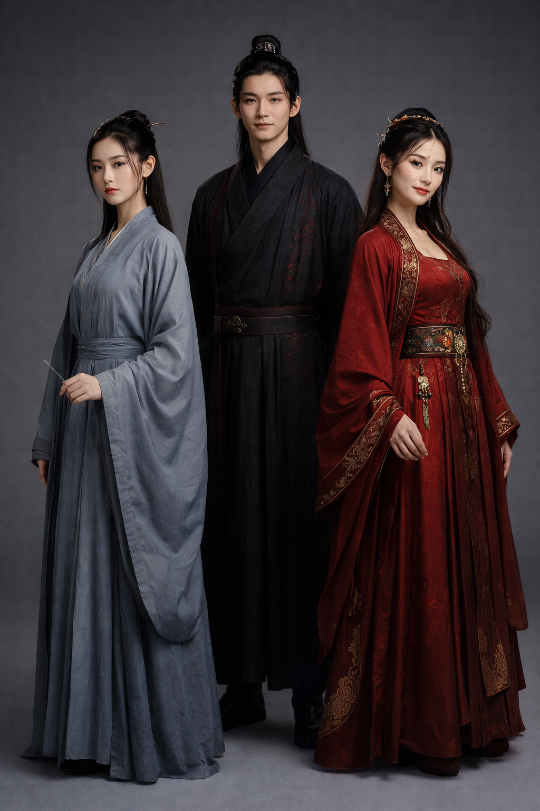

# 赤霞倚天录

**——暮霞未散，天下将明**

*一个隐世家族的后人，与一个被命运碾碎又重铸的少年，在倾覆的天下里，走出一条没有人走过的路。*

---

## 楔子

元至正十七年，秋。

应天府城墙上，一个说书人正在给守城的士兵们讲故事。

他讲的不是什么才子佳人、帝王将相，而是一个很多年前的旧事——

"话说南宋末年，有个奇人叫杨过。他是叛贼杨康的种，十岁在嘉兴街头偷馄饨，被赤练仙子李莫愁捡了回去。后来这小子考了状元、守了城、又让了城，被全天下骂了一百年的'叛贼'。"

"可你们猜怎么着？"说书人压低了声音，"他让出去那座城里的五千条人命，活了。五千人。他们的儿子、孙子、重孙子，现在还在这世上活着。"

一个年轻的士兵问："后来呢？那个杨过后来怎样了？"

"后来？后来他带着老婆孩子找了个没人知道的山谷，隐居了。他老婆就是赤练仙子李莫愁——对，就是那个曾经杀人如麻的女魔头。可你别说，那女人到了云州守城的时候，比谁都心善。百姓们都叫她'杨夫人'。"

"他们有后人吗？"

说书人嘿嘿一笑："有没有后人我不知道。但我听说——"

他的话被一阵马蹄声打断了。城墙下，一队骑兵正疾驰入城。为首的是一个穿铁甲的年轻人，面容温和，眼神却深不见底。

守城的士兵们立刻站直了身子。

"教主回来了！"

说书人探头往下看了一眼，缩了缩脖子，赶紧收起了惊堂木。

那个被叫做"教主"的年轻人叫张无忌。此刻他正率军从北方凯旋，身后是浩浩荡荡的明教大军。

没有人注意到，在城墙另一侧的暗处，一个灰蓝色衣衫的女子正静静地看着城下的车马。她的手指修长，指尖夹着一枚银针，在暮色中闪了一下，又暗了下去。

天边的最后一抹霞光还没有散。

---

## 第一章 武当山上的血

元至元四年，冬。武当山。

那一年张无忌十岁。

他后来回忆这一天的时候，记得的不是父亲张翠山的剑、不是母亲殷素素的泪，甚至不是满堂所谓"正派人士"逼问屠龙刀下落时的嘴脸。

他记得的是——冷。

不是天气的冷。是一种从骨头缝里往外渗的冷。那种冷在他看到父亲的剑刺入自己胸口的瞬间开始，在母亲的身体倒在父亲身边的瞬间达到极点，然后就再也没有消退过。

玄冥神掌的寒毒后来也侵入了他的身体，但那种毒的冷跟这种冷比起来，不过是小巫见大巫。

满堂的人都在看他。有人惋惜、有人冷漠、有人暗自庆幸——谢逊的下落没问出来，但至少张翠山这个"叛徒"死了，他的天鹰教妖女也死了。至于这个孩子——一个十岁的男孩，谁会在乎呢？

太师父张三丰从人群中走出来。百岁老人的手颤抖着，把他从父母的尸体旁扶起来。

张无忌没有哭。

他抬起头，用那双还沾着父母鲜血的眼睛，把在场的每一张脸都看了一遍。

那些脸以后都会出现在他的噩梦里。不是因为恐惧。是因为记忆。他要记住——这就是所谓的"正道"。这就是"侠义"。他的父亲为了不出卖义父的秘密自尽身亡，他的母亲为了追随丈夫饮剑殉情，而这些人只是站在旁边看着，有些人的眼睛里甚至带着——满意。

"太师父，"他说，"弟子记住了。"

张三丰低头看着这个孩子。他活了一百多年，见过无数人间惨剧，但这一刻他心中涌起的悲凉比以往任何一次都深。

不是为张翠山夫妇的死。是为这个孩子眼中的东西。

那不是仇恨。仇恨至少还有温度。那是一种比仇恨更冷、更深的东西——十岁的孩子，在三秒钟之内长大了。

---

下山的路上，张三丰带着张无忌，走得很慢。

老人一路沉默。他在想一件事——一件尘封了七十年的旧事。

那年他十三岁，还叫张君宝。从少林寺出逃后，在江南一带流浪。有一次重病倒在山路上，被一个三十来岁的男人救了。那男人把他带回了一座山谷，用草药和针灸救活了他。

那座山谷里住着一个小家族——一个姓杨的男人和他的妻子，还有两个年幼的孩子。男人长得清俊，说话和气，举手投足间有一种读书人的儒雅；他的妻子却冷得像一块冰，不爱说话，偶尔开口就是呛人，但她的银针手法出神入化，几针下去就把张君宝的高烧退了。

张君宝在那座山谷里养了两个月的伤。临走前，那个男人对他说了一句话：

"小兄弟，你的根骨极好，将来在武学上必有大成。但你记住——天底下最强的东西不是铁，不是石头，是水。水能穿石。你想想这个道理。"

七十年后，张三丰创出了太极拳法。以柔克刚，以水之道应万变之形。每当有人问他太极的精义从何而来，他只是微微一笑。

他从没忘记那座山谷。但那个姓杨的男人——杨过——早已不在人世了。

"无忌，"张三丰忽然开口，"你身中玄冥神掌的寒毒，寻常医者怕是解不了。"

张无忌点头。他已经知道了。

"我年轻时……认识一些人。"老人的声音带着遥远的回忆，"他们住在江南一座山谷里。那家的女主人擅长解毒之术。如果她的后人还在——"

他顿了顿，摇了摇头。

那已经是七十年前的事了。那座山谷如今在不在，还有没有人，他也不知道。

张三丰派了两个弟子南下寻找。一个月后，弟子回来了，两手空空。

"师父，我们找遍了皖南和浙西的山区，没有找到任何踪迹。"

张三丰叹了口气。

他不知道的是，那座山谷还在。山谷里的人还在。只是他们不想被人找到。

此刻，在那座四面环山的谷地深处，一个五十多岁的清瘦老人正坐在书院里读《资治通鉴》。他穿着灰布长衫，手不释卷，像一个书院的山长而非武林中人。

他叫杨守拙。杨过的第四代后人。这座山谷的主人。

书院的窗外传来一阵轻响——嗖、嗖、嗖——三声极细的破风声，然后是竹靶上"笃笃笃"三声闷响。

杨守拙抬头往窗外看了一眼。

练武场上，一个十来岁的女孩正收回手指。二十步外的靶心上，三根银针呈品字形排列，入靶三分。

那女孩身材纤细，面容清冷，穿一件灰蓝色的素衣。她的眉目像一幅还没画完的水墨——线条极利落，但颜色还没染上。

"暮霞。"杨守拙唤了一声。

女孩转过头来。

"三针都偏了半寸。靶心在这里，你扎的是这里。"杨守拙指了指。

女孩——李暮霞——低头看了看自己的手指，没有辩解。她重新取出三根银针，凝神片刻，手腕一抖——

嗖、嗖、嗖。

三针正中靶心。分毫不差。

杨守拙点了点头，继续看他的书。

李暮霞收回目光，看向谷口的方向。黄昏的余晖正从谷口涌进来，把整个山谷染成了一片赤红色——这是这座山谷每天傍晚都会出现的景象，也是"赤霞"之名的由来。

她不知道——此刻在千里之外的武当山上，一个与她年龄相仿的男孩正独自走在下山的路上，身体里藏着足以致命的寒毒，眼睛里藏着比寒毒更冷的东西。

他们的命运将在五年后交汇。

然后改变天下。

---

## 第二章 山路上的银针

元至正八年，秋。

李暮霞十三岁。

按照杨李家族的规矩，每个孩子到了十二三岁都要独自出谷历练一次。不许带随从，不许暴露家族身份，不许使用家族信物。目的只有一个——让你知道外面的世界是什么样子。

杨守拙给她的任务更具体一些："你去看看外面的武林在忙什么。尤其是跟屠龙刀有关的事。听就行了，不要介入。"

李暮霞出谷那天是个阴天。她背着一个小包袱，里面装着换洗衣物、银针、几瓶解毒药，还有一本家族的穴位手册。

她从小在山谷长大。山谷里有书院、有练武场、有药圃、有菜地。太祖杨过亲手种下的黄瓜传了近百年，一代比一代歪——这是全族的笑谈。她在书院里读经史兵法，在练武场上练赤霞剑法和银针术，在药圃里学太祖婆婆李莫愁传下来的毒理解毒之术。

她知道外面有一个"江湖"。但她从未见过。

走出谷口的那一刻，她回头看了一眼。赤霞未散，谷中的炊烟正袅袅升起。

她转身上路。

---

出谷后的第七天，她在一条山路上发现了一个人。

准确地说，是一个昏倒在路边的少年。

他大约十二岁，瘦得像根竹竿，面色青白，嘴唇发紫。身上的衣服又脏又旧，但布料质地不差——不像穷人家的孩子。他的右手紧紧攥着一个小布包，即使在昏迷中也没有松开。

李暮霞蹲下来，先检查了周围环境——没有埋伏的痕迹。然后她伸出手，两根手指搭上了少年的脉搏。

脉象极其混乱。一股寒气盘踞在经脉深处，像一条冬眠的毒蛇，缓慢而持续地侵蚀着他的五脏六腑。这是某种极厉害的阴寒内力留下的伤——不是普通的风寒，是有人对他下了狠手。

但同时，她也摸到了另一样东西。

这个少年的内力根基极其深厚。以他的年纪来说，这种内力修为简直不可思议——不像是自己练出来的，更像是某种奇遇带来的天赋加成。

李暮霞皱了皱眉。

她从包袱里取出银针，快速在他的几处穴位上连刺七针。这是家传的封穴手法——不能治本，但可以暂时把寒毒压下去。

第七针落下时，少年的眉头动了动。

他睁开了眼睛。

那双眼睛让李暮霞微微一怔。不是因为好看——虽然确实不难看——而是因为那双眼睛里的东西。

十二岁的少年，眼神不像少年。那里面有一种经过淬炼的沉着，像一块被反复烧过又冷却的铁——表面平静，内里滚烫。

少年看着面前的陌生女孩，本能地往后缩了一下。但他没有惊慌，也没有出声。他先扫了一眼四周的环境，确认了自己的位置和退路，然后才把目光收回来。

"你醒了。"李暮霞说。语气平淡，像在陈述一个事实。

"你是谁？"少年的声音沙哑。

"路过的。你身上有寒毒。我帮你压住了，大约能管三个月。"

少年低头看了看自己身上的银针，眼中闪过一丝讶异。他对穴位并非一无所知——在冰火岛上，义父谢逊教过他一些基本的经脉知识。这几针的位置极精准，每一针都恰好扎在寒毒流经的关键节点上。

"你的针法……很厉害。"

"还行。"

少年沉默了一会儿。

"谢谢。"他说。很简短，但很认真。

"不用谢。你叫什么？"

少年犹豫了一秒。这一秒里他做了一个判断——这个女孩不像是有恶意的人，但也不像是普通人。她的手法太专业了，她的眼神太冷静了，她蹲在一个陌生人身边的姿势太放松了——一个真正有戒心的人反而不会这么放松。她不怕他。

"张无忌。"

"张无忌。"李暮霞重复了一遍这个名字，没有任何表情变化。

她当然知道这个名字。武当张翠山之子，三年前父母在武当山上自尽，身中玄冥神掌，流落江湖。这些消息杨家的情报网早就收集过。

但她没有表露。

"你的寒毒很深。"她站起来，拍了拍膝盖上的灰土，"我只能帮你压住三个月。三个月后如果找不到解毒的办法——"

她没有说完。

张无忌接上了："我知道。我会死。"

他说"死"字的时候，语气平静得不像一个十二岁的孩子。像是在说"天要下雨"或者"今天没吃饭"一样的事情。

李暮霞看了他一眼。

她忽然想起太祖爷爷杨过的家训里有一句话："遇见比你预期更冷静的人，要么他是蠢到不知道害怕，要么他经历过比这更可怕的事。"

这个少年显然不蠢。

"你有地方去吗？"她问。

"有。"张无忌从地上站起来，动作有些吃力但不需要人扶，"我要去蝴蝶谷，找一个叫胡青牛的医生。"

"蝴蝶谷在南边，翻过这座山再走两天。"

"你知道路？"

"我知道很多路。"

这句话说完，两个少年对视了一眼。

张无忌注意到她的银针手法非同一般——那种精准度不是自学能达到的，是经过长年累月训练的结果。李暮霞注意到他的内力根基超乎寻常——一个十二岁的孩子，经脉中运行的内力强度比很多成年武者都高。

两个人都在心里记下了对方。

"走了。"李暮霞转身。

"你不跟我同路？"

"我不跟任何人同路。"

她走了几步，忽然停下来，从包袱里掏出一小包东西扔给他。

张无忌接住了。是一小包干粮和一瓶水。

"别饿死在路上。浪费我的银针。"

她说完就走了。身法极快，几个起落就消失在了山林间，像一只灰蓝色的鸟。

张无忌站在原地，看着她消失的方向。他低头看了看手中的干粮和水，又看了看身上那几根银针——它们已经自动退出了皮肤，说明封穴完成了。

他把银针收好。放进了贴身的口袋里。

很多年以后，他成了天下至尊的皇帝，身边有了无数谋臣武将、妃嫔宫人，拥有了这世上一个人能拥有的最大权力。但在他的寝宫最隐秘的抽屉里，始终放着几根旧银针。

那是他这一生中，第一次被一个陌生人毫无条件地帮助。

而那个灰蓝色衣衫的女孩，在当天晚上的日记中写下了一行字：

"路遇一中毒少年，内力深厚，眼神不像少年。记之。"

---

## 第三章 蝴蝶谷的两个月

元至正九年，春。蝴蝶谷。

张无忌找到了胡青牛。

这个被称为"蝶谷医仙"的怪人脾气比他的医术更出名——他只医明教中人，其他人一概不理。张无忌费了不少周折才让他松口，条件是张无忌必须帮他打下手，同时接受他的医术考验。

张无忌的学习能力让胡青牛刮目相看。他不仅记忆力惊人，更难得的是一种近乎本能的对人体的理解——仿佛他天生就知道经脉该怎么走、穴位该怎么通。

"你这小子，"胡青牛有一天捋着胡子说，"以你的资质，不学医是天大的浪费。"

"学。我什么都学。"张无忌回答。

他说这话的时候语气很平静，但眼睛里有一种胡青牛读不懂的东西——不是求知的热情，而是一种更实际的、近乎冷酷的需求：我必须掌握一切可能让我活下去的东西。

在蝴蝶谷的日子平淡而充实。白天学医，夜间自行运功对抗寒毒。寒毒被那个灰蓝女孩的银针压住了，但压制是有时限的，他能感觉到那股寒气正在慢慢苏醒，像一条冬眠将尽的蛇。

三个月的期限正在一天天逼近。

就在这时候，她又出现了。

---

那天傍晚，张无忌在蝴蝶谷外的山坡上采药。他蹲在一丛草药旁边，正辨认一株他不太确定的植物，身后忽然传来一个冷淡的声音：

"那是半夏，不是天南星。你看错了。"

张无忌没有回头。

"我知道你来了。"他说，"你的脚步声很轻，但风从你那个方向吹过来的时候，带了一股药草的味道。你身上常备解毒药，对吧？"

身后沉默了两秒。

"你的观察力比上次见面时进步了。"

张无忌转过身。

那个灰蓝色衣衫的女孩站在三步之外，背着一个比上次大了一些的包袱，面容一如既往地冷清。半年不见，她似乎长高了一点，但眼神没变——深潭一样的平静，冷得让人想往后退半步。

"你来这里做什么？"张无忌问。

"采药。蝴蝶谷周围的药材品种比别处丰富。"

这是真话，但不是全部的真话。李暮霞确实需要采药，但她选择在这个时间来蝴蝶谷，并非完全出于偶然。出谷历练的半年间，她已经走遍了大半个江南，听到了无数关于屠龙刀和武林纷争的消息。她把这些消息整理好，准备回谷报告。

蝴蝶谷是归途中的一站。至于碰上张无忌——她告诉自己这是巧合。

张无忌显然不这么看。他看着她的眼神带着一丝"我知道你在说谎但我不拆穿"的意味。

"你的寒毒怎么样了？"李暮霞问。

"还没死。"

"不是问你死没死。是问寒毒。"

"还在。胡先生也没有根治的办法。但你上次帮我压住了三个月，给了我足够的时间学到一些东西。"他顿了一下，"多谢。"

"谢过了。上次就谢过了。"

这段对话冷得像两块冰在互相碰撞。但张无忌注意到——她问他寒毒的时候，目光快速扫过了他的手腕和面色，做了一次无声的诊断。这个动作极其隐蔽，如果不是他在胡青牛这里学了半年的望诊之术，根本不会察觉。

她在关心他。用她自己的方式。

---

接下来的两个月，李暮霞留在了蝴蝶谷附近。

她说是为了采药。确实每天都能看到她在山间穿行，辨认草药、采集根茎，偶尔还会在溪边晒药材。但她同时也在跟张无忌交流——大多数时候是关于医药和毒理的讨论。

胡青牛对这个不知从哪冒出来的女孩非常警惕，但在看到她对毒理的精深了解后，态度从排斥变成了好奇，最终变成了一种不情不愿的欣赏。

"你这丫头，"胡青牛有一天说，"你的毒理知识不是从书上学的。是家传的。"

"我们家种地的。顺便研究一些草药。"李暮霞面不改色。

胡青牛哼了一声，不再追问。

张无忌也试过旁敲侧击地打听她的来历。

"你的银针手法不是一般的门派传承。你家到底什么来头？"

"一个种地的家族。"

"种地的家族？种地的人不需要会封穴、辨毒、在二十步外扎准靶心。"

"我们家的地比较特殊。虫子多。"

张无忌看着她一本正经胡说八道的样子，忽然笑了。

那是她第一次看到他笑。不是客气的笑、不是敷衍的笑，而是一种发自内心的、带着一丝狡黠的笑——像是在说"我知道你在撒谎，但我觉得你撒谎的样子挺有意思"。

那个笑让李暮霞心中一动。

不是被打动的那种"动"。是警觉的那种"动"。

她忽然想起父亲李承文教她看人的一句话："看一个人笑的时候，不要看他的嘴，看他的眼睛。嘴会骗人，眼睛不会。"

张无忌笑的时候，嘴角是温暖的，但眼睛里有一种比温暖更深的东西——是在计算。不是恶意的计算，但确实是在计算。他在判断她值不值得信任，在衡量她能给他带来什么，在试探她的底线在哪里。

这个人城府很深。他笑的时候是最危险的时候。

李暮霞在心里默默记下了这一笔。

---

两个月的时间说长不长，说短不短。

他们之间的交流始终保持着一种奇怪的距离——足够近，能互相学到东西；足够远，不会暴露各自的秘密。像两只在同一片水域觅食的鱼，偶尔擦身而过，但从不结伴。

李暮霞发现，张无忌不仅内力惊人，学什么都极快。胡青牛教他的医术他几乎过目不忘。更让她在意的是，他对"策略"有一种天然的敏感——不只是战术层面的，而是更深的、关于人心和博弈的那种。

有一次他们在讨论一种毒的解法时，张无忌说了一句让她印象深刻的话：

"毒和药的区别不在于东西本身，在于剂量和时机。权力也是一样——用对了是药，用错了是毒。"

十二岁的孩子说出这种话。

李暮霞又一次在心里做了标记。

而张无忌也在观察她。他发现这个"种地的家族"出来的女孩，不仅懂毒理、懂医术，还精通经史和兵法。有一次他无意间提到淝水之战，她随口补充了三个他不知道的战术细节——那些细节不是书上能找到的，更像是某种实战经验的总结。

"你家种的是什么地？"张无忌再次问。

"黄瓜。"她说，"长得歪歪扭扭的那种。"

---

两个月后，胡青牛被一群武林中人杀害。蝴蝶谷发生了变故，张无忌不得不离开。

李暮霞也要返回山谷了。

临别在一条溪流旁边。春天的溪水清得能看见底下的石头。蝴蝶从花丛中飞过，在阳光下像一片片碎金。

李暮霞从包袱里取出一个小布包，递给他。

张无忌打开一看：一小包银针，和一张手绘的穴位图。图上标注了详细的封穴手法和运针路线，字迹工整得不像出自一个十三岁女孩之手。

"你按这个图自己封穴，每三个月一次，可以压住寒毒。"她说，"不是根治。但能让你活得更久一些。"

张无忌看着那张穴位图。每一个穴位的标注都精确到毫厘，每一条经脉的走向都画得清清楚楚。这不是随手画的——这是她花了很多时间、很多心思才完成的东西。

"如果你死了，"她补了一句，"这些银针就浪费了。别死。"

张无忌把穴位图折好，小心地放进怀里。

"你呢？你要去哪儿？"

"回家。我们家的黄瓜该浇水了。"

她转身走了。走了几步，又停了一下——像是想说什么，但最终没有说。

张无忌站在溪边，看着她的身影消失在林间。溪水从他脚边流过，带走了几片落花。

他低头看了看怀里的穴位图和银针。然后他把银针也收进了贴身的口袋里——跟上次的那几根放在一起。

多年以后，李暮霞才知道，她画那张穴位图的时候，字迹比她写给家族的任何一份报告都工整。

她自己也说不清为什么。

---

## 第四章 密室

元至正十一年。

张无忌十三岁。李暮霞十六岁。

他们之间隔了两年。两年间各自经历了很多事。

张无忌被朱长龄设计推下悬崖，坠入昆仑山腹的一个密室。在那个与世隔绝的黑暗中，他发现了白猿腹中的《九阳真经》全本。

那几个月，他在密室中独自修炼九阳神功。

黑暗。寒冷。孤独。唯一的光源是偶尔从岩缝中透进来的一线天光。他靠石壁上生长的苔藓和地下水活着，每天的生活只有两件事：运功修炼，然后继续运功修炼。

九阳神功的内力循着经脉运行，一遍又一遍地冲刷着玄冥神掌留下的寒毒。像一条滚烫的河流灌进冰冻的河道——冰一层层地碎裂、融化，河水一寸寸地前推。

痛苦是难以想象的。寒毒被逼出来的过程如同千万根针同时扎入皮肉。张无忌咬着牙，一声不吭。

他在黑暗中默念着一句话：这个世界只尊重力量。

数月后，九阳神功大成。寒毒尽去。他的体内仿佛装了一个太阳——内力浑厚至极，温热、绵长、生生不息。

他觉得自己像是被重新铸造了一遍。从一块含有杂质的铁矿石，变成了一块纯钢。

但他还没有找到出去的路。

---

就在他试图寻找密室出口的时候，另一个人从另一个方向找了进来。

那天，他正在一处岩壁前研究裂缝的走向，身后忽然传来极轻极细的脚步声。脚步声轻得几乎听不见——如果不是九阳神功大幅提升了他的感知力，他绝对不会发现。

他没有转身。他把内力凝于双掌，做好了战斗准备。

脚步声在五步外停了下来。

然后一个他既熟悉又陌生的声音响起：

"是你。"

张无忌转过身。

火把的光照亮了一张冷清的脸。灰蓝色的衣衫，修长的手指，深潭一样的眼睛——两年不见，那个女孩长成了一个少女，但眼神没变。还是那种让人想往后退半步的冷静。

"银针姑娘。"张无忌说。

"你还没死。"李暮霞说，"不错。"

两人对视了三秒。

然后张无忌笑了。

"你怎么找到这里的？"

"我在昆仑山区发现了异常痕迹——有人从悬崖坠落，但崖底没有尸体。我追踪痕迹，找到了密室的另一个入口。"她顿了一下，"你的寒毒呢？"

"没了。"

"没了？"李暮霞的眉头微微一动——这是她极少有的表情变化，"怎么做到的？"

张无忌指了指身后的岩壁。上面刻满了密密麻麻的文字和运功图形。

"九阳真经。全本。就在这间密室里。"

李暮霞走上前，借着火把的光看那些石壁上的文字。她看得很仔细，一行一行地扫过去，眉头越皱越紧——不是不懂，而是她在把这些内容跟自己所学的东西做比较。

"这是……"她轻声自语，"跟古墓派的运气法门有几分相似。但路径完全不同。更纯粹。更极端。"

张无忌不动声色地观察着她的反应。她居然能看懂九阳真经的部分内容——这说明她的武学根基远比她表现出来的更深。

"你说你家是种地的。"他说。

"是种地的。"她没有回头，"但我们家也读书。武功算课外活动。"

---

密室很大。不止一个石室。

当李暮霞和张无忌深入探索时，他们发现了一间更隐秘的石室。石壁上刻着另一套完全不同的武学——乾坤大挪移心法。

这是明教的至高武学。传说只有历代教主才有资格修炼。

张无忌看着石壁上的文字，眼中闪过一道锐利的光。李暮霞注意到了——那道光不是贪婪，而是一种更复杂的东西。像一个棋手看到了关键的一步棋。

他要学。不是为了变强——九阳神功已经让他足够强了。而是因为他需要一个"身份"。

一个被明教认可的身份。

李暮霞看着他开始对照石壁修炼乾坤大挪移。第一层，两个时辰。第二层，四个时辰。第三层开始吃力了，但他咬着牙继续。他的九阳内力像一个巨大的容器，源源不断地为乾坤大挪移的运转提供动力。

第四层。第五层。第六层。

到第六层的时候，密室中的空气都在颤抖。张无忌盘膝而坐，周身的气流肉眼可见地旋转。李暮霞退到了石室的角落，用银针封住自己的几处穴位以抵御那股排山倒海的气劲。

第六层修成。

张无忌睁开眼睛，吐出一口浊气。他的眼神跟修炼前不一样了——更沉、更深，仿佛多了一层看不透的幕。

"还有第七层。"他说。

李暮霞走上前，仔细看了石壁上第七层的描述。她看了很久。

"不要练。"

"为什么？"

"第七层的心法有一个'反转'——把前六层积蓄的内力全部逆运。如果成功，威力翻倍。如果失败——"她指了指石壁上一行小字，"'心魔反噬，轻则走火入魔，重则经脉尽断。'"

"我有九阳护体。"

"九阳护体不是万能的。"李暮霞的声音陡然冷了一个度——这一刻她不像一个十六岁的少女，像一个看过太多生死的老将，"你现在六层的实力已经足够让你在天下前十中占一席之地。练第七层的收益是从第一变成'绝对第一'，代价是五成以上的概率走火入魔。你自己算这笔账。"

张无忌沉默了。

他盯着石壁上第七层的文字，像是在做一道极难的算术题。

过了很久，他收回了目光。

"你说得对。六层够了。"

这个决定不是因为害怕。李暮霞看得出来——他不怕死。他的决定完全基于利弊分析：如果他死在这里，那之前所有的积累都白费了。他还有更大的事要做。

而正是在这一刻，两个人之间产生了一种微妙的默契——不是信任，还远远谈不上信任，但是一种"我认可你的判断力"的默认。

李暮霞拿出一把银针，帮他疏通修炼后淤滞的几处经脉。张无忌闭着眼睛，任由银针在穴位间游走。这是一种极其脆弱的姿态——把自己的经脉完全暴露给另一个人。

但他没有犹豫。

他已经判断过了：这个女孩有一万种方法在他修炼时杀死他，但她没有。她不但没有，还在帮他。这意味着——至少在目前——她不是敌人。

银针拔出的时候，李暮霞的手指微微有一丝颤抖。

极轻微。轻微到她自己都没有察觉。但那一丝颤抖——日后回想——是她在整个故事里唯一一次失去完全的控制。

因为她在劝他不练第七层的时候，心中有一瞬间闪过的念头不是"利弊分析"，而是一个更简单、更原始的念头——

她不想他死。

---

## 第五章 光明顶

从密室出来后，他们发现天已经变了。

昆仑山区的冰雪中隐约传来金铁交击的声音。李暮霞展开轻功攀上一处高崖，极目远眺——光明顶方向火光冲天，旌旗密布。

"六大门派围攻明教光明顶。"她回来后对张无忌说，语气平静得像在报告天气。

"什么时候的事？"

"从兵力部署来看，至少已经准备了两三个月。"她从包袱里取出一卷纸，展开——上面是一幅详细的兵力分布图，六大门派的人数、领军人物、攻击方向都标注得清清楚楚。

张无忌看着那张图，沉默了很久。

"你的'种地的家族'，连这种情报都种得出来？"

"我们家的地种得比较广。"

这一次张无忌没有笑。他盯着那张图，眼中的光芒在火把的映照下明灭不定。

"你要去光明顶。"李暮霞说。不是疑问，是陈述。

"你看得出来？"

"你刚才在密室里修炼乾坤大挪移的时候，不是为了变强。你是为了一个'名义'。乾坤大挪移是明教的至高武学，你练了它，就等于拿到了一张进入明教核心的通行证。"

张无忌静静地看着她。

"你想让明教认你。"她继续说，"你不是要去'救'明教——你是要去'收'明教。对吗？"

火把"噼啪"响了一声。

"你很危险。"张无忌说。

"这话我还想对你说。"

沉默了几秒。

"你帮我？"张无忌问。

"我不介入。"李暮霞的回答干脆利落，"我的家族有规矩——不入江湖门派，不争武林名号。我可以给你情报，但不会出现在任何人面前。"

"那就够了。"

---

两人在后山的山洞中度过了一夜。那一夜他们没有睡，而是在制定计划。

李暮霞把六大门派的情报一条一条地摊开：峨眉的灭绝师太最难缠，她带的人最多、杀心最重；武当不会真心围攻——张三丰不在，武当弟子对明教的仇恨远没有峨眉深；少林实力最强但态度最保守；华山、昆仑、崆峒三派各有心思。

"你出去后的第一步不是打赢他们。"她说，"是让明教的人先认你。你需要一个亮相的方式——既能展现实力，又能收买人心。"

"具体呢？"

"先用五成力。"

"五成？"

"你的实力是碾压级的，但你不能一上来就碾压。你要让明教的人觉得你是在为他们拼命——一个年轻人，冒着生命危险替他们挡刀。这样他们才会感激你、信任你、追随你。如果你一出手就把所有人都打趴下，他们心里生出来的不是信任，是恐惧。"

张无忌想了想，点了点头。

"第二步呢？"

"等他们被你的'五成力'打动了，你再逐步加力。从五成到七成到全力——让他们看到你的成长，而不是你的碾压。人们愿意追随一个'在他们面前成长起来的英雄'，不愿追随一个'从天而降的怪物'。"

"第三步？"

"收心。打完之后不杀降，不逼宫。给所有人退路。'大度'是最好的武器。"

张无忌凝视着她。

"你到底是什么人？"

"一个种黄瓜的。"

---

光明顶之战。

后来的江湖传说中，这一战被描述成"天降神人，力挽狂澜"——一个年轻人从天而降，以一人之力击退六大门派，拯救了明教。

真相当然没有那么简单。

张无忌确实出手了。他以乾坤大挪移化解了六大门派的第一波攻击，在明教众人绝望的时候挺身而出。他"惊险万分"地挡住了灭绝师太的倚天剑——实际上留了余力——又在关键时刻用九阳内力震退了几名一流高手的合击。

明教的人看到的是：一个年轻人浑身是血、死战不退，为了保护他们把命豁出去了。

没有人注意到——在战场的暗处，有人在做另一些事。

一个灰蓝色的身影在山崖间穿行，无声无息。两名试图从暗处偷袭张无忌的高手忽然同时捂住了肩膀——银针封穴，准确到令人发指。他们不知道发生了什么，只觉得半边身子忽然不能动了。

那个灰蓝色的身影找到了杨逍。

杨逍——明教光明左使。骄傲、有才、自视甚高，此刻正因为战局的崩溃而暴怒。

"前面那个年轻人叫张无忌。"李暮霞的声音从暗处传来，冷得像冬天的铁。

杨逍猛然转身，但只看到了一片阴影。

"你是谁？"

"你如果想让明教活过今天，就听他的。"

杨逍的手按上了腰间的长剑。但他的直觉告诉他——这个声音的主人不是敌人。而且她说的没有错。此刻明教群龙无首，再不找一个核心人物来统一指挥，今天就是明教的末日。

他做了一个决定。

---

战后的光明顶一片狼藉。

六大门派撤退了。明教保住了——至少暂时保住了。

被保住的明教上下都在看着同一个人：张无忌。

杨逍第一个站出来："张公子武功盖世，救我明教于危难之中。在下提议——请张公子出任明教第三十四代教主。"

附议声此起彼伏。有真心的，有见风使舵的，也有持保留态度但不好当面反对的。

张无忌的表情是恰到好处的推辞和感动。他说了些"我年纪尚幼、资历尚浅"之类的话，被众人再三劝进后才"勉为其难"地答应。

李暮霞在远处的山崖上看着这一切。夜色中看不清她的表情，但她心中对这个年轻人的评估又更新了一层。

他的演技比她预想的更好。

战斗结束后一个时辰，她离开了光明顶。走之前，她做了两件事：

第一，在暗处看了张无忌很久。他正在处理战后事宜——安抚伤员、调配物资、跟各路首领谈话。他的笑容温和真诚，让每一个跟他说话的人都觉得被重视。

她看了很久才走。

第二，她在张无忌的包袱里留了三页信。

信纸不大，但字迹极工整——比她写给家族的任何一份报告都工整得多。

第一页：明教内部势力分析。杨逍、殷天正、韦一笑、五散人——每个人的性格、诉求、可利用点和风险点，写得清清楚楚。

第二页：外部局势评估。六大门派围攻失败后的可能动向，蒙元朝廷的态度，各地义军的分布。

第三页：只有三行字。

"朱元璋此人，有大才，有大志，有大野心。你不控制他，他必控制你。从现在起就要动手。不能晚。"

张无忌在当天夜里发现了这三页信。他把信读了三遍，然后放在烛火上一页一页地烧。

火光映在他的脸上，明暗不定。

他坐在火光前很久。

"这个女人，"他终于低声说，"比我想象的危险得多。也比我想象的有用得多。"

---

## 第六章 暮客

元至正十二年。

光明顶之后半年。张无忌已经是明教教主。

他用了六个月的时间初步整合了明教内部——拉拢杨逍、稳住殷天正、安抚五散人、压住了几次小规模的内部叛乱。三页信上的建议他几乎全部采纳了，而且每一条都被验证是准确的。

尤其是关于朱元璋的警告。

朱元璋——明教濠州分坛的核心人物，本名朱重八。出身贫寒，当过乞丐、做过和尚，后来加入明教，凭借极其出色的才干迅速崛起。他忠心？他恭顺？他对张无忌毕恭毕敬？

以上全是假象。

张无忌在接管明教后的第一个月就注意到，朱元璋在暗中笼络中层将领。手段极其隐蔽——不是直接拉拢，而是通过帮忙、送礼、解决困难来建立私人忠诚网络。如果不是那三页信提前预警，他可能要晚三个月才能发现。

三个月的差距，足以让一切失控。

他必须找到写信的人。

---

一个江南小镇。雨天。茶馆。

张无忌换了一身普通的青衫，坐在靠窗的位置。他面前放着一壶茶，茶已经凉了。

对面坐着李暮霞。

她还是那身灰蓝色的素衣，头发简单地挽着，不施粉黛。她的手指环着茶杯，姿态放松——但张无忌注意到她选的位置背靠墙壁，面对门口，视野能覆盖整个茶馆。

这是一个习惯性防御意识极强的人。

"找了你三个月。"张无忌开门见山。

"你找到了我，说明我让你找到了。"

"你为什么让我找到？"

"因为你比我预想的更好。三页信你全用了，而且用得比我预想的更精准。说明你不只是武功高——你有做大事的脑子。"

张无忌看着她。窗外的雨水顺着屋檐流下来，在青石板上溅起细碎的水花。

"我需要一个谋士。"他说。

"你凭什么觉得我不会背叛你？"

"因为你如果想背叛我，在光明顶就动手了。你有一万次机会杀我或者出卖我，但你没有。这说明你有你自己的立场——这个立场跟帮我是一致的。至少目前是。"

"'至少目前是'——这句话很聪明。"

雨下得更大了。茶馆里除了他们就只有一个打瞌睡的老头和一个擦桌子的伙计。

"我有三个条件。"李暮霞说。

"说。"

"第一，我不暴露身份。你可以叫我'暮客'。明教上下只知道教主身边有一个幕僚，不知道是谁。"

"可以。"

"第二，我保留随时离开的权利。如果我判断你的方向出了问题，我走。不需要你同意。"

"……可以。"

"第三——"

她的眼睛直视着他。这一刻她的目光锋利得像一柄出鞘的剑。

"如果有一天你变了——变成了你曾经鄙视的那种人——我会把你所有的布局告诉你的敌人。全部。"

茶馆里安静了。

连雨声都仿佛停了一瞬。

张无忌看着她的眼睛，看了很久。

然后他笑了。那种笑跟他面对明教部下时的温和完全不同——更冷、更深，像是在说"好，我接受你的棋"。

"好。成交。"

从那天起，张无忌的身边多了一个谁也看不见的影子。

"暮客"。

---

接下来的一年，明教发生了脱胎换骨的变化。

表面上，所有的改革都是"教主英明"的结果。但只有极少数人知道——那些改革方案的真正设计者，是一个从不在公开场合出现的灰蓝衣衫女子。

"三分法"——把明教从一个江湖帮派变成一个军政组织。武力核心由杨逍统领，负责教内事务和特殊任务；军事主力由五行旗改编的正规军担当；行政体系则是全新建立的——粮草司、情报司、占领区治理。

行政体系是李暮霞的手笔。

她从各地招募了一批落第秀才和寒门读书人——这些人有才学但没有出路，正是最容易被收编的力量。她给他们一个明确的承诺：明教不搞武林帮派那一套，我们要建立一个像样的政权。

五行旗的改编也是她主导的。锐金旗改为先锋军，巨木旗管后勤，洪水旗建水军，烈火旗研究火器，厚土旗负责防御工事。每一面旗帜不再是一个松散的门派分支，而是一个有明确职能的军事单位。

对朱元璋的压制策略更是精妙。

李暮霞把它叫做"金丝笼"——给权不给兵，给事不给人。朱元璋被任命为"征东先锋"，职位听起来很高，但实际兵权被限制在一个固定范围内。同时给他堆了大量的行政事务——管理占领区的税收、民政、治安。

"让他忙到没时间搞政治。"李暮霞对张无忌说。

"万一他忙里偷闲呢？"

"所以我在他身边安了三个人。一个是他的文书，一个是他的马夫，还有一个是他最近新纳的妾。"

张无忌沉默了两秒。

"你真狠。"

"我姓李。我太祖婆婆是赤练仙子。狠，是家传的。"

这是她第一次在张无忌面前提及自己的家族渊源。

张无忌的眼神变了。

"赤练仙子……李莫愁？"

"是。她是我太祖婆婆。我太祖爷爷叫杨过。"

很长的沉默。

张无忌忽然想起了太师父张三丰说过的话——那个年轻时救过他的姓杨的男人和他擅长解毒的妻子。

一切都连起来了。

---

## 第七章 赵敏

元至正十四年。

她来了。

李暮霞第一次见到赵敏是在一份情报报告中——"蒙古汝阳王之女敏敏特穆尔，汉名赵敏，统领蒙古武林势力，在绿柳山庄设下机关，试图一举剿灭中原武林。"

李暮霞读完报告，写了一行批注："此女有大智。是对手。"

半年后她见到了真人。

赵敏"叛逃"到明教的那天，李暮霞站在暗处，隔着半个院子看着这个蒙古郡主跪在张无忌面前。

赵敏穿着一身红色的汉式衣裙——刻意的。这个选择本身就说明了很多问题：她不是临时起意投奔的，她是有计划地"投降"。换汉服是向明教上下释放信号：我已经做好了断绝蒙古身份的准备。

漂亮。明艳照人。五官带有蒙古血统的立体感——高颧骨、深邃眼窝、饱满嘴唇。笑起来灿烂如阳光。

她跪在那里的姿态也恰到好处——既有郡主的骄傲，又有投诚者的谦卑。这种分寸感不是天生的，是算计出来的。

"她不是因为一个男人放弃一切。"李暮霞在当天晚上的简报中写道，"她在对冲风险。蒙元气数将尽——她看得出来。与其做一个亡国的公主，不如做一个新朝的功臣。张无忌是她的筹码，不是她的全部。"

张无忌看了简报，没有反驳。

他做了一个决定：留赵敏，但不让她进核心决策层。利用她的蒙古情报网——那是明教目前最缺的东西。

"你信得过她？"李暮霞问。

"信不信的——"张无忌笑了笑，那种深不见底的笑，"不重要。重要的是她现在没有别的选择了。一个没有选择的盟友，比一个有选择的朋友可靠。"

"那如果她以后有了别的选择呢？"

"到时候再说。"

---

赵敏加入明教的前三个月，她和李暮霞之间的关系是一种微妙的隔空角力。

赵敏知道张无忌身边有一个幕僚。她不知道是谁，但她看得出痕迹——那些精确的行政改革方案、那些完美的情报分析、那些对朱元璋滴水不漏的压制策略——不是张无忌一个人能想出来的。

"张教主身边有高人。"赵敏对自己说。

她开始寻找"暮客"的踪迹。

而李暮霞也在观察赵敏。观察她的情报质量、她的忠诚度、她的底线。

第一次正面交锋发生在一次军事会议上。

赵敏提出北上方案——趁蒙古内部混乱，直接进攻大都。理由充分、逻辑清晰。

李暮霞当场反驳。

当然不是以"暮客"的身份。她化装成一个普通的幕僚——灰布衣衫、低眉顺目——坐在会议室的角落里。

"此方案有一个致命的漏洞。"她站起来说，声音不高但每个字都清清楚楚，"直取大都看似最快，但我们的后勤线拉得太长。一旦蒙古骑兵从侧翼包抄断我粮道，前线大军就是一支死军。"

赵敏抬起头，直直地看向这个灰衣女子。

那一眼看了很久。

然后赵敏笑了——那种"我终于找到你了"的笑。

"你是'暮客'。"她说。

会议室里一片寂静。所有人的目光都集中到了那个角落。

李暮霞面色不变。

"军事方案的讨论不需要讨论身份。你的方案有漏洞，我指出来了。你可以反驳，但请用数据。"

赵敏看着她，目光复杂。然后她说了一句让在场所有人都意外的话：

"张教主，你身边有这样的人，难怪你能走到今天。"

---

当天夜里，赵敏睡不着。她一个人坐在帐中饮酒，脑子里翻来覆去地想着那个灰衣女子的面孔。

那张面孔冷清得像一潭深水。不是赵敏习惯面对的那种冷——蒙古贵族的冷是傲慢的、居高临下的；这个女子的冷不是傲慢，是一种"我把所有的情绪都锁起来了"的冷。

像是……有什么东西被压在了很深很深的地方。

赵敏的直觉告诉她——那个女人对张无忌不只是谋士和主公的关系。

但她说不清那个"不只是"具体是什么。

也是在那天夜里，李暮霞在简陋的幕僚房中，借着烛光写当天的记录。写完后她放下了笔，从怀里取出一枚银针。

那是她第一次救张无忌时用的银针。

她把银针放在烛光前，慢慢地擦拭。银针在火光中闪着微弱的冷光。

这个习惯她保持了很多年。没有任何人知道。

---

## 第八章 赤霞出谷

元至正十五年。

杨李家族存世近百年以来，最大的一次危机和最大的一次转折，同时到来。

元军在围剿南方义军的过程中，一支骑兵闯入了杨家山谷附近的镇子。烧杀掳掠，鸡犬不宁。逃出来的百姓涌向山谷方向——他们不知道山谷里住着什么人，只知道那个方向有山可以躲。

杨守拙站在谷口的竹林里，看着远处升起的浓烟。

他面临的选择——和八十年前他的太祖杨过面临的选择——一模一样。

关门，还是开门。

关门是安全的。杨家山谷隐蔽了近百年，谷口有暗哨和机关，外围有巡逻。只要把门一关，元军连门都找不到。

但门外的百姓会死。

杨守拙回到祠堂。

祠堂正中挂着杨过和李莫愁的画像。画是第二代杨慈请人画的，已经有些褪色了，但还看得清——画中的男人清隽温和，女人清冷绝美。两人并肩而立，背后是一片赤红的晚霞。

画像下方的供桌上摆着两样祭品：一碗馄饨，一支银簪。

馄饨是杨过和李莫愁相遇的信物——那年在嘉兴，一碗馄饨开始了一切。银簪是杨过用冰魄银针磨成的——那是他们的定情之物。

两侧的墙壁上刻着家训。

杨守拙的目光落在第三条上：

**"遇乱世，保家人为先，保百姓为次，保名声最末。"**

他闭上了眼睛。

---

一个时辰后，杨守拙召集了全族。

两百多人站在祠堂前的空地上。老人、壮年、少年、孩子。有人一脸紧张，有人面色凝重，有人还不太明白发生了什么。

杨守拙站在祠堂的台阶上。灰布长衫，手里拿着一本《资治通鉴》——他已经看了几十年的那本。

他没有客套。

"太祖当年让城，被人骂了一百年。但城中五千人活了下来。"

他的声音不高，但在寂静中清晰可闻。

"我今日若关起山谷的门，不管外面的百姓，太祖在天之灵会不会骂我？"

没有人说话。

"他老人家的家训说得明白：保家人为先，保百姓为次，保名声最末。如今家人安全，百姓在受苦。所以——"

他把手中的书合上了。

"出谷。"

---

杨李家族出谷。

这是这个隐世家族近百年来第一次以集体力量介入外部世界。

他们的参战方式不是冲锋陷阵。两百多人，论武功没有一个是顶尖高手，论人数比不上任何一支正规军。但他们有别人没有的东西。

文脉的子弟做情报和后勤——他们读了几十年的经史兵法，管理能力远超一般人。武脉的精锐组成小队保护平民——他们不跟元军正面交锋，而是在夜间袭扰、在山林间伏击、在百姓转移时提供掩护。

银针是他们的标志。每次行动后，现场总会留下几根冰魄银针——精准地扎在敌人的穴位上，不致命但让人完全丧失战斗力。

"赤霞客"——江南民间开始流传这个名字。没人知道他们是谁，只知道有一群身手不凡的人在暗中保护百姓。他们来去如风，行事低调，从不留名。

消息传到了明教。

张无忌在战场上捡起了一根银针——冰魄银针。

他把银针放在指间，看了很久。

然后他去找了张三丰。

百岁老人听完张无忌的描述，沉默了。

"无忌，"他终于开口了，声音里带着七十年的回忆，"你去找那些人。如果我猜得不错，他们姓杨。"

---

## 第九章 入谷

张无忌找到了杨家山谷。

谷口的竹林在夕阳下泛着金色的光。一条窄路从竹林间蜿蜒而入，路边有看不见的暗哨和机关——但今天它们没有启动。

因为杨守拙就站在谷口等他。

灰布长衫，手里还是那本《资治通鉴》。他看上去就像一个乡间的书院山长，而非一个延续了近百年的隐世家族的族长。

"张教主。"杨守拙微微拱手，"老朽等你很久了。"

"杨前辈知道我会来？"

"暮霞说你会来的。"

张无忌跟着杨守拙走进了山谷。

谷中的一切都超出了他的预期。他以为会看到一个简陋的山寨或隐居的小村落。但他看到的是——一个完整的、运转有序的小型社会。

书院、练武场、药圃、菜地、民居。溪流穿谷而过，两侧是竹林和梯田。炊烟袅袅升起，远处传来孩子的读书声。

"这就是杨过前辈留下的……"张无忌低声说。

"太祖什么都留了。"杨守拙带他走向祠堂，"留了房子、留了规矩、留了武功、留了书。还留了一地歪歪扭扭的黄瓜。"

祠堂。

杨过和李莫愁的画像在烛光中静静地注视着来者。横匾上四个字——"赤霞未散"。

张无忌站在画像前，看了很久。

他看到了两个人——一个清隽的男人和一个清冷的女人。男人的眼神温和而深邃，像是在看很远的地方。女人的嘴角微微向下抿着，但眉目间有一种说不清的、被岁月打磨过的柔和。

"太祖年轻时候不是这个样子。"杨守拙站在他身旁，"这是他们晚年的画像。太祖婆婆年轻时杀人如麻——你大概也听说过。"

"赤练仙子。"

"是。她恨了一个男人二十年，杀了无数无辜的人。后来遇到了太祖。太祖教她放下恨，她教太祖拿起剑。两个被全天下嫌弃的人，互相撑起了一小片天。"

杨守拙指了指画像下面的供桌。

"馄饨是他们相遇的信物。银簪是太祖用冰魄银针磨成的定情之物。"

张无忌看着那碗馄饨和那支银簪，心中涌起了一种复杂的感情。他想起了自己的父母——张翠山和殷素素——他们也是在江湖中相爱的人。他们的结局比杨过和李莫愁惨得多。

"杨前辈，"他收回目光，"太师父告诉我，我与贵族有缘。"

杨守拙点了点头。

"太祖当年救了一个少年。那少年叫张君宝。"

"太师父。"

"是。你师祖——太祖告诉他'水能穿石'。七十年后，张真人创出了太极拳法。"

杨守拙走到祠堂的侧墙前，那里刻着另一段文字。

"太祖留过一句口信：'如果有一天，有个值得的人问起，你就把这话告诉他。如果没有——就让它烂在肚子里。'"

"什么话？"

"'刀剑合璧，内有乾坤。'"

张无忌的瞳孔微微缩了一下。

屠龙刀。倚天剑。

整个武林为这两件兵器争夺了几十年，死了无数人。而真正的秘密——一直在这座与世隔绝的山谷里安安静静地等着。

---

那天晚上，杨守拙设了一桌简单的晚餐。没有珍馐美味，只有山谷里自产的蔬菜、溪里的鱼、还有一碗——馄饨。

张无忌吃着馄饨，心想：太祖杨过的故事，就是从一碗馄饨开始的。

李暮霞也在。

她坐在杨守拙身旁，灰蓝衣衫，面容冷淡如常。但张无忌注意到，在这座山谷里——在她的家中——她的眼神比在外面柔了一点点。像冰面下有一线极细的暖流。

杨守拙给了张无忌三个回答。

第一：杨家不加入明教。"我们不入任何门派。这是太祖的规矩。"

第二：刀剑合璧的秘密。"刀中有《武穆遗书》，剑中有《九阴真经》和《降龙十八掌》心法。都是郭靖大侠殉城前铸进去的。"

第三：杨家的实力。"两百多人。十来个能打的，二十几个能出谋划策的，剩下的是普通百姓。我们能做的不多。但能做的——都会做到最好。"

张无忌记住了每一个字。

临走前，他在菜地旁边停了一下。那片菜地种着各种蔬菜，其中有一畦黄瓜——果然歪歪扭扭的，没有一根是直的。

"太祖种的？"

"太祖种了第一株。"杨守拙说，"种子传了近百年了。一代比一代歪。"

张无忌看着那些歪黄瓜，忽然笑了。

"我觉得……这是我今天看到的最了不起的东西。"

杨守拙看了他一眼，也笑了。

"太祖会喜欢听你这么说。"

---

## 第十章 刀剑与峨眉

屠龙刀和倚天剑的秘密，在接下来的一年中被逐步揭开。

这是一个漫长而曲折的过程。两件兵器辗转流传了几十年，中间经过了无数次的争夺、失窃、隐匿、重现。最终它们被汇聚在一起——在一个所有人都没有预料到的时刻。

刀剑合璧。内有乾坤。

刀中藏着《武穆遗书》——岳飞的兵法。那是一部百战百胜的军事宝典，每一页都凝结着一代名将的心血。

剑中藏着《九阴真经》全本和《降龙十八掌》心法——两门绝世武学的完整传承。

郭靖用自己和全家的命，把翻盘的希望藏进了两件兵器里。他相信后人——总有一天，会有人把它们找出来，用它们驱逐蒙元、恢复中华。

张无忌坐在军帐中，面前摊着《武穆遗书》。杨守拙派来了家族中精通兵法的晚辈协助解读——杨家几代人传承的实战经验和岳飞的理论体系形成了互补。

但《武穆遗书》出世的同时，另一场风暴也来了。

---

灭绝师太。

峨眉派掌门——这个名号在本作的世界中有一层特殊的底色。

峨眉派不是郭襄创建的——郭襄随全家殉于襄阳。创派的是郭靖的女弟子风陵——一个在城破前被黄蓉秘密送出的年轻女子。她亲眼目睹了襄阳的沦陷和恩师全家的殉难，在峨眉山出家后创建了以"国殇"为底色的新门派。

灭绝师太是这个门派的第三代传人。她继承的不只是武功，更是一种深入骨髓的偏执——对蒙元的恨、对"叛徒"的恨、对一切她认为"不够坚定"的人的恨。

而在灭绝师太的仇恨清单上，有一个名字——杨过。

"让城叛贼。"这是灭绝师太对杨过的评价。在她看来，郭靖全家死守襄阳、以身殉国，那才叫忠义。杨过把城让给蒙古人？不管救了多少人——那就是叛。

当她得知杨过的后人还存在于世时，多年的旧恨如火山爆发。

她命令周芷若——她最信任的弟子——在合适的时机刺杀杨家后人。

---

一个月夜。

周芷若手持倚天剑，找到了一个杨家子弟。

那人不是李暮霞，是族中另一个年轻女子，负责在外联络事务。她察觉到了杀意，但没有逃跑。

月光下，倚天剑寒光凛凛。

"你是峨眉的人。"杨家女子说，声音平静。

"我奉师命，来取杨家人的命。"周芷若的手在颤——她自己都不确定自己能不能动手。灭绝师太的命令像一座大山压在她心上，但她的本性并不嗜杀。

"你手里那把剑，"杨家女子没有拔剑，没有取银针，只是静静地说，"是郭靖大侠殉城前铸造的。"

"我知道。"

"郭大侠和我太祖杨过，是同一个时代的人。郭大侠守襄阳，太祖守另一座城。郭大侠选择殉城，太祖选择让城。两种选择，一个目的——让更多的人活下来。"

周芷若的手停了。

"你现在拿着郭大侠铸的剑，来杀郭大侠同袍的后人。"杨家女子看着她的眼睛，"你觉得郭大侠在天之灵会怎么想？"

沉默。

月光很亮。倚天剑的剑身映出了周芷若的脸——苍白、犹豫、痛苦。

"真正的懦弱不是让城，"杨家女子最后说，"是不敢承认自己错了。"

倚天剑缓缓放下了。

周芷若的手指松开了剑柄。她蹲在地上，双手捂着脸，无声地哭了很久。

那一夜之后，周芷若再没有提起刺杀的任务。这成了她脱离灭绝师太思想控制的转折点——虽然这条路她还要走很久。

---

## 第十一章 烧信

元至正十六年。

北伐前夜。明教已经准备了三年。

三年间，明教从一个松散的江湖帮派变成了一个横跨数省的军政组织。五行旗改编的军队经过了实战磨砺，行政体系运转顺畅，后勤保障基本到位。

但在大军北上之前，张无忌还有一件事必须处理。

朱元璋。

---

"金丝笼"策略用了三年，效果显著。朱元璋的兵权被限制在一个可控范围内，他的私人忠诚网络被不断渗透和稀释，他的时间被行政事务占据了绝大部分。

但朱元璋是一个不会被彻底驯服的人。他太聪明了——聪明到知道自己被限制了，聪明到知道限制来自谁，但也聪明到知道反抗的时机尚未到来。

所以他等。

一个真正危险的人不会在劣势时反抗，他会把自己的牙齿藏起来，让你以为他已经没有牙了。然后在你最需要他的时候——比如北伐前夜——再把牙齿亮出来。

李暮霞的情报网在三天前截获了一批信件。

信是朱元璋写的。不是亲笔——他从不留亲笔——而是通过一个叫王六的马夫口述、另一个叫钱三的文书代笔。内容是联络明教中层将领，试探他们对"教主独断"的不满，暗示如果有一天需要"纠正路线"，朱将军会"与诸位共商大计"。

措辞极其隐晦。每一句都可以解释为"关心同僚"。但李暮霞一眼就看穿了——这是兵谏的前奏。

她把信件整理好，连夜送到了张无忌面前。

"他动了。"她说。

张无忌坐在军帐中，烛火把他的影子投在帐壁上，巨大而安静。他把那些信一封一封地翻看，速度不快不慢，像在读一本并不急着看完的书。

读完之后，他把信放在桌上，沉默了很久。

李暮霞站在帐门旁边。她没有催他。这种时刻，催是没有用的。他在想的不是"怎么处理朱元璋"——这个问题的答案他可能在三年前就想好了。他在想的是"用哪种方式处理"。

不同的方式通向不同的未来。

"你的建议？"他终于开口。

"杀。"李暮霞的回答只有一个字。

张无忌抬眼看她。

"杀了他，把信公布，以谋反罪论处。他的嫡系将领全部清洗，换上我们的人。干净利落。"

"然后呢？"

"然后北伐少一个隐患。"

"也少一个能打仗的人。"张无忌的语气平淡，像在讨论晚饭吃什么，"朱元璋有三个别人替代不了的优点：他极善于治理占领区，他在民间的声望仅次于我，他手下的兵最能打硬仗。北伐在即，我杀了他，他的嫡系将领就算不哗变，士气也至少折损三成。"

李暮霞沉默了。

她知道他说的是对的。这也正是朱元璋选在此刻动手的原因——他赌张无忌不敢在北伐前夜杀他。

"你打算怎么办？"

张无忌站起来。他走到帐门口，掀开帐帘看了一眼外面的夜色。军营中篝火点点，远处有巡逻兵的脚步声，再远处是秦淮河沉默的流水。

"把朱元璋叫来。"

---

半个时辰后。

朱元璋走进了张无忌的军帐。

他穿着一身朴素的灰色袍子——朱元璋永远穿灰色，这是他的伪装色。出身赤贫的人穿灰色显得谦卑，而谦卑是最好的盔甲。

他的面相不算好看。国字脸，颧骨高耸，下巴突出，额头宽阔。但他的眼睛极亮——那种亮不是光彩照人的亮，是暗处盯着猎物的鹰的亮。

此刻那双眼睛里带着恰到好处的恭敬。

"教主深夜召臣，不知有何吩咐？"

张无忌坐在桌后。桌上只有一盏油灯和一沓信纸。

"坐。"

朱元璋坐下了。他的目光在桌面上扫了一下——只一下，极快，但足以让他看清那沓信纸的大小和厚度。他的瞳孔微微缩了一下。

然后他恢复了那副恭顺的面孔。

"元璋，"张无忌把那沓信推到了他面前，"你自己看。"

朱元璋拿起了信。

他翻了两页之后，手指微微僵了一瞬。但也仅仅是一瞬。他继续翻，一页一页，神色从容，像一个被老师叫起来读自己作文的学生——略有几分尴尬，但还不至于慌张。

看完之后，他把信放回桌上。

然后他做了一件张无忌没有预料到的事——他笑了。

不是苦笑、不是尬笑、不是讨好的笑，而是一种"行，你赢了"的坦然的笑。

"教主的情报网，臣佩服。"

"你不否认？"

"有什么好否认的？信是我让人写的。"朱元璋的声音平静了下来，平静得近乎诚恳，"教主，臣不说假话——至少这一次不说。我确实在试探那些人。不是想造反——至少不是现在。我想知道，如果有一天我需要退路，退路在哪里。"

张无忌看着他。

帐中安静了很久。油灯的火苗偶尔跳动一下，两个人的影子在帐壁上忽大忽小。

"你知道我可以杀你。"张无忌说。

"知道。"

"你也知道我杀你的代价——北伐至少推迟半年。"

"所以我赌您不会杀。"朱元璋的嘴角还挂着那丝坦然的笑，"教主，我知道自己几斤几两。论武功，您一个指头就能要我的命。论权谋，您身边有比我更厉害的人。我朱元璋这辈子最拿得出手的，不过是'打仗'和'治民'这两样东西。这两样东西，您现在用得着。"

"所以？"

"所以我值得活。"

这话说得极大胆。大胆到帐外如果有人听见，第二天朱元璋的人头就该挂在旗杆上了。但他说得自然，像是在陈述一个显而易见的事实。

张无忌没有说话。他伸手拿起桌上那沓信，然后做了一个让朱元璋始料未及的动作——

他把信放在了油灯上。

火舌舔上信纸的边缘，纸张迅速卷曲、发黄、燃烧。火光照亮了两个人的脸。朱元璋的脸上第一次出现了真正的惊讶——不是装的，是真的。

那沓信烧了大约一炷香的时间。火焰从旺盛到微弱，最后只剩下一堆黑色的灰烬。

张无忌用手指拨了拨灰烬，确认每一页都烧透了。

然后他抬起头，看着朱元璋。

"信没了。"他说，语气平淡得像在说今天天气不错，"这件事也没了。我不会提第二次。"

朱元璋的手在膝盖上攥紧了。

他经历过很多事——从乞丐到和尚到叛军将领，他被饿过、打过、骗过、出卖过。他以为自己已经对所有的手段都免疫了。

但他没有预料到这一招。

如果张无忌用这些信威胁他，他不怕——被人拿着把柄，那就想办法把把柄抢回来，或者让拿把柄的人消失。这是他熟悉的规则。

如果张无忌杀他，他也不怕——死就死了，他这条命本来就是从乱坟岗里捡回来的。

但张无忌把信烧了。

把柄没了。证据没了。他朱元璋欠下了一条命——一条不知道什么时候会被讨回去的命。这比任何威胁都可怕。因为一个被你拿着把柄的人，永远在算计怎么翻盘；但一个被你放过一命的人，至少有一半的时间在想——我该怎么报恩。

恩比仇难还。

朱元璋慢慢站起来。他直直地看着张无忌的眼睛，看了很久。

然后他弯下了腰。不是跪——他这辈子除了爹娘没跪过任何人。但他深深地鞠了一躬。

"教主，臣记住了。"

他转身走出了军帐。夜风吹进来，卷走了桌上的几片灰烬。

---

帐中只剩下张无忌一个人。

他坐回椅子上，闭上了眼睛。帐外有虫鸣和远处的流水声。

过了一会儿，帐帘的角落微微动了一下。李暮霞从暗处走了出来。

她全程都在帐中。在帐帘后面，在朱元璋的视线之外。

"你都听到了。"张无忌没有睁开眼睛。

"听到了。"

"你觉得他信了？"

"不好说。但他至少会安分三年。三年足够打完北伐了。"

张无忌睁开眼睛。他看向帐壁上自己的影子——那个影子在烛光中显得比他本人更高大，也更模糊。

"你刚才建议杀。"

"是。杀是最干净的办法。但你选了更高明的。"李暮霞的语气没有一丝波动，"烧信。把一个对手变成一个欠你人情的人。你把威胁变成了投资。"

"你不赞同？"

"我赞同结果。不赞同手段。"

"为什么？"

"因为你这一招只能用一次。"李暮霞的目光变得锐利，"下一次他再犯，你就没有信可以烧了。到时候你要么杀他，要么……你杀不了他了。因为他今天的一鞠躬会传出去，传到每一个将领的耳朵里。到时候'张教主连朱将军都能饶'就变成了一个枷锁——谁都觉得自己也能被饶。"

张无忌沉默了。

"所以？"

"所以你需要在北伐期间给他足够多的功劳，让他忙得没时间想别的。打完仗之后封他一个足够高的位置——高到他不敢再往上爬，因为再往上就只有你坐的那把椅子了。"

"左丞相？"

"左丞相。"

张无忌看着她。烛光在她的脸上投下浅淡的光影。灰蓝色的衣衫，冷清的面容，说出的每一句话都像一枚钉子——精准、有力、毫不留情。

"你比我想的更可怕。"他说。

"这话你说过了。"

"每次你都变得更可怕一点。"

"那你怎么还在这里？"

"因为你可怕的方向是对的。至少目前是。"

李暮霞看着他。那双深潭一样的眼睛里闪过了一丝极淡的、只有她自己能感觉到的东西——不是温柔，更近似一种确认。确认他还是那个值得辅佐的人。

"至少目前是。"她重复了一遍这四个字，然后转身走向帐门。

走到帐门口时她停了一下。

"誓师大会的文书我已经拟好了。明天你过目。"

"好。"

帐帘落下。她消失在夜色中。

张无忌独自坐在帐中，面前是一堆已经冷却的灰烬。他伸手拨了拨那些灰烬——黑色的碎屑在指间碎裂，像极了某种被碾碎又放手的东西。

他忽然想起一个人。不是朱元璋，不是李暮霞，而是一个已经死了很久的人。

他的父亲张翠山。

父亲当年在武当山上，面对满堂逼问，选择了自尽——他宁死也不出卖义父谢逊的秘密。那是一种决绝的、不计后果的选择。

而他刚才做的事——烧信、施恩、布局——是一种完全相反的选择。冷静的、精密的、把每一个人都当成棋子来使用的选择。

父亲会怎么看他？

这个念头在他脑海中一闪而过，然后被他按了下去。

他不能想这些。帝王不能有这种念头。

张无忌站起来，走到帐门口。夜风拂面，带着深秋的凉意。军营中的篝火快要熄了，远处的秦淮河在月光下像一条银色的蛇。

明天就是誓师大会。后天大军北上。

他深吸一口气，转身回到帐中，拿起了李暮霞拟的文书。

---

誓师大会在应天府城外的校场举行。

三万大军列阵。五行旗改编的各部分列两翼，朱元璋的征东军居中，杨逍统领的护教精锐在后。旗帜如林，铁甲如山。

张无忌站在点将台上。他穿了一身玄色铁甲——这是他极少穿甲的时刻之一。他更习惯青衫便服，因为那样看起来"温和""亲切""不像一个杀人的人"。但今天他需要另一种形象。

铁甲在阳光下泛着冷光。他的面容在铠甲的衬托下显得格外年轻——才二十岁出头的脸，但眼睛里的东西比任何一个老将都深。

他开口了。

声音不高，但校场中三万人听得清清楚楚——这是九阳内力送出的声音，穿透了风声和旗帜的猎猎作响。

"兄弟们。"

两个字。极简单，极有力。

"八十年了。"

他没有铺垫，没有客套，直入正题。

"八十年前，襄阳城破。郭靖大侠全家殉城。他用全家的命，给我们留了一句话——'号令天下，莫敢不从'。"

"这句话不是让我们去当什么天下至尊。这句话是说——总有一天，会有人拿起刀，把蒙古人赶走。"

"我不知道我是不是那个人。但我知道一件事——我身后这三万人，是。"

校场上安静了一瞬。然后声浪从人群中涌起来，一波一波，像海潮。

"驱逐鞑虏！恢复中华！"

朱元璋站在队列的正前方。他的面容恭肃，嘴唇微微动着——在喊着同样的口号。但他的眼睛在看点将台上那个人。

那个昨夜烧了他的信、放了他一条命的人。

"这小子，"朱元璋在心中默默地想，"将来不是一个好伺候的主子。"

但他弯下腰，弯得比任何人都深。

---

大军北上那天，天还没亮。

李暮霞站在应天府城南的一座小山丘上。她没有随军。她留在后方——管理后勤补给、维持情报网络运转、协调各地占领区的行政事务。

这是她自己的选择。

"你不跟去？"张无忌在出发前问过她。

"前方有你打仗，我去添什么乱？后方的粮草比你的剑重要。"

她说的是实话。一支大军能走多远，不取决于前锋的刀有多快，取决于后面的粮车能跟多久。李暮霞花了三年建立的后勤体系是这支军队的命脉——她比任何一个将军都清楚每一座粮仓的位置、每一条补给线的容量、每一个转运站的人手配置。

她走不了。

大军开拔。三万人的行军纵队绵延数里。张无忌骑在一匹黑马上，铁甲在晨曦中闪着暗光。他从山丘下经过时，抬头看了一眼。

山丘上有一个灰蓝色的身影。

两人隔着人海对视了一眼。距离太远，看不清彼此的表情。但张无忌微微点了一下头。

李暮霞没有任何回应。她站在那里，像一棵长在山顶上的松树，被风吹着却纹丝不动。

大军走了很久。蹄声和脚步声渐渐远去，扬起的尘土慢慢落定。

李暮霞在山丘上站到了日上三竿。

然后她转身下山，回到了她那间简陋的幕僚房。桌上摊着各地送来的情报和补给清单。她坐下来，拿起笔，开始处理第一份公文。

笔尖落在纸上的那一刻，她的手顿了一下。

只一下。

然后她继续写。字迹工整，一如既往。

---

## 第十二章 淮河

元至正十七年，春。

北伐的第一个难题来得比预想的更早。

明教大军渡过长江后，沿着运河一路北上，连克滁州、泗州，势如破竹。蒙古的地方守军大多闻风而逃——他们早就知道这一天会来，能跑的在半年前就跑了，剩下的不过是些刺史县令，城门一开就跪了。

但到了淮河，情况变了。

淮河是蒙古帝国的南方防线。河北岸驻扎着三万蒙古骑兵，由蒙古最后的名将扩廓帖木儿——汉人叫他王保保——统率。这个人是赵敏的兄长，也是蒙元朝廷在中原最后的依仗。

明教先锋军——锐金旗改编的五千轻骑——在渡河后遭到了蒙古铁骑的突袭。

那是一个雾蒙蒙的清晨。淮河北岸的平原上雾气弥漫，能见度不过三十步。先锋军刚刚完成渡河，阵型还没展开，蒙古骑兵就从雾中杀了出来。

马蹄声先到。闷雷一样的马蹄声从四面八方涌来，震得地面都在发抖。然后是箭雨——蒙古人的骑射是天下一绝，他们可以在全速奔驰中射出精准的弓箭，而且不是一波，是一波接一波，绵绵不绝。

先锋军的指挥官是一个叫庄铮的年轻将领。他在箭雨落下的第一瞬间就下了正确的命令——结阵。但已经晚了。步兵结阵需要时间，而蒙古骑兵的速度不给你时间。

第一次冲击就冲碎了先锋军的左翼。一千多人在一炷香的时间内死伤过半。庄铮带着残部退到了一处土丘后面，靠着地形勉强挡住了第二波冲击，但他知道——第三波来了他就挡不住了。

消息传到了中军。

张无忌骑马赶到前线时，看到的是一片血色的雾。雾气里混着血腥味和马粪的臭味，残兵从各个方向涌来，有的拖着断了的旗杆，有的抱着同伴的尸体，有的什么都没拿——因为手已经没了。

他没有犹豫。

九阳内力催发到极致，铁甲外面裹了一层肉眼几乎看不见的气劲。他单骑冲入了蒙古骑兵的阵中。

乾坤大挪移在战场上的效果是恐怖的。蒙古骑兵的马匹在冲到他十步之内时纷纷人立而起——不是受惊，是被一股无形的力量推了回去。紧接着，一道劲气从张无忌掌心射出，像一堵无形的墙，把冲在最前面的十几骑齐齐扫倒。

蒙古万夫长——一个身高六尺、膀大腰圆的汉子——挺矛直取张无忌。张无忌不闪不避，伸手握住矛杆，九阳内力灌入。万夫长只觉一股烫得像岩浆的力量从矛杆传来，整条手臂瞬间失去知觉，人从马背上被震飞出去，落地时已经昏死。

一个万夫长的阵亡在蒙古军中引起了短暂的混乱。张无忌趁势收拢残兵，在土丘上建立了临时防线。

蒙古骑兵退了。

但张无忌知道——他们会回来。

---

当天夜里，军帐中灯火通明。

张无忌面前摊着一张淮河沿岸的地形图。地图上用红色标注了蒙古骑兵的活动范围——几乎覆盖了整个淮河北岸的平原。

问题很明显：平原是骑兵的天下。明教的步兵在平原上跟蒙古铁骑正面硬刚，等于送死。

"我们不能在平原上跟他们打。"朱元璋说。他站在地图旁边，手指点着几个位置，"但我们也不能退回淮河以南。退了就前功尽弃。"

杨逍在旁边冷笑："那朱将军的意思是？"

"我没有意思。我只是说问题。"朱元璋的语气不卑不亢，"解决问题是教主的事。"

张无忌没有说话。他的目光在地图上移动，一寸一寸地扫过每一条河流、每一座山丘、每一片树林。

他在等一个人。

帐帘掀开了。一个信使走进来，递上一封信。

信是从应天府送来的。没有署名，没有落款，字迹极工整——工整到让张无忌一看就知道是谁写的。

信只有一页纸。

上面画了一幅图。图的左边是淮河，右边是蒙古骑兵的活动范围。在两者之间，密密麻麻地标注了一连串小圆圈——每个圆圈之间相隔大约二十里，圆圈与圆圈之间用虚线相连。

图的下方只有一行字：

**"杨过的笨办法。每隔二十里建据点，壕沟拒马相连。骑兵的优势是速度，把速度拿掉，他们就是步兵。"**

张无忌看着那张图，看了很久。

然后他把图放在了地形图旁边，开始在图上一个一个地标注据点的位置。

"传令，"他说，"全军就地扎营。明天开始挖壕沟。"

---

据点连锁战法。

这是一个极其笨拙、极其耗时、但极其有效的战术。

原理很简单：在淮河北岸的平原上，每隔二十里修建一个小型据点。据点不大——能容纳一百到两百名士兵就够了。据点与据点之间用壕沟和拒马相连，形成一道道半人高的障碍线。

蒙古骑兵的优势在于速度和冲击力。但壕沟不怕速度——马跑得再快也跳不过三丈宽的壕沟。拒马不怕冲击——三排削尖的木桩插在地上，战马一头撞上去就是个死。

骑兵一旦减速，就不再是骑兵了。

修建据点的过程漫长而艰苦。三万大军变成了三万民工。白天挖壕沟、削木桩、垒土墙，夜里轮班站岗、防备蒙古骑兵的夜袭。每天都有人受伤——不是战斗受伤，是劳动受伤。手磨破了、肩膀扭了、脚被铁锹砸了。

蒙古人当然不会坐视不理。

王保保派出小股骑兵反复骚扰，试图在据点完工之前将其摧毁。但张无忌早有准备——他把朱元璋的征东军放在了最外层，专门应对骚扰。朱元璋的兵最能打硬仗，这一点他没有看走眼。

一个月。两个月。三个月。

据点一个接一个地建起来。壕沟一条接一条地连通。拒马一排接一排地竖起来。

淮河北岸的平原上，慢慢长出了一张巨大的网。

王保保站在远处的山丘上，看着那张网一天天变大。他的脸色越来越凝重。

"这不像是武林人的打法。"他对身边的副将说。

"那像什么？"

"像一个读了很多兵书的人的打法。"王保保的目光深沉，"这个人懂蒙古骑兵的弱点。不是从书上读来的那种懂，是打过仗的那种懂。"

他不知道的是，那张图上标注的据点间距——二十里——恰好是八十年前杨过在抗蒙战争中总结出的经验数据。骑兵从全速到停止需要的减速距离，加上步兵从据点出击到接敌的反应距离，两者之和约等于二十里。

这是一个死人的智慧。通过一个隐世的家族传了近百年，又通过一个灰蓝色衣衫的女子送到了前线。

---

三个月后，明教大军发起了淮河北岸的总攻。

蒙古骑兵撞上了据点连锁体系，就像一群狼冲进了铁丝网。他们的速度被壕沟切碎，他们的冲击被拒马瓦解，他们的队形在一个个据点之间被分割成零散的小股。

然后明教的步兵从据点中涌出来。

步兵对骑兵，在开阔平原上是送死。但在壕沟和拒马的夹缝中，步兵的短刀和长矛比骑兵的弯刀更管用——因为马动不了了。

淮河之战持续了七天。七天里蒙古骑兵发起了十一次冲锋，每一次都被据点体系粉碎。第七天，王保保率残部向北撤退。

他走的时候回头看了一眼那片布满壕沟和据点的平原。

"这一仗输得不冤。"他说。

---

## 第十三章 灭绝与代价

淮河之战后，明教大军势如破竹，连下中原数城。蒙古的防线像一面被锤子反复敲打的薄冰，一块一块地碎裂。

但战争从来不只是胜利。

战争是代价。

---

灭绝师太死在一个无名的渡口。

那天是北伐的第五个月。明教的一支偏师在河南境内渡河时遭遇了蒙古骑兵的伏击。领军的是明教的一个旗主——一个四十来岁的壮汉，久经沙场，但在蒙古骑兵的包围中还是寡不敌众。

消息传到了附近的峨眉派营地。

灭绝师太此时已经不再是三年前的那个灭绝师太了。北伐开始后，峨眉派以独立阵营的身份加入了联军。灭绝不受张无忌的指挥，也不听任何人的调遣——她只认一件事：杀蒙古人。

三十年前她的师父在蒙古人手里死了。更早之前，峨眉的创派祖师风陵在襄阳城破的那一夜失去了一切。这个门派的血液里流淌着八十年的国仇。

"杀蒙古人"是灭绝师太一生的使命，也是她唯一不会犹豫的事。

她带了二十名峨眉弟子赶到了渡口。

蒙古骑兵有三百余骑。灭绝师太手持倚天剑，从侧翼杀入。倚天剑的寒光在阳光下划出一道又一道银色的弧线，所过之处，蒙古骑兵的刀枪纷纷断裂——倚天剑削铁如泥，这是郭靖殉城前铸进去的品质。

她杀了四十七个蒙古兵。这是后来清点战场时数出来的数字。

第四十八个蒙古兵射出的箭正中她的左肩。她没有停。第四十九个蒙古兵的弯刀砍在她的腰间。她还是没有停。倚天剑继续挥舞，每一剑都带着一种不管不顾的、近乎疯狂的凌厉。

直到第五十一个蒙古兵的长矛刺穿了她的腹部。

灭绝师太跪了下去。

倚天剑插在了地上，剑身还在微微颤动。她的双手撑着地面，血从腰间和腹部流出来，在泥土中洇开，像一朵不规则的红花。

她的目光越过了战场，越过了尸体和散落的兵器，落在了远处。

远处，一面旗帜在风中猎猎作响。旗帜是红色的，上面绣着一个"明"字。

明教的旗帜。

她一辈子骂明教是邪教。她一辈子看不起那些"不走正道"的人——张无忌、杨逍、韦一笑，一个比一个不入她的眼。

但此刻，在她生命的最后几息，她看着那面旗帜，心中涌起了一种说不清的东西。

不是认同。不是后悔。更像是一种——困惑。

这些她唾骂了一辈子的"邪教"中人，正在做她一辈子想做的事：驱逐蒙元，恢复中华。而她，一个"正道"的掌门人，此刻正跪在血泊中，跟他们并肩作战。

她的嘴唇动了动。

"也许……杨过他……"

没有说完。

灭绝师太的身体向前倒下。倚天剑立在她身旁，寒光不减。

---

消息传到应天府，传到李暮霞面前，是三天后的事。

信使送来的不是正式战报——灭绝师太的阵亡没有被写进战报里，因为她不是明教的人。信使带来的是一封私信，是周芷若写的。

周芷若的字迹很乱。不是她写不好字，是她的手在抖。

信很短：

> "师父战死于渡口。临终前似有所悟，但未能说完。倚天剑暂由弟子保管。师父一生偏执，但死得堂正。请转告杨家后人——师父也许错怪了太祖杨过。她没有来得及说出口，但弟子替她说了。"

李暮霞看完了信。

她把信折好，放进了抽屉里。然后她坐在桌前，沉默了很久。

灭绝师太。一个她从来没有见过面的人。一个恨了她的家族一辈子的人。一个在生命的最后一刻可能终于明白了什么、但来不及说出口的人。

她拿起笔，给周芷若回了一封短信：

> "令师虽偏执，其志未偏。八十年国仇，她用命来还了。余无可指摘。倚天剑留在峨眉——这是郭大侠的遗物，当由郭大侠的传人保管。"

写完后她又加了一句：

> "你师父最后那句话，不必替她说完。有些话，说不完才是最好的。"

---

同一天的傍晚，另一封信送到了杨李山谷。

杨守拙在祠堂里读完了信。

信是李暮霞写的，报告了北伐的最新进展。信末附了一行小字：

> "族中阵亡者：杨铮（武脉，年二十三），李慎（文脉情报员，年三十一），杨霞（武脉，年二十六）。"

三个名字。三个人。

杨守拙把信放在了供桌上。供桌上还摆着那碗馄饨和那支银簪——像八十年来的每一天一样。

他对着杨过和李莫愁的画像站了很久。

画中的男人依然清隽温和，画中的女人依然清冷绝美。他们静静地看着画外的后人，仿佛在说：我们当年也经历过这些。

"太祖，"杨守拙的声音很低，"出谷的代价来了。"

他从祠堂走出来时，天已经完全黑了。院子里有人在等——是阵亡者的家人。一个年轻的女子抱着一个不到三岁的孩子，站在月光下，脸上没有表情。没有表情比痛哭更让人心碎。

杨守拙走过去，在她面前站定。

"杨铮是好孩子。"他说。

年轻女子没有说话。她只是把孩子抱得更紧了一些。

月光很冷。

---

## 第十四章 大都之约

元至正十八年，冬。

中原的战事已经基本结束。

据点连锁战法像一把慢刀，一寸一寸地切碎了蒙古骑兵的空间。王保保率残部退到了黄河以北。蒙古在中原经营了近百年的统治，像一座被白蚁蛀空的老房子，终于轰然倒塌了。

明教大军的前锋已经到了大都城外。

大都——元朝的首都，蒙古帝国在中原的心脏。城高四丈，墙厚三尺，蒙古禁军五万。城中还有几十万百姓——汉人、蒙古人、色目人混居。

张无忌面临最后的选择。

强攻，还是谈判。

---

军帐中，所有人都在等他的决定。

朱元璋主张强攻："蒙古人已经是秋后的蚂蚱了，打进去就是了。五万禁军？不过是困兽。我们的兵力是他们的三倍。"

杨逍也赞同强攻，但理由不同："教主，明教受蒙古人压迫了百年。今天不打进去，怎么对得起那些死在蒙古人手里的弟兄？"

赵敏没有发言。她坐在角落里，手指绞着衣角——她的兄长王保保还在城中。

张无忌看向帐中唯一一个不在场的人留下的东西——一封信。

那封信是李暮霞在三天前送来的。她仍然留在应天府，距离大都千里之遥，但她的信总是在最关键的时刻到达。

信上只有三句话：

**"强攻大都，至少牺牲一万人。城中几十万百姓生死难测。打下来容易，收拾残局难。"**

**"你入城谈判。带赵敏。元顺帝已经没有退路了——给他一条退路，他就会走。"**

**"两天之内你没出来，我们攻城。不等第三天。"**

张无忌把信折好，放进怀里。

"我入城。"他说。

帐中一片哗然。

朱元璋第一个站出来反对："教主！亲身入敌营？万一——"

"万一什么？"张无忌笑了。那种笑——温和、深不见底，让人看不清底下藏着什么。"元璋，你觉得大都城里有谁能留住我？"

这话说得平淡，但帐中所有人都沉默了。

是啊——九阳神功大成、乾坤大挪移第六层、太极拳剑、天下第一的内力修为——大都城里五万禁军加上所有蒙古高手一起上，也留不住张无忌。

他不是去送死。他是去收网。

"带赵敏。"张无忌看向角落里的赵敏。

赵敏抬起头。她的眼中有泪光，但她很快把泪光收了回去。

"我跟你去。"她说。

---

大都城门在一个冬天的清晨缓缓打开。

张无忌穿着一身素色长袍——不是铁甲，不是战袍，是一件普通的读书人穿的长衫。这是他刻意的选择：他不是来攻城的，他是来谈判的。

赵敏走在他身旁。她穿了一身蒙古式的长裙——这是她离开蒙古后第一次穿蒙古服饰。她的步伐稳定，面容平静，但张无忌注意到她的手指微微颤抖。

他没有去握她的手。不是在这个时候。

城门洞里很暗。他们的脚步声在石板上回响，像某种古老的鼓点。

元顺帝在皇宫的大殿里等他们。

---

大殿金碧辉煌，但已经显出颓败。天花板上的彩绘有些剥落了，柱子上的漆也在起皮。像一个曾经富贵的老人，衣裳虽然还华丽，但已经遮不住骨头里的虚弱。

元顺帝坐在龙椅上。

他比张无忌想象的更——老。不是年纪的老，是一种被掏空了的老。他才四十出头，但脸上的疲惫像是六十岁的人。他的眼睛没有光——不是愤怒、不是恐惧，甚至不是绝望，只是一种深入骨髓的疲倦。

一个帝国坐在他身上太久了，把他压成了一具空壳。

"张教主。"元顺帝的声音出奇地平静，"朕等你很久了。"

张无忌在丹陛下站定。他没有跪。赵敏站在他身旁，低着头——她不敢看龙椅上的人。那个人曾经是她效忠的君主，是她父亲誓死追随的天子。

"陛下，"张无忌开口了，"天命已变。我今日来，不是要杀您。是要请您离开。"

元顺帝的嘴角微微动了一下。像是在笑，又像是在叹息。

"离开？离开去哪里？"

"回蒙古草原。大漠是您的故乡。中原不是。"

沉默了很久。

大殿里安静得能听见风从殿门外吹进来的声音。冬天的风很冷，穿过金碧辉煌的殿堂，像穿过一座空坟。

"你知道朕为什么等你吗？"元顺帝忽然说。

"请陛下赐教。"

"因为朕知道你会来。"元顺帝的声音里有了一丝说不清的东西——像是释然，又像是苦涩，"你不是那种会屠城的人。如果你是，朕今天就该在城头上跟你拼命。但你不是。"

他站了起来。

"中原不是蒙古人的故乡。这一点，朕比谁都清楚。"他的目光扫过大殿，扫过那些剥落的彩绘和起皮的漆柱，"我们在这里坐了近百年，但始终是客人。客人待得再久，也不是主人。"

他从龙椅旁取下一块玉玺——传国玉玺。那块玉玺在灯火中泛着温润的光，沉甸甸的，像一座微缩的山。

"拿去吧。"

他把玉玺放在了丹陛的边缘。

张无忌没有立刻去拿。他看着元顺帝，看了很久。

"陛下要带多少人走？"

"宗室。还有愿意走的人。"

"需要多少时间？"

"三天。"

"五天。"张无忌说，"五天足够您把该带的人和东西都带走。大都城中的百姓——汉人、蒙古人、色目人——一律不动。我会下令全军入城后军纪从严，扰民者斩。"

元顺帝的眼中闪过了一丝微光——那是在这个疲惫的空壳中，最后一点帝王的尊严。

"张教主，你是一个——"他停顿了一下，"比朕想象的更好的人。"

"陛下过奖了。"张无忌弯了弯腰——不是跪，是一个晚辈对长辈的礼，"中原百姓受苦了八十年。以后不会了。"

---

五天后，元顺帝率蒙古宗室北退。

车队从大都的北门缓缓驶出，绵延数里。马车、骆驼、牛车，装满了宗室的家眷和随从的行李。蒙古铁骑在车队两侧护行，盔甲在冬日的阳光下闪着冷光——但那冷光不再是凌厉的杀气，而是一种落寞的余晖。

赵敏站在城门上，看着车队远去。

冬天的风很大。她的蒙古长裙被风吹得猎猎作响。车队越来越小，越来越远，最终消失在北方天际线的尽头，只留下地面上两道深深的车辙。

那两道车辙从大都城门一直延伸到天边。像两条伤疤。

赵敏的眼泪无声地流了下来。

不是悲伤。不完全是。她的泪水里有太多东西——愧疚、释然、不舍、疼痛，还有一种连她自己都说不清的、深入骨髓的断裂感。

她帮助推翻了自己的族人。她提供的每一份情报都意味着蒙古人的又一次失败。她用自己的智慧和勇气，帮助一个汉人推翻了蒙古人在中原的统治。

这是她自己选择的路。她不后悔。但"不后悔"和"不痛"是两回事。

一只手握住了她的手。

温暖的，干燥的，有力的手。

张无忌站在她身旁。他没有说话。他只是握着她的手，跟她一起看着那两道远去的车辙。

这是全书中，两人最亲密的身体接触之一。

赵敏把头靠在了他的肩上。

风继续吹。

很久以后，赵敏轻声说了一句话——声音小得几乎被风吹散了：

"如果有来世……我想做一个普通的蒙古姑娘。不懂政治，不认识什么教主……就在草原上放羊。"

张无忌没有回答。他只是把她的手握得更紧了一些。

---

消息传到应天府，传到李暮霞面前。

她看完了前线送来的战报——大都和平易手，蒙古北退，无大规模流血。

她放下战报，长长地吐出了一口气。

那口气她憋了很久。也许是三年，也许更久。从她第一次在茶馆里答应做"暮客"的那天起，这口气就一直憋在她的胸腔里。

"也许他真的不想当一个暴君。"她自言自语，"我宁愿相信是这样。"

她站起来，走到窗前。应天府的冬天没有雪，但天空灰蒙蒙的，像一块洗了很多遍的旧布。远处的秦淮河上有船只来往，河面上的雾气还没散。

她从怀里取出了一枚银针。

那枚银针她带了很多年。从十三岁在山路上救了一个昏倒的少年开始，她就一直把这枚银针带在身边。银针的表面因为反复擦拭而变得光滑如镜，在灰蒙蒙的光线中泛着冷冽的光。

她把银针放回怀里。

然后她坐回桌前，开始处理下一份公文。

大军班师还需要时间。在那之前，后勤的事不能停。

---

## 第十五章 南归

大军班师南归。

从大都到应天府，千里之遥，走了将近一个月。沿途的百姓夹道欢迎，鞭炮声、锣鼓声、欢呼声不绝于耳。八十年了——蒙元统治中原近百年，中原百姓做了近百年的二等人。如今蒙古人走了，天下要变了。

张无忌骑在马上，面容温和，向沿途百姓频频点头致意。他的铁甲换回了青衫——又变回了那个看起来"温和""亲切""不像一个杀人的人"的年轻人。

但骑在他身旁的朱元璋知道——这个青衫人比铁甲更可怕。穿铁甲的时候你知道他是来打仗的，穿青衫的时候你不知道他在想什么。

---

行军途中的一个夜晚。

大军在徐州扎营。张无忌独自走出了中军大帐，在营地外的一条河边站了很久。

河水在月光下无声地流。冬天的河水瘦了，河床露出了大片的鹅卵石。月亮很亮，亮得能看见河对岸的枯树。

他听到了脚步声。

不是侍卫的脚步——侍卫的步子整齐划一。这个脚步声很轻，轻得像落叶沾地，但带着一种他再熟悉不过的节奏。

"你来了。"他没有回头。

"你叫我来的。"

李暮霞站在了他身后三步远的地方。

张无忌转过身。月光下，她还是那身灰蓝色的素衣。不施粉黛，头发简单地挽着。手指修长——常年练银针的手指。脸上没有什么表情，但眼睛里有一种东西在月光下变得格外清晰——疲倦。

这是他第一次在她脸上看到疲倦。

三年。她在后方守了三年。管后勤、管情报、管行政、管粮草。每一粒送到前线的米、每一匹运到前线的马、每一份送到他案头的情报——都经过了她的手。

她不打仗。但她比任何一个将军都累。

"谢谢你。"张无忌说。

这两个字很轻。但他说的时候，眼睛里的东西变了。不是帝王看谋士的目光，不是主公看幕僚的目光，而是一种更私人的、更柔软的东西——像是一个在黑暗中走了很久的人，终于看见了灯。

李暮霞看着他。

"我不需要你的谢。"她说，"我需要你做一个好皇帝。"

"我会。"

"不够。"她的语气忽然锐利了起来——像一把在鞘中沉默了很久的刀，突然出了鞘，"你'会'不够。你必须'一直'会。不是登基那天会，不是第一年会，是三十年、五十年都会。权力会腐蚀你——比玄冥神掌的寒毒更慢、更深、更难察觉。到时候不会有九阳神功来救你。"

张无忌沉默了。

河水在月光下安静地流。远处的军营中有人在吹笛子——一支走调的曲子，但在寒冷的冬夜里显得格外温暖。

"你会看着我的，对吧？"他说。

这句话让李暮霞愣了一下。

不是因为这句话的内容——他一直依赖她的判断，这不是新闻。而是因为他说这句话时的语气。那不是一个帝王在确认谋士的忠诚，而是一个人在向另一个人确认一件更私密的事。

她偏过头，不看他的眼睛。

"我会的。"她说，"至少目前会。"

两个人在河边站了一会儿。谁也没有再说话。

然后李暮霞转身走了。她的身影在月光下拉得很长很长，投在鹅卵石上，像一条灰蓝色的影子。

张无忌看着她走远。

他在河边又站了很久。久到月亮都西沉了，营中的笛声也停了。

这是两人之间"最近"的一次——也是他们都知道、以后不会再有的距离。

---

## 第十六章 明

元至正十九年，春。

应天府。

张无忌在应天府称帝，国号"明"。

登基大典的排场比预想的简朴。没有金銮殿——应天府的旧衙门被简单改造成了临时皇宫，大殿里的柱子还是木头的，漆都没来得及上。龙椅是临时打造的——一把宽大的檀木椅，扶手上雕了龙纹，但刀工粗糙，跟真正的龙椅差了十万八千里。

但没有人在意这些。

大殿中站满了人。文官在左，武将在右。朱元璋站在文官之首——左丞相。杨逍站在武将之首——大将军。殷天正坐在一旁的太师椅上——太师。他老了，站不了太久了。

赵敏站在大殿的最前方，穿着一身红色的凤冠霞帔。册封皇后的仪式与登基同日举行。一个蒙古女子成为汉人王朝的皇后——这本身就是一个政治信号：新朝不搞种族清洗。

赵敏的面容在凤冠下看不太清楚。但张无忌知道，那凤冠下面的表情一定很复杂。

他自己的表情倒是很简单——或者说，看起来很简单。温和的微笑，深不见底的眼睛。跟他在明教当教主时一模一样，跟他在光明顶上当英雄时一模一样。

但他坐上那把龙椅的瞬间，有一些东西变了。

变化不在外表。外表还是那个温和的年轻人。变化在某个更深的地方——像是一扇门关上了。一扇通往"张无忌"这个名字的门。

从此以后，他不再是张无忌了。他是皇帝。

---

登基后的第三天。

张无忌——不，皇帝——在大殿中处理完了一天的政务。封赏功臣的名单已经拟定：朱元璋为左丞相，杨逍为大将军兼管原明教事务过渡，殷天正荣养为太师，韦一笑为御前侍卫统领，五散人各有封赏。赵敏的兄长王保保被封为"忠义侯"——一个听起来很高但没有实权的虚衔——作为对蒙古降将的政治安抚。

所有人都有了去处。

只有一个人没有出现在任何名单上。

---

那天傍晚，张无忌找到了李暮霞。

她没有住在皇宫里。她住在皇宫外街的一间普通客栈中，跟来来往往的商人和赶考的书生挤在一起。房间很小，一张床、一张桌、一把椅子。桌上摊着一堆文书——她还在整理情报网络和行政体系的移交文档。

张无忌推门进来时，她正在写字。

她抬头看了他一眼，又低下头继续写。

"你不该一个人出来。"她说。

"我是皇帝。我想去哪儿去哪儿。"

"正因为你是皇帝，你才不能想去哪儿去哪儿。"

张无忌在桌对面坐下了。桌上的烛火照着两个人的脸——一个温和而深不见底，一个冷清而波澜不惊。

"留下来。"他说。

两个字。很轻。但分量比任何诏书都重。

李暮霞的笔停了一下。

只一下。

然后她继续写。

"不是'暮客'，"张无忌补充道，"是你。李暮霞。留在朝中。入阁。我给你一个正式的位置。"

"什么位置？"

"你想要什么位置都行。"

李暮霞把手中的那页纸写完了。她把笔放在笔架上，抬起头看着他。

烛光中，她的眼睛很亮。亮得不像平时那个冷如深潭的李暮霞。那双眼睛里有一瞬间——只一瞬间——闪过了一种她平时绝不会让人看到的东西。

然后那个东西被她按了下去。像把一块烧红的铁摁进了冰水里——嘶的一声，然后什么都没有了。

"天下太平了。"她说，声音平静得无懈可击，"你不需要一个暗中操纵的军师了。"

"我需要的不只是军师。"

"那你需要什么？"

这个问题让张无忌沉默了。

他需要什么？他需要一个能在他犯错时毫不留情地指出来的人。他需要一个不会因为他是皇帝就对他唯唯诺诺的人。他需要一个他信得过的人。

但他知道——如果他把这些话说出来，她会问一个他回答不了的问题。

"你要去哪里？"他换了一个方向。

"回家。"她说，"我的山谷还在。"

"据说黄瓜还是长得歪歪扭扭。"

李暮霞嘴角微微动了一下——不是笑，只是嘴角动了一下。但那一动比她正儿八经笑一次还要让人心酉中。

"歪歪扭扭的才好。"她说，"直的黄瓜反而不像我们家的。"

张无忌看着她。他想说很多话。但他是皇帝了。皇帝不能说"留下来陪我"这种话——不是因为不能，是因为说了之后，他们之间的关系就变了。变成了另一种关系。而那种关系会毁掉他们之间最珍贵的东西。

什么东西？

他说不清。她也说不清。但他们都知道——那个东西比爱情更难得，也更脆弱。它存在于"不说"的缝隙中。一旦说出口，它就消失了。

"那你走之前，"张无忌站起来，"帮我做最后一件事。"

"什么事？"

"把关于朱元璋的最后评估报告整理好。所有的——他的人脉、他的弱点、他的底线、他可能的动向。全部。"

"交给谁？"

"交给赵敏。"

李暮霞的眉毛微微一动。

"不交给你？"

"我是皇帝了。皇帝不能什么事都自己看着。"他的嘴角带着一丝自嘲，"况且——朱元璋最怕的人不是我。是你。你走了之后，得有个人接替你盯着他。赵敏够聪明，也够狠。"

"你信她？"

"我爱她。爱和信不一样，但有时候效果差不多。"

这是张无忌第一次在李暮霞面前明确地说出"爱"这个字。

不是对李暮霞说的——是关于赵敏的。但李暮霞听到这个字的瞬间，那双深潭一样的眼睛里极快地闪过了什么。快到连张无忌都没有捕捉到。

"好。"她说，"报告三天后给你。"

张无忌点了点头。他站在门口犹豫了一下，像是想再说什么。但他最终什么也没说，转身离开了。

门关上了。

李暮霞独自坐在桌前。烛火跳了一下，差点灭了，又稳了下来。

她拿起笔，开始写朱元璋的评估报告。

写了三行，笔停了。

她把笔放下，从怀里取出了那枚银针。

月光从窗缝里透进来，落在银针上，折射出一点微弱的冷光。

她用指尖慢慢地擦拭着银针。擦了很久。

然后她把银针放回怀里，重新拿起了笔。

字迹一如既往地工整。

---

## 第十七章 城墙

三天后，李暮霞把所有的文档整理完毕，交接完毕。

情报网络移交给了张无忌指定的接班人——一个从寒门提拔起来的年轻文官，精明能干，但跟李暮霞比起来还差得远。行政体系的运转文档、人事档案、粮草调度手册——几十卷文书，摞起来有半人高。她一份一份地检查、批注、签字，像一个即将离任的掌柜清点账本。

朱元璋的评估报告她没有交给张无忌，而是按照约定交给了赵敏。

---

那天下午，赵敏在后宫的偏殿里接见了她。

偏殿不大，但布置得很雅致——这是赵敏的风格。她虽然嫁给了汉人皇帝，但骨子里还是一个蒙古贵族，审美跟汉人不太一样。殿中摆着蒙古式的矮桌和毡毯，桌上放着一壶马奶酒和两只银杯。

赵敏穿着一身红色的常服——她永远喜欢红色。凤冠已经摘了，头发用一根金簪随意挽着，整个人看起来比登基那天轻松了很多。

"坐。"赵敏指了指对面的位置。

李暮霞坐下了。

两个女人对坐。一个灰蓝，一个赤红。一个冷如深潭，一个艳如烈焰。

赵敏给她倒了一杯马奶酒。李暮霞看了一眼，没有喝。

"不习惯？"赵敏笑了，"蒙古人的酒。不难喝。"

"我不喝酒。"

"今天可以破例。"

李暮霞看着她。然后她端起了酒杯，浅浅地抿了一口。酒味酸涩中带着淡淡的奶香——确实不难喝。

赵敏也喝了一口。然后她放下酒杯，目光变得认真起来。

"报告我看了。"她说，"写得很详细。朱元璋这个人……比我想象的更复杂。"

"他不只是复杂。他是一面镜子。"李暮霞说，"张无忌看着他，能看到自己的另一种可能——如果张无忌没有太师父、没有九阳神功、没有明教、只是一个在乱世中挣扎求存的穷人——他就会变成朱元璋。"

赵敏沉默了一会儿。

"所以你让我盯着朱元璋……其实是让我盯着——"

"盯着他。"李暮霞说，"不只是朱元璋。是他。"

这个"他"不需要解释。赵敏知道她在说谁。

"如果有一天他变了——变成了他曾经鄙视的那种人——"

"你来山谷找我。"

赵敏看着她。那双明艳的眼睛里闪过了很多东西——敬佩、心疼、理解，还有一丝极淡的嫉妒。

"你对他……"她犹豫了一下，但还是把话说了出来，"是不是有过那种感情？"

李暮霞的脸上没有任何变化。

"如果我和他有了那种关系，"她的声音平静得像在读一份报告，"我就没办法在他犯错的时候毫不留情地指出来了。"

"这是回答吗？"

"这是回答。"

赵敏看着她的眼睛，看了很久。

然后赵敏笑了。不是嘲讽的笑，也不是释然的笑，而是一种"我终于看明白了"的笑。

"你活得好累。"赵敏说。

李暮霞没有反驳。

赵敏站起来，走到窗前。窗外是应天府的城墙，城墙外是长江。长江在冬日的阳光下泛着灰白色的光，宽阔、沉默、永不停歇。

"我替你看着他。"赵敏说。

"谢了。"

"别谢。"赵敏转过身，"我不是为了你看着他。是为了我自己。"

李暮霞端起酒杯，把剩下的马奶酒一口喝完了。

酒味在喉咙里滚了一下，酸酸涩涩的。

---

傍晚。应天府城墙。

李暮霞独自走上了城墙。

城墙面朝长江，视野开阔。冬天的傍晚，太阳正从西方的天际线上沉下去，把半边天空染成了赤红色。长江水面上映着晚霞的倒影，像一条流动的火河。

风很大。她的灰蓝色衣衫被风吹得猎猎作响。

她站在城垛旁边，两手撑着城墙的石面，看向远方。长江的对面是江北的平原，平原的尽头是天际线，天际线上是一片赤红的霞光。

赤霞。

她想起了山谷。想起了谷口每天傍晚的那一场霞光——赤红色的光从谷口涌进来，把整个山谷都染成了金色。

想起了祠堂里太祖和太祖婆婆的画像。馄饨和银簪。"赤霞未散"四个字的横匾。

想起了歪歪扭扭的黄瓜。

想起了十三岁那年，她在一条山路上发现了一个昏倒的少年。她蹲下来，两根手指搭上他的脉搏。脉象极其混乱，一股寒气盘踞在经脉深处。

她给他扎了银针。

"你的寒毒很深。我只能帮你压住三个月。"

三个月。那三个月改变了一个人的命运。也改变了天下。

她想起蝴蝶谷的春天——溪水很清，蝴蝶从花丛中飞过，像一片片碎金。他说"黄瓜"，她一本正经地点头。他笑了。他笑的时候嘴角是温暖的，但眼睛里有一种比温暖更深的东西。

她想起昆仑山腹的密室——火把的光照亮石壁上密密麻麻的文字。他坐在石室里，盘膝运功，周身气劲翻涌。她劝他不要练第七层。她的声音有一瞬间的颤抖。

——她不想他死。

她想起光明顶——她在暗处看他"惊险万分"地挡住灭绝师太的一剑，心里明明白白地知道他留了余力，但还是——紧了一下。

她想起茶馆——窗外的雨水顺着屋檐流下来，在青石板上溅起细碎的水花。"我有三个条件。""好。成交。"

她想起军帐中的无数个夜晚——烛火摇曳，他们隔着一张桌子讨论战局、讨论粮草、讨论朱元璋、讨论天下。她写报告，他看报告。两个人之间永远隔着一张桌子的距离。

不远不近。刚好。

她想起河边——他说"谢谢你"，声音很轻。她说"我不需要你的谢"。月光很亮。笛声走调。

她想起客栈——他说"留下来"。她说"不"。

那个"不"她说得很快。快得像是在害怕——害怕如果慢了一秒，她就会说出别的字。

---

城墙上的风越来越大了。

赤霞正在散去。天边最后一抹红色像墨水一样慢慢洇开，与夜色混在一起。长江的水面渐渐暗了下来，只剩下远处的渔火还在闪。

李暮霞从城墙上收回了目光。

她转身，准备下城墙。

走了两步，她停住了。

身后有脚步声。

不是赵敏。不是侍卫。

张无忌站在城墙的另一端。

他不知道来了多久。可能一直在。灰蓝与青衫，隔着二十步的距离，在渐渐暗下来的天色中互相看着。

两个人都没有说话。

风从长江上吹来，吹动了他的衣袍和她的衣袖。

过了很久——也许只有几息，但感觉像很久——张无忌开口了。

"保重。"

两个字。轻得几乎被风吹散。

李暮霞看着他。看着那个她辅佐了多年的人。看着那个温和的、深不见底的、可怕的、了不起的、让她在第一次诊脉时就记住了的人。

"你也是。"

三个字。同样轻。

她转身走下了城墙。

没有回头。

因为她知道——如果回头了，她就走不了了。

---

张无忌站在城墙上，看着那个灰蓝色的身影一步一步走下石阶，消失在城墙下的阴影中。

他站了很久。

久到天完全黑了。久到城墙上的守兵换了一轮岗。久到一个侍从小心翼翼地走上来，低声禀报："陛下，晚膳已备，丞相们在等您处理几份急报。"

张无忌收回了目光。

他转过身，面对那个侍从。他的脸上恢复了那个温和而深不见底的微笑。

"走吧。"

他走下城墙，走进灯火通明的皇宫。

龙椅在等他。天下在等他。

从此以后，每天都是。

---

## 尾声 赤霞未散

李暮霞回到了山谷。

走的那天是一个晴天。她骑了一匹灰色的马，背着一个不大的包袱——包袱里装着换洗衣物、银针、几瓶解毒药。跟十三岁出谷时一模一样。

从应天府到杨李山谷，五天路程。她走了三天。因为她没有在路上停留——不看风景，不逛集市，不住客栈。夜里就在树上打盹，天不亮就上路。

像一只归巢的鸟。

第三天的傍晚，她看见了谷口的竹林。

竹林在夕阳下泛着金色的光。一条窄路从竹林间蜿蜒而入。路边的暗哨还在——她辨认出了那些隐蔽在竹叶间的铜铃和细线，跟她离开时一模一样。

杨守拙站在谷口。

灰布长衫，手里还是那本《资治通鉴》。他比几年前老了一些——头发全白了，背也微微佝偻了。但眼神还是清亮的，带着读了一辈子书的人才有的从容。

"回来了？"

"回来了。"

"你那个张教主——现在该叫张皇帝了——可靠吗？"

李暮霞想了想。

"至少目前是。"

杨守拙看着她，忽然笑了。笑纹从他的眼角扩散开来，像一块老树皮上的年轮。

"'至少目前是'——你这话跟你太祖说的一模一样。他当年评价郭靖也是这六个字。"

李暮霞没有接话。她走进了谷口。

谷中的一切都没有变。

书院还在——窗棂上积了一层薄灰，但书架上的书整整齐齐。练武场还在——暗器靶场上插着几根歪歪扭扭的竹靶，是哪个小辈练功时留下的。药圃还在——秋末的药田里还有最后一茬金银花，在傍晚的风里微微摇晃。溪流还在——水声跟十年前一模一样，清亮，不急不缓，像一个人平稳的呼吸。

有几个孩子在溪边玩水，看见她走过来，好奇地抬头张望。他们太小了，不认识她。

一个扎着总角的男孩跑过来，仰头问："姐姐，你是谁呀？"

"我住这儿的。"

男孩歪了歪脑袋，又跑回去了。

李暮霞看着他跑远的背影，嘴角动了一下。

---

她先回了自己家。

院子不大，三间瓦房，院中有一棵枣树。这棵枣树是她母亲嫁过来那年栽的，如今已经有碗口粗了。枣子早已落尽，光秃秃的枝干在暮色中像一幅水墨画。

房门虚掩着。推开门，里面干干净净——有人定期来打扫过。桌上放着一只瓷瓶，瓶里插着几枝干枯的桂花，是秋天的。大约是哪个族里的姐妹替她插的，后来忘了换。

她把包袱放在床上，解开。换洗衣物、银针、解毒药。一样一样取出来，摆好。

然后她在床边坐了一会儿。

房间很安静。安静得能听见院子里枣树的枝杈在风中轻轻碰撞的声音。

这种安静她很久没有感受过了。在明教的那些年里，她的耳朵永远是醒着的——军报的脚步声、哨兵的换岗声、帐外巡逻的马蹄声、远处偶尔传来的箭矢破空声。她睡觉都只闭一只眼，另一只眼随时准备睁开。

现在不用了。

这个念头涌上来的时候，她没有感到轻松。她感到的是——空。

像一把拉满了多年的弓突然被松开，弓弦还在嗡嗡地颤，但箭已经射出去了。射到了它该去的地方。

弓还在。弦还在。只是没有箭了。

---

她坐了一刻钟，起身去了祠堂。

祠堂在谷中心的位置。简朴的石屋，门楣上没有漆，石墙上爬着薜荔。门口的石阶被踩得很光滑——一百年来，无数双脚从这里走过。

她推开门。

祠堂里点着长明灯。灯火昏黄，在石壁上投下摇曳的影子。

正中的墙上挂着两幅画像。

左边是一个男人。面容清俊，眉目间有一股不羁之气，但嘴角微微带笑，笑意里有一种经历过大风大浪之后才有的温和。他穿着一身半旧的青衫，手里拿着一卷书。画得不算精工，但那股子气韵是活的——像一个刚从书斋里抬起头来的人，正准备去菜地看看他的黄瓜长得怎么样了。

右边是一个女人。极美。高额、凤眼、薄唇——这些特征李暮霞在镜子里见过，因为她继承了大半。但画像中的女人比她多了一样东西——眼神里有烈焰。不是恨——是一种曾经燃烧过、灼伤过自己和别人、最后终于被另一团更温暖的火覆盖住的东西。她穿着一身浅紫色的衣裙，腰间系着一条赤红色的丝带。

杨过。李莫愁。

太祖和太祖婆婆。

画像下方的供桌上摆着两样祭品。一碗馄饨，一根银簪。

馄饨是新换的——热气还没完全散尽，皮子白白胖胖的，跟嘉兴街头卖的一模一样。这是家族的规矩：祠堂里的馄饨每天换一碗，一百年未断。因为太祖和太祖婆婆的缘分，始于一碗偷来的馄饨。

银簪是旧的——银色已经暗了，簪头上刻着一朵极小的赤芍花。据说这是太祖亲手给太祖婆婆打的，用的是他们在山谷里找到的一小块银子。做工粗粝，花纹歪歪扭扭——太祖是状元，不是银匠，但太祖婆婆戴了一辈子。

供桌上方的横匾上，四个字。

**赤霞未散。**

字是太祖亲笔。笔锋不算好——状元归状元，书法只能算中等——但胜在一股子气。每一笔都写得很用力，像是要把这四个字刻进石头里，再也拿不掉。

两侧的墙上刻着家训。右墙四条，是太祖遗训。左墙一段，是杨守拙的第二次家训。

李暮霞跪下来。

她从供桌旁取了三炷香，在长明灯上点燃，插进香炉里。

烟气袅袅升起，在画像前散开。

她跪在那里，看着太祖和太祖婆婆的画像，很久没有说话。

她不是一个喜欢跟画像说话的人。活人的事跟死人说不着。但此刻她跪在这里，忽然觉得有些话堵在胸口——不是非要说出来不可，但如果不说，会一直堵着。

"太祖，太祖婆婆。"

她的声音很轻。祠堂里只有她一个人。

"我回来了。"

停了一下。

"外面的事办完了。天下换了个姓。蒙古人退回草原了。新皇帝是个……还不错的人。至少目前是。"

又停了一下。

"家里出去的那些孩子——有三个没能回来。杨霁、李衡、杨小妹。杨霁死在淮河，中了流矢。李衡死在攻城战里，掩护队友撤退。杨小妹是病死的——北方的冬天太冷了，她的身子骨没撑住。"

她的声音没有变化。平稳、清晰，像在念一份报告。

"杨守拙叔公说，这是家族出谷的代价。三条人命换天下太平——值不值得，他说后人自有评论。"

"我不评论。我只记名字。"

香燃了一半。

她又说："太祖婆婆，您传下来的银针术——很好用。救了很多人。也杀了一些人。我分得清哪些该救、哪些该杀。您放心。"

最后，她说："太祖，您那块菜地——我去看看。"

她站起来，对画像行了一礼，转身走出了祠堂。

---

菜地在谷南侧。

说是菜地，其实更像一片小小的田园。几畦菜、一口水井、一圈低矮的竹篱笆。太祖当年亲手开辟的，后来一代接一代地种了下来。

此刻是傍晚。太阳已经沉到了山后面，但天边还留着最后一抹霞光。赤红色的光从谷口斜斜地照进来，把菜地上的一切都镀上了一层暖色。

黄瓜架子还在。

歪歪扭扭的。

藤蔓已经枯了大半——毕竟是秋末了——但还有几根顽强的枝条攀在竹架上，上面挂着几条最后的黄瓜。弯弯曲曲的，没有一条是直的。

一百年了。从太祖种下第一颗种子开始，这些黄瓜就没有直过。换了多少茬种子、施了多少肥、搭了多少次架，它们永远长得歪歪扭扭。

族里的老人说，这是因为太祖本人就是个"歪"人——叛贼的儿子、状元的出身、让城的将军、隐居的怪客——他这辈子就没走过一条直路。他种的黄瓜，自然也是歪的。

李暮霞站在菜地边。

风从谷口吹进来，带着竹叶的清香和泥土的气息。她的灰蓝色衣衫在风中轻轻飘动。

她看着那些歪歪扭扭的黄瓜，忽然想到了一些很远的事。

---

她十三岁那年，在一条山路上发现了一个昏倒的少年。

他瘦得像根竹竿，面色青白，嘴唇发紫。她蹲下来，两根手指搭上他的脉搏。脉象极其混乱。一股寒气盘踞在经脉深处。

她给他扎了七根银针。

他睁开眼睛。那双眼睛里有一种十二岁的少年不该有的东西——像一块被反复烧过又冷却的铁。

"你的寒毒很深。我只能帮你压住三个月。"

三个月。

她当时不知道，这三个月的时间，足够让他撑到蝴蝶谷。足够让他遇见胡青牛。足够让他活下来，练成九阳神功，学会乾坤大挪移，在光明顶上力挽狂澜，当上明教教主，整合义军，北伐中原，攻破大都——

足够改变一个人的命运。

也足够改变天下。

七根银针。三个月。

因果就是这样的。你在路边救一个人，不知道他将来会成为什么。太祖当年在嘉兴街头偷馄饨，也不知道那个提着他后领的女人会成为他的妻子。太祖婆婆当年收养那个脏兮兮的小鬼，也不知道这个小鬼会让她放下半辈子的恨。

你做选择的时候不知道后果。后果来的时候你又没法选择。

所以太祖才会说——"问世间情是何物"，不是让你去问，是让你去答。用一辈子去答。

李暮霞站在菜地边，想着这些事。

她低头看着自己的手。这双手扎过银针、写过兵书、画过地图、递过毒药、杀过人、也救过人。此刻这双手空空的，什么也没有拿。

她从怀里摸出了那枚银针。

就是那一枚。十三岁那年，在山路上第一次用在他身上的那一枚。她一直留着。带在身上，走了十四年。

银针在暮色中闪了一下。微弱的、冷冷的光。

她看了它一会儿。

然后她把它收回了怀里。

---

远处传来了孩子的读书声。

是书院里的晚课。稚嫩的声音参差不齐，但念得很认真。念的是《孟子》——"天将降大任于斯人也，必先苦其心志，劳其筋骨，饿其体肤……"

李暮霞听着这些声音，嘴角微微动了一下。

不是笑。但很接近。

风又吹过来了。竹林沙沙地响。天边最后一抹霞光正在慢慢消散，赤红色一点一点地变淡，变成橘色，变成粉色，最后融进了深蓝色的夜幕。

但那颜色没有完全消失。在天际线与夜幕的交界处，还留着一道极细极细的红线。像一根丝，像一道痕——

像一个承诺。

明天傍晚，它还会回来。

赤霞散了又起，起了又散。

但山谷里的灯火从未灭过。

---

**（全书完）**

---

> **作者附言：**
>
> 这个短篇，用数万字走完了一条漫长的路——从武当山上一个十岁男孩的冰冷记忆，到应天府城墙上一个二十七岁女子的沉默转身。中间隔了十四年的风雪、战火、权谋和一个从未说出口的字。
>
> 但被省略的远比被写下的多。
>
> 那些被略过的细节——蝴蝶谷两个月里两个少年之间真正发生过的每一次对话、昆仑密室中她劝他不练第七层时那一瞬颤抖的完整始末、光明顶上她在暗处看了他多久才转身离开、茶馆里三个条件背后各自的计算与赌注、赵敏第一次走进明教大营时所有人的目光、杨守拙在祠堂中宣布出谷时老人们的泪和年轻人的血、朱元璋在无数个深夜里独自推演的那些未曾实施的计划、周芷若在月光下放下倚天剑的那个完整的夜晚、淮河战场上那些有名字的士兵如何一个一个倒下、大都谈判桌上元顺帝与张无忌之间真正说过的每一句话——
>
> 以及，李暮霞那枚银针的全部故事。
>
> 都在长篇小说**《赤霞倚天录》**中。
>
> *赤霞散了又起，起了又散。但山谷里的灯火从未灭过。*
>
> **《赤霞倚天录》即将连载，敬请期待。**
